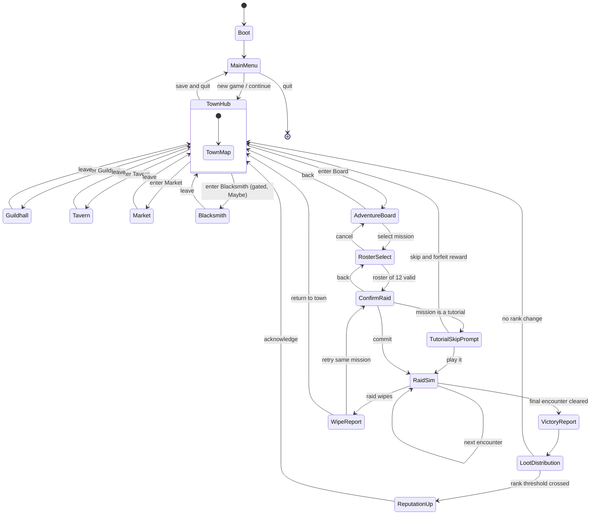

# 01 — Core Loop & Session Flow

> **Status:** Draft · **Owner:** Design · **Updated:** 2026-09-08
> **Canon:** _source/lead-designer-notes-raw.md, _source/ideaboard-transcription.md
> **Legend:** ✅ CANON = decided · 🔷 PROPOSED = needs sign-off · ❓ OPEN = undecided

**In one line:** This document defines the shape of play at three timescales — one raid attempt, one town cycle, one raid tier — and the top-level state machine that connects them.

## 1. Scope

**This doc owns:**

- The three nested play loops (micro / meso / macro) and what closes each one.
- The top-level screen/phase state machine and every legal transition between phases.
- The decision list the player actually makes per cycle, and the information each decision requires on screen.
- Wipe/failure handling at the loop level (what a failed attempt costs the run).
- The pacing budget: target minutes per phase and the "what should the player be doing at hour 1 / 3 / 10" shape.
- The new-game initial state (§8.0) — the gold, roster, gear, consumables, rank, buildings and unlocked content a fresh save starts with. Each individual value is owned by the doc that owns that system; this doc only gathers them.
- How the canon tutorial content (Adventure 0, Tutorial Raid) threads into the loop, including the skip rule.
- Whether the raid sim is attended, sped up, or skipped (flagged open).

**This doc does NOT own:**

| Topic | Owner |
|---|---|
| Building interiors, what each shop screen contains, upgrade trees | [02 — Town & Buildings](02-town-and-buildings.md) |
| Reputation rank unlock tables | [03 — Guild Reputation](03-guild-reputation.md) |
| Class kits, roles, raid composition rules | [06 — Classes & Roles](06-classes-and-roles.md) |
| Morale numbers, the mistake-chance curve, backstory triggers | [05 — Morale](05-morale.md) |
| Recruit rarity rolls, named legendaries | [04 — Recruitment & Roster](04-recruitment-and-roster.md) |
| Combat/sim resolution, round order, mistake resolution | [07 — Combat Simulation](07-combat-simulation.md) |
| Item stats and loot tables | [09 — Items & Itemization](09-items-and-itemization.md) |
| Currency values, prices, sell rates | [11 — Economy & Crafting](11-economy-and-crafting.md) |
| Per-encounter scripts for Adventures and Raids | [10 — Content & Encounters](10-content-and-encounters.md) |

> The owners above are the canonical set in [00 §1.1](00-vision-and-pillars.md). This table and *Related documents* were written against guessed filenames and re-pointed on 2026-09-10; the **numbers** moved as well as the slugs — classes are doc 06 and recruitment doc 04, items doc 09 and economy doc 11 — so a citation copied out of an older revision of this doc will name the wrong document.

---

## 2. The canon "Core things to do", mapped to loops

Canon lists five verbs (canon: raw notes, *Core things to do*). Every screen in this game exists to serve one of them. If a screen serves none, cut it.

| # | Canon verb (verbatim) | Loop it lives in | Primary screen | Closes the loop by… |
|---|---|---|---|---|
| 1 | "You earn money." | Micro | Raid Sim → Loot Report | Producing sellable loot and coin from a completed attempt |
| 2 | "You spend money at the blacksmith/Merchant." | Meso | Market, Blacksmith | Converting coin into AC/Power/Mana and consumables |
| 3 | "You recruit people at the tavern as needed." | Meso | Tavern | Replacing leavers, filling missing roles, upgrading raider rarity |
| 4 | "You take missions from the adventure board." | Micro entry point | Adventure's Board | Committing to an attempt, which starts the micro loop |
| 5 | "You improve the guild/raid team." | Meso + Macro | Guildhall, Blacksmith, Tavern | Raising the team's clear probability for the next attempt |

✅ CANON — all five verbs and their building assignments (canon: raw notes, *Core things to do* and *Town as progression engine*).

⚠️ Note the canon tension: the Blacksmith is marked "Blacksmith (Maybe)" in the town section but verb 2 names it outright. See Open Questions #3.

---

## 3. The three loops

### 3.1 Micro loop — one raid attempt (target 3–8 min)

**Why this exists:** the micro loop is the only place the game's premise is expressed — you are not raiding, you are watching people you hired fail in ways you could have prevented at the roster screen.

```
Adventure's Board  →  Roster Select (pick 12)  →  Confirm  →  Raid Sim
                                                                  ↓
                            ┌───────────── mistakes happen ────────┤
                            │                                      ↓
                            └──────────────────────────→  Clear  or  Wipe
                                                                  ↓
                                                        Loot / Wipe Report
                                                                  ↓
                                                        back to Town (meso)
```

| Step | Player action | System action | Canon status |
|---|---|---|---|
| M1 | Select a mission on the Adventure's Board | Show difficulty, encounter count, loot slots offered | ✅ CANON — board content and drop slots (canon: raw notes, *Adventure's Board*; *Raid Layout and loot drops*) |
| M2 | Fill a roster of 12 | Validate composition; warn on missing role | ✅ CANON — "I'd like the raid size to be 12, most fights normally requiring 2 tanks" (canon: raw notes, *Classes*) |
| M3 | Confirm | Lock roster, snapshot morale, consume nothing yet | 🔷 PROPOSED — see §6.2 for what confirm commits |
| M4 | Watch the sim | Resolve encounters 1→5, roll mistakes per raider | ✅ CANON — encounter ladder; ❓ OPEN whether watching is required (§8) |
| M5 | Clear or Wipe | Award loot on clear; apply wipe cost on failure | ✅ CANON on loot; 🔷 PROPOSED on wipe cost (§6) |
| M6 | Read the report | Attribute mistakes to named raiders, apply morale deltas | 🔷 PROPOSED |

**Encounter ladder inside one Raid attempt** — ✅ CANON (canon: raw notes, *Raid Layout and loot drops*):

| Encounter | Drops | Difficulty |
|---|---|---|
| Encounter 1 (Trash) | Feet + basic weapons | ★ |
| Encounter 2 (Harder trash) | Legs + healer off-hand | ★★ |
| Encounter 3 (Mini boss) | Head + stronger shared gear | ★★★ |
| Encounter 4 (Mini boss) | Chest + strong weapons | ★★★★ |
| Encounter 5 (Main boss of tier) | Class-specific + trinkets | ★★★★★ |

### 3.2 Meso loop — one town cycle (target 10–20 min)

**Why this exists:** canon states the design thesis directly — "Instead of the guild simply being a menu between raids, make the town itself your progression engine" (✅ CANON: raw notes, *Town as progression engine*). The meso loop is that engine's turn of the crank.

```
        Loot Report
             ↓
   ①  Triage loot  ──→  ②  Sell / Buy (Market)  ──→  ③  Upgrade gear (Blacksmith)
             ↓                                                     ↓
   ⑥  Re-select roster  ←──  ⑤  Recruit (Tavern)  ←──  ④  Morale repair (Guildhall)
             ↓
      next attempt (micro)
```

| Step | Building | What the player does | Canon status |
|---|---|---|---|
| ① Triage | — (inventory) | Equip upgrades, mark keeps vs. junk | 🔷 PROPOSED (loot exists in canon; the triage screen does not) |
| ② Sell / Buy | Market | "Sell loot", "Buy consumables (Potions)" | ✅ CANON (canon: raw notes, *Market*) |
| ③ Upgrade | Blacksmith | "Equipment upgrades < Maybe" | ❓ OPEN — canon marks the whole building "(Maybe)" |
| ④ Morale repair | Guildhall | "Manage morale with comfort items"; "Upgrade guild facilities < better morale values" | ✅ CANON (canon: raw notes, *Guildhall*) |
| ⑤ Recruit | Tavern | "Recruits are found and managed here" | ✅ CANON (canon: raw notes, *Tavern*) |
| ⑥ Re-roster | Adventure's Board / Roster | Rebuild the 12 with new gear, new hires, repaired morale | ✅ CANON (raid size 12) |

**Loop-closing condition:** the player returns to the Adventure's Board with at least one of — better gear, higher average morale, a better-rarity raider, or a new unlocked mission. 🔷 PROPOSED: if a town cycle produced none of those four, the run has stalled and the game should surface a hint (see Open Questions #7).

**Also in canon and mapped here:** "Quest/achievement board" (Guildhall) and "Crafting Supplies < Maybe" / "Salvaging < If we do crafting" (Market/Blacksmith) sit in the meso loop as optional stops. Their contents belong to doc 02.

### 3.3 Macro loop — one raid tier (target hours)

**Why this exists:** canon: "the town will be improved by the raids you do. Mostly by gaining reputation levels. Which will unlock additional things in the town" (✅ CANON: raw notes, *Town as progression engine*). The macro loop is a ratchet: the reward for clearing content is a better *class of problem*, not just bigger numbers.

```
   Clear the tier's Encounter 5 (main boss)
                ↓
   Reputation increases  →  Tavern recruit pool improves
                ↓                        ↓
   New town options unlock  ←────────────┘
                ↓
   Next tier of Adventures / Raids appears on the board
                ↓
   Re-gear the roster in the new tier  →  repeat
```

✅ CANON — the reputation ladder and its recruit effects (canon: raw notes, *Guild Reputation*):

| Rank | Recruit pool effect (verbatim summary of canon) |
|---|---|
| Unknown | "you can only find the worst players to join your guild, they have 0 raid experience etc. (Common raiders)" |
| Known | "a chance to find raiders that have a small amount of experience, 1-2 pieces of basic adventure gear from your current raid tier etc.. (uncommon raiders)" |
| Respected | "you no longer find common and sometimes you find rare raiders … (rare raiders) finding uncommon raiders is now common" |
| Established | ❓ OPEN — listed in the rank ladder but canon gives it no description |
| Renowned | "you no longer find uncommon raiders … (epic raiders) you also gain a VERY SMALL chance to find … (Legendary raiders)" |
| Legendary | ❓ OPEN — listed in the rank ladder but canon gives it no description |

✅ CANON — "You can only ever find 1 Legendary per class - They are also named characters - IE Natsuna(the shaman) or something."

✅ CANON — "New Tiers can be unlocked by gaining reputations with the town."

**Canon mission ladder** (canon: raw notes, *Adventure's Board*) — names are explicitly placeholders:

| Order | Entry | Content | Notes |
|---|---|---|---|
| 1 | Adventure 0 | "1 Trash mob (Just for learning - 1 crap trinket)" | Skippable tutorial |
| 2 | Tutorial Raid | "1 Boss (Just for learning - 1 crap trinket)" | Skippable tutorial |
| 3 | Adventure 1 | "a few trash encounters and a mini boss" | |
| 4 | Raid 1 | 5 encounters per *Raid Layout* | |
| 5 | Adventure 2 | "TBD ---" ❓ OPEN | |
| 6 | Raid 2 | | |
| 7 | Adventure 3 | | |
| 8 | Raid 3 | | |
| 9 | Adventure 4 | | |
| 10 | Raid 4 | | |
| 11 | Adventure 5 | | |
| 12 | Raid 5 | | |

❓ OPEN — canon immediately qualifies the ordering: "This continues or can go raid raid, adventure adventure, obviously they will need names later, but this is a placeholder". Do not treat alternation as decided. Naming is pending; ship with the placeholder strings.

### 3.4 How the three loops nest

| | Micro | Meso | Macro |
|---|---|---|---|
| Unit | 1 attempt | 1 town cycle | 1 tier |
| Length | 3–8 min | 10–20 min | hours |
| Player verb | commit + watch | spend + fix + hire | clear + unlock |
| Resource created | loot, coin, mistake data | equipped power, morale, roster depth | reputation, recruit rarity, town options |
| Failure means | wipe (recoverable, §6) | wasted cycle (nothing improved) | tier stall |
| Contains | — | 1–3 micro loops 🔷 | 4–10 meso loops 🔷 |

🔷 PROPOSED counts: one town cycle should support 1–3 attempts before the player runs out of meaningful changes to make; a tier should take 4–10 town cycles at first exposure. These are the tuning knobs for the pacing budget in §7.

---

## 4. State machine

### 4.1 Mermaid



### 4.2 Transition table (authoritative if the diagram and the table disagree, fix the diagram)

| From | To | Trigger | Guard / condition | Canon status |
|---|---|---|---|---|
| Boot | MainMenu | load complete | — | 🔷 PROPOSED |
| MainMenu | TownHub | New Game / Continue | save valid | 🔷 PROPOSED |
| TownHub | Guildhall | interact with building | always available | ✅ CANON (building exists) |
| TownHub | Tavern | interact | always available | ✅ CANON |
| TownHub | Market | interact | always available | ✅ CANON |
| TownHub | Blacksmith | interact | ❓ OPEN — canon marks Blacksmith "(Maybe)"; if built, 🔷 PROPOSED gate at reputation *Known* | ❓ OPEN |
| TownHub | AdventureBoard | interact | always available | ✅ CANON |
| Any building | TownHub | Leave / Esc | — | 🔷 PROPOSED |
| AdventureBoard | RosterSelect | pick a mission | mission unlocked at current reputation | ✅ CANON (tier unlock by reputation) |
| RosterSelect | ConfirmRaid | Confirm | 12 raiders assigned; 🔷 PROPOSED soft-warn if fewer than 2 tanks | ✅ CANON (size 12; "most fights normally requiring 2 tanks") |
| RosterSelect | AdventureBoard | Cancel | — | 🔷 PROPOSED |
| ConfirmRaid | TutorialSkipPrompt | commit on Adventure 0 / Tutorial Raid | tutorial not yet completed | ✅ CANON (tutorials skippable with warning) |
| TutorialSkipPrompt | RaidSim | "Play it" | — | ✅ CANON |
| TutorialSkipPrompt | TownHub | "Skip" | player has been warned they forfeit the reward | ✅ CANON |
| ConfirmRaid | RaidSim | commit | roster locked, morale snapshotted | 🔷 PROPOSED |
| RaidSim | RaidSim | encounter resolved, more remain | — | ✅ CANON (5-encounter ladder) |
| RaidSim | VictoryReport | last encounter cleared | — | 🔷 PROPOSED — the victory state itself is not in canon; [07 — Combat Simulation](07-combat-simulation.md) §7 owns it |
| RaidSim | WipeReport | raid group defeated | — | 🔷 PROPOSED — canon never defines a wipe as a mechanic; [07 — Combat Simulation](07-combat-simulation.md) §7: "Canon never uses the words death, resurrect, wipe-as-mechanic, or attempt limit — despite the source game being *It's A Wipe!*" |
| VictoryReport | LootDistribution | continue | — | 🔷 PROPOSED — the drop *content* is ✅ CANON (raw notes, *Raid Layout and loot drops*), but the screen and this transition inherit VictoryReport's proposed status above |
| LootDistribution | ReputationUp | reputation threshold crossed | tier main boss cleared | ✅ CANON (reputation unlocks tiers/town) |
| LootDistribution | TownHub | continue | no threshold crossed | 🔷 PROPOSED |
| ReputationUp | TownHub | acknowledge | — | 🔷 PROPOSED |
| WipeReport | TownHub | Return to town | — | 🔷 PROPOSED |
| WipeReport | ConfirmRaid | Retry | 🔷 PROPOSED: allowed only if retry cost payable (§6.2); roster editable via a back step to RosterSelect | 🔷 PROPOSED |
| TownHub | MainMenu | Save & Quit | not mid-sim | 🔷 PROPOSED |

**Illegal transitions worth stating explicitly** (🔷 PROPOSED): no building-to-building teleport (always via TownHub, so the town stays the spine); no entry to RaidSim except through ConfirmRaid; no save/quit from inside RaidSim — the attempt is atomic (see Open Questions #6).

---

## 5. The decision the player actually makes

### 5.1 Decision inventory

| Loop | Decision | Real choice being made | Information required on screen |
|---|---|---|---|
| Micro | Which mission | Push new content vs. farm a cleared one | Encounter count, difficulty stars, slots that drop, "already owned" markers |
| Micro | Which 12 | Trade role coverage against morale risk | Name, class, role, morale value + state label + face icon, gear score, mistake history |
| Micro | Bring or bench a low-morale raider | See §5.2 | That raider's morale band effect, whether they want to go, whether a substitute exists |
| Micro | Consumables loadout | Insurance vs. coin | Potion counts, cost, what they mitigate |
| Meso | Sell or keep a drop | Coin now vs. slot upgrade later | Stat delta vs. currently equipped, who else in the roster can use the family |
| Meso | Which raider gets the upgrade | Concentrate power vs. spread it | Per-raider gear gaps, role criticality |
| Meso | Repair morale or buy gear | Reliability vs. raw power | Morale distribution across the 12, cost of comfort items vs. gear |
| Meso | Hire, fire, or hold | Roster churn cost vs. quality | Recruit rarity, current reputation, roles missing, morale of incumbents |
| Macro | Progress or consolidate | Attempt the next tier under-geared vs. farm the current one | Reputation progress bar, tier gear coverage %, average roster morale |
| Macro | Which town facility to upgrade | Where the guild's ceiling is | Facility effect on morale values, cost, what the next rank unlocks |

### 5.2 The interesting decision: bring the low-morale raider, or be weaker

**Canon frames it exactly this way** (canon: raw notes, *Morale*):

> "Oh shit, Steve is at 14. Maybe I shouldn't bring him, unless he really wants to go and I know I can beat the raid with him messing up."

And the canon example roster it refers to:

| Raider | Morale | Class | State |
|---|---|---|---|
| Natsuna | 87 ❤️ | Shaman | Very Happy |
| Bob | 54 🙂 | Warrior | Content |
| Greg | 31 😒 | Rogue | Annoyed |
| Steve | 14 😡 | Mage | Upset |

**Risk / reward statement** — 🔷 PROPOSED wording, canon inputs:

> Bringing a raider whose morale is in the 10–20 *Upset* band buys you their full role contribution at the price of an elevated mistake rate for the whole attempt **and** a chance that raider leaves the guild afterwards. Benching them removes both risks and removes the contribution: you attempt the encounter with 11 effective raiders, or with a substitute who is off-role. The decision is interesting only when the raider is *needed* — that is, when no same-role substitute of comparable gear exists.

Canon supplies the two consequences: at 10–20 "Increased mistake chance; may leave guild" (✅ CANON: raw notes, *Morale: 0-100*).

**Worked example — Steve the Mage, Raid 1, Encounter 4.**

Assume Steve is the roster's only Mage, and canon assigns Mage the "Raid spell buff + AoE damage" role (✅ CANON: raw notes, *Classes*). Encounter 4 is ★★★★.

| Option | Roster effect | 🔷 PROPOSED expected outcome | Cost if it goes wrong |
|---|---|---|---|
| **Bring Steve** | 12/12, raid spell buff active, AoE covered | Clear chance ~55% | Elevated mistake rolls all attempt; ~12% chance Steve leaves the guild after a wipe |
| **Bench Steve, run 11** | No Mage: no raid buff, no AoE | Clear chance ~30% | Wasted attempt; 🔷 PROPOSED −3 morale to Steve if he had flagged that he wanted to go |
| **Bench Steve, sub a Wizard** | Single-target DPS instead of AoE; still no raid buff | Clear chance ~40% | As above, plus the Wizard is pulled off whatever he was covering |
| **Repair Steve first (Guildhall), attempt next cycle** | 12/12 at a higher morale band | Clear chance ~65% | ~8–12 min of town time and the comfort-item cost |

All four percentages are 🔷 PROPOSED illustrative targets for tuning, not shipped numbers — the mistake-chance curve that produces them belongs to [05 — Morale](05-morale.md) and [07 — Combat Simulation](07-combat-simulation.md).

**The "wants to go" flag** — 🔷 PROPOSED. Canon's phrasing "unless he really wants to go" implies raiders can express eagerness. Proposal: each raider may carry a per-mission `wants_to_go` flag surfaced at Roster Select.

| Condition | Effect |
|---|---|
| `wants_to_go` and brought | +5 morale on attempt resolution, win or lose |
| `wants_to_go` and benched | −3 morale |
| No flag and benched | 0 morale change (benching is free by default) |

This is the lever that makes the canon sentence true: a raider who *wants* to go is worth bringing at a morale band you'd otherwise refuse, because the attempt itself is the morale repair.

**Adjacent idea, not a commitment** — ❓ OPEN. Canon raises this as a concept only — "We could have raiders also know their bis … This is all just concepts and can easily be revisited" (canon: raw notes, *Morale*). Owned by [05 — Morale](05-morale.md) §9 behind a feature flag.

### 5.3 Roster Select screen — information contract

🔷 PROPOSED. Every raider row must show, without a hover or a second click: name, class, role, morale number, morale state label, morale emoji, equipped gear count for the current tier, and mistake count in the last three attempts. The header must show: raid size filled (n/12), tank count, healer count, and a composition warning if tanks < 2. Justification: the canon fantasy is a leader reading a roster at a glance ("So when you're preparing a raid, you immediately know: Oh shit, Steve is at 14") — anything requiring a click breaks that read.

---

## 6. Failure handling

🔷 PROPOSED — **canon is silent on what a wipe costs.** Canon establishes only that wipes are the premise (the source game is *It's A Wipe!*) and that very low morale "may cause guild disband" (canon: raw notes, *Morale*), which is the sole loss condition anywhere in the notes.

**Why this exists:** a comedy management game about incompetence has to make failing funny and recoverable. If failure deletes raiders or gear, the player stops experimenting with the exact rosters that generate the comedy, and the game teaches "only bring happy raiders" — which deletes the decision in §5.2.

### 6.1 The proposal: time + consumables + morale

| Cost | Amount | Rationale |
|---|---|---|
| Time | The 3–8 min of the attempt, unrecovered | The real currency of a management game |
| Consumables | Potions consumed up to the wipe are gone | Canon already sells Potions at the Market; makes stocking a decision |
| Morale | −8 to every participant (cap −16 per attempt session), an extra −4 to the raider whose mistake triggered the wipe — [05 §7.1](05-morale.md) owns the numbers, [15 BL-107](15-open-questions.md#bl-107) the culprit rule; no tutorial exemption ([BL-112](15-open-questions.md#bl-112)) | Turns the wipe into next cycle's town work, which is the meso loop |
| Retry fee | ~~🔷 PROPOSED flat coin cost scaled per tier (Tier 1: 25)~~ **Not built** ([15 Q-53](15-open-questions.md#q-53), 2026-09-15): the day, the chalked provisions and the morale ledger are the per-attempt cost; attempts are unlimited and committed at Depart, and "Try again" on the wipe page (`Results.TRY_AGAIN`) costs a day and the provisions chalked | A fee on top of a day would punish the considered second attempt the row wanted to allow |
| **Not lost** | Raiders, equipped gear, unspent coin, reputation | See §6.3 |

**Partial credit** — 🔷 PROPOSED: loot from encounters cleared *before* the wipe is kept. Wiping on Encounter 4 still hands you the Feet, Legs and Head drops from 1–3. This is what makes a raid tier a ladder rather than an all-or-nothing gate, and it means a losing attempt still feeds verb 1 ("You earn money").

**Checkpointing** — 🔷 PROPOSED: on retry, resume at the first uncleared encounter of that mission within the same town cycle. Leaving town resets progress to Encounter 1. Open Questions #5.

### 6.2 What "Confirm" commits

🔷 PROPOSED. At ConfirmRaid the game locks the roster and snapshots morale; nothing is spent. Costs are only incurred as encounters resolve. Consequence: cancelling at the confirm screen is always free, and the player is never punished for reading the final composition warning.

### 6.3 The rejected alternative: permadeath / gear loss

| Alternative | Why rejected |
|---|---|
| Raider permadeath on wipe | Kills the §5.2 decision — you would never risk a needed raider. Also destroys the named-Legendary fantasy, since canon allows only one Legendary per class ever. |
| Gear destruction / durability | Adds an upkeep tax on the exact activity the game wants you doing repeatedly, and makes the Blacksmith mandatory when canon marks it "(Maybe)". |
| Run reset / roguelike restart | Contradicts the canon thesis that the *town* is the progression engine — a town you lose is a run, not an engine. |
| Coin loss proportional to holdings | Punishes the successful player hardest, and coin is already the meso loop's throttle. |

**The one exception kept from canon:** ✅ CANON — at 0–10 *Very Upset*, morale "may cause guild disband", and at 10–30 raiders "may leave guild". Failure is therefore permanent *through the morale system*, never directly through the wipe. That is the correct location for it: the player loses people by neglecting them over time, not by losing a fight. ❓ OPEN — canon never states whether "guild disband" is a game over. See Open Questions #2.

### 6.4 Making the failure funny

🔷 PROPOSED — the Wipe Report screen is a comedy beat, not a defeat screen: a post-mortem naming the raider at fault, the specific mistake, and a one-line in-character excuse from that raider. Copy tone and the mistake catalogue belong to [07 — Combat Simulation](07-combat-simulation.md); this doc only reserves the screen and requires that it be *readable in under 15 seconds* so retrying stays fast.

---

## 7. Pacing budget

🔷 PROPOSED throughout this section. Canon gives no timings.

### 7.1 Minutes per phase

| Phase | Target | Hard ceiling | Notes |
|---|---|---|---|
| Adventure's Board browse | 0:20–0:45 | 1:30 | Should be a glance once the board is familiar |
| Roster Select | 0:45–1:30 | 3:00 | First-ever selection may run long; add a "last roster" recall to keep repeats near 0:20 |
| Confirm | 0:10 | 0:20 | One screen, composition warnings only |
| Raid Sim (5 encounters) | 3:00–4:30 at 1× | 6:00 | ~35–50 s per encounter |
| Victory / Wipe Report | 0:20–0:40 | 1:00 | Wipe Report readable in 15 s (§6.4) |
| Loot Distribution | 0:30–1:00 | 2:00 | |
| **Micro total** | **3:00–8:00** | 10:00 | Matches the brief's micro target |
| Loot triage | 2:00–4:00 | | |
| Market (sell/buy) | 2:00–3:00 | | |
| Blacksmith | 1:00–2:00 | | If built |
| Guildhall (morale) | 3:00–5:00 | | The most interesting town stop; give it room |
| Tavern (recruit) | 2:00–4:00 | | |
| **Meso total** | **10:00–20:00** | 25:00 | Matches the brief's meso target |

Design rule 🔷 PROPOSED: **town time should exceed sim time per cycle.** If a session's ratio inverts, the town has stopped being the progression engine and has become a menu — the exact failure canon warns against.

### 7.2 What the player should be doing at hour 1 / 3 / 10

| | Hour 1 | Hour 3 | Hour 10 |
|---|---|---|---|
| Reputation | Unknown → Known | Respected | Renowned or beyond |
| Recruit pool | "only the worst players … 0 raid experience" (Common) | Uncommon common, occasional Rare | Epic, with a VERY SMALL Legendary chance |
| Board content | Adventure 0, Tutorial Raid, Adventure 1 | Raid 1 in progress, Adventure 2 opening | Raid 2–3 tier, farming an earlier tier for coin |
| Core activity | Learning to read a roster; first wipe; first sell | Deliberate morale management; role gaps; first Legendary hunt begins | Optimizing a 12 across gear + morale; chasing named raiders |
| Gear state | Starting armor (Warrior 7 AC … Mage/Wizard 4 AC) | Tier 1 Adventure gear (Warrior/Bard 15 AC, Mage/Wizard 8 AC / +17 Mana) | Tier 1 Raid gear filling in; capstone Boss 5 pieces |
| Emotional beat | "these people are idiots" | "these are *my* idiots" | "I am running a real guild, and Steve is still a liability" |
| Failure meaning | Comedy | Diagnosable — you can name what went wrong | Chosen risk — you knew and did it anyway |

Gear values cited are ✅ CANON (canon: raw notes, *Starting armor for common recruits*; ideaboard §2.5). Reputation and pool descriptions are ✅ CANON (canon: raw notes, *Guild Reputation*). The hour markers themselves are 🔷 PROPOSED.

---

## 8. Onboarding path

✅ CANON content (canon: raw notes, *Adventure's Board*):

- "Adventure 0 - 1 Trash mob (Just for learning - 1 crap trinket)"
- "Tutorial Raid - 1 Boss (Just for learning - 1 crap trinket)"
- "Tutorials can be skip, but will offer a special loot piece that is easy, players will be warned that they will miss out on reward if they skip tutorial (not a big deal - not a great piece) Like a +1 dps trinket or something"

### 8.0 New game initial state

🔷 PROPOSED throughout. **Why this exists:** §4's state machine has a `MainMenu → TownHub : new game` transition and nothing in the doc set says what the player owns when they arrive. [11 — Economy & Crafting](11-economy-and-crafting.md) prices every purchase without ever naming an opening balance, [02 §11](02-town-and-buildings.md) fixes building levels at start, and [14 §7.1](14-technical-architecture.md) persists `guild` gold and `roster` without initial values. This table is the missing row: the values the sibling docs already imply, gathered in one place so a new save can be constructed. Every figure below is owned by the doc cited; this doc only asserts that a value must exist and proposes one.

| Field | Value at new game | Source / owner |
|---|---|---|
| Gold | **60 G** | 🔷 PROPOSED. Sized against [11 §3.1](11-economy-and-crafting.md)'s anchor (a full Raid 1 clear ≈ 100 G) and [11 §4.2](11-economy-and-crafting.md)'s prices: enough for one Common hire (15 G) plus a farm run's potions (≈ 15 G) with change, and not enough to skip Adventure 0's payout. See Open Questions #13 |
| Roster | **6 Common raiders**, pre-made: Warrior (tank), Cleric, Shaman, Rogue, Mage, Wizard | 🔷 PROPOSED. Adventure 0 fields a fixed **4** of them and the Tutorial Raid all **6**, matching [10 §9.1](10-content-and-encounters.md)'s party sizes (4, then 6 with 1 tank) without needing a mid-tutorial grant. Names pending |
| Does the squad persist? | **Yes** — the pre-made squad *is* the player's roster from the first frame; it is not a scripted cast that despawns after Adventure 0 | 🔷 PROPOSED. Anything else means the player's real first roster arrives from the Tavern at 15 G a head with 60 G in the bank |
| Roster morale | **45** each (the Common `baseline`) | [05 §4](05-morale.md) — "a newly recruited raider starts at `baseline`, not at 50 … a Common walks in at 45" |
| Equipment | Canon per-class starting armour, **AC only** (Warrior 7 AC … Mage/Wizard 4 AC) | ✅ CANON (raw notes, *Starting armor for common recruits*); reproduced in [09 §5](09-items-and-itemization.md) |
| Main hand | 🔷 PROPOSED: the six starting raiders arrive with a **0-stat placeholder weapon** so Adventure 0 is completable without a purchase. The general question — do Commons arrive armed at all? — is [04 Q3](04-recruitment-and-roster.md) / [09 §10.2](09-items-and-itemization.md)'s and is ❓ OPEN | ✅ CANON is silent: canon's starting list has four armour slots and no weapon |
| Off-hand / trinket | Empty | [09 §5](09-items-and-itemization.md) — canon lists neither |
| Consumables | **4 × Minor Healing Potion** | 🔷 PROPOSED, per [11 §7](11-economy-and-crafting.md) (8 G each). The player should see the safety net fire once before deciding to buy it |
| Comfort items / Fittings | None | [11 §8](11-economy-and-crafting.md), [11 §3.2](11-economy-and-crafting.md) |
| Reputation | **Unknown**, 0 RP | [03 §6.4](03-guild-reputation.md) |
| Buildings | Guildhall L1, Tavern L1, Market L1, Adventure's Board L1 (all at 0 G, present and derelict). Blacksmith absent — ❓ OPEN, canon marks it "(Maybe)" and [02 §11](02-town-and-buildings.md) gates L1 at *Respected* | [02 §11](02-town-and-buildings.md) |
| Content unlocked | Adventure 0, Tutorial Raid, Adventure 1, Raid 1 | [03 §7](03-guild-reputation.md) (rank *Unknown* row) |
| Progress / active run | All encounters uncleared; `active_run = null`; `legendaries_found` empty | [14 §7.1](14-technical-architecture.md) |

**Two one-line edits owed elsewhere:** [11 §4.1](11-economy-and-crafting.md)'s ledger has no opening-balance row — the faucet table starts at a tier's gross income — and should carry an `F0 — new game opening balance` row citing this table; [14 §7.1](14-technical-architecture.md)'s `guild` and `roster` blocks should cite this table as the source of a new save's initial values.

### 8.1 What each tutorial teaches

🔷 PROPOSED mapping (canon defines the content, not the teaching order):

| Step | Canon content | Teaches | Loop introduced |
|---|---|---|---|
| Adventure 0 | 1 Trash mob | Roster Select; Confirm; reading the sim; a mistake happening on screen | Micro |
| Loot after Adventure 0 | 1 crap trinket | Equip flow; the inventory | Micro → Meso handoff |
| Tutorial Raid | 1 Boss | A full encounter with a real fail state; the Wipe Report | Micro incl. failure |
| First town cycle | Market + Guildhall + Tavern | Sell, buy a Potion, repair one morale value, meet one recruit | Meso |
| Adventure 1 | "a few trash encounters and a mini boss" | Multi-encounter pacing; partial loot | Micro at full length |
| Raid 1 | 5-encounter ladder | The real game | Macro entry |

🔷 PROPOSED: Adventure 0 ships the player a pre-made starting squad rather than asking them to field 12 before the Tavern exists. Canon fixes raid size at 12 but a "1 Trash mob" encounter should not require 12; party sizes for tutorials and Adventures are owned by [10 — Content & Encounters](10-content-and-encounters.md) §3 and §9.1 (Adventure 0: 4 pre-made · Tutorial Raid: 6 pre-made, 1 tank · Adventures: 6 · Raids: 12). See Open Questions #4.

### 8.2 The skip rule

✅ CANON — tutorials are skippable; the player must be warned they forfeit the reward; the reward is deliberately weak (canon example: "a +1 dps trinket or something").

🔷 PROPOSED implementation:

| Rule | Spec |
|---|---|
| Where the skip lives | TutorialSkipPrompt, reached from ConfirmRaid on a tutorial mission (§4) |
| Warning copy requirement | Must name the specific forfeited item and state that it is not a strong piece — honesty is the joke |
| Reward | [09 §10.2](09-items-and-itemization.md)'s two tutorial trinkets — Adventure 0: **Cracked Charm of Power, +1 Power**; Tutorial Raid: **Cracked Charm of Health, +2 HP** — canon's "+1 dps trinket" in effect, each visibly under the canon Adventure charms. The earlier placeholder `Trinket of Mild Competence — +1 Damage` is struck ([15 BL-144](15-open-questions.md#bl-144); `+1 Damage` is not expressible on a trinket — doc 09 §12.2). The names are the §11.3 template's, ruled final by [BL-119](15-open-questions.md#bl-119). |
| Irreversibility | 🔷 PROPOSED: skipping is permanent for that tutorial; the mission leaves the board. Alternative (re-playable, reward still forfeited) noted in Open Questions #8. |
| Skip both | Allowed; both rewards forfeited |

❓ OPEN — canon gives "1 crap trinket" to *both* Adventure 0 and the Tutorial Raid, but the skip paragraph speaks of "a special loot piece" singular. Two trinkets or one? Quoted in Canon Tensions.

---

## 9. Idle / auto considerations

❓ OPEN — canon says nothing about sim automation, speed, or skipping.

The question matters because it decides what the Raid Sim *is*: a watched performance (the comedy is the point, so you must see the mistake), or a resolver (the decision is the point, so watching is a tax after attempt three).

🔷 PROPOSED default — **attended by default, accelerable, skippable only once mastered:**

| Control | Behaviour | Availability |
|---|---|---|
| Speed 1× | Full animation, mistake callouts readable | Always |
| Speed 2× / 4× | Same events, compressed | Always |
| Pause | Freezes between actions, roster panel inspectable | Always |
| Skip encounter | Resolve instantly, show the event log | Unlocked per encounter after first clear of that encounter |
| Skip attempt | Resolve the whole mission instantly to its report | Unlocked after the mission has been cleared once |
| Unattended / background | Not in v1 | — |
| True offline idle progression | Not in v1 | — |

Rationale: gating skip behind a first clear means the player always watches the content that is new (where the comedy and the learning are) and can fast-forward content that is now farming. Barring unattended play in v1 keeps the sim's mistake resolution free of "what happens if nobody is looking" edge cases.

Speed setting persistence, and whether speed is per-mission or global, are 🔷 PROPOSED as: global, persisted, reset to 1× for any mission never cleared.

**Decided here, and two siblings currently disagree.** The first-clear gate above is this doc's ruling (OQ#1) and governs, because availability is a loop-pacing question. Two one-line edits are owed elsewhere: [07 — Combat Simulation](07-combat-simulation.md) §3.1 lists `Instant` and `Skip to result` under the heading "Always available, zero cost" — they need moving out of that heading with an **Availability** column marking both *unlocked per encounter after first clear*; and [13 — UI & UX](13-ui-ux.md) §11.2 and its `SpeedDial` widget render `Instant` as a permanent fifth position and need a **locked** state that states the unlock condition as text (doc 13 §7 already requires locked controls to state their reason). Speed 1×/2×/4× and Pause are unaffected and stay always available, so doc 07's "speed affects presentation only, never outcome" rule is untouched.

---

## 10. Open questions

| # | Question | Why it matters | Proposed default |
|---|---|---|---|
| 1 | Does the raid sim run unattended / at speed / skippable? (§9) | Decides whether the sim is a performance or a resolver; changes sim architecture and comedy delivery | **Decided (this doc governs):** attended by default; 1×/2×/4× + pause always available; Instant / skip-to-result unlocked per encounter after first clear of that encounter, skip-attempt after the mission has been cleared once; no unattended or offline idle in v1. Owed edits in [07 §3.1](07-combat-simulation.md) and [13 §11.2](13-ui-ux.md) — see §9 |
| 2 | Is "guild disband" (morale 0–10) a game over, or a setback? | It is the only loss condition in canon; a hard game over changes every risk calculation in §5 | Setback: the guild survives, a scripted mass-departure event fires, reputation unaffected. Never a run-ending state. |
| 3 | Is the Blacksmith in v1? Canon marks it "(Maybe)" but the core verbs name it | Removes or keeps one full meso-loop stop and the entire gear-upgrade lever | RULED ([15 Q-13](15-open-questions.md#q-13)): out of 1.0 — the facade stays locked behind "Closed. The smith took a better offer."; the Merchant keeps canon's "spend money" verb true |
| 4 | What roster size do tutorials and Adventures use? Canon fixes raid size at 12 | A "1 Trash mob" tutorial requiring 12 raiders is unshippable before the Tavern opens | Adventure 0 uses a pre-made squad of 4, the Tutorial Raid 6, Adventures 6, Raids exactly 12 ([10 — Content & Encounters](10-content-and-encounters.md) §3, §9.1, which owns content structure) |
| 5 | Does a wipe checkpoint at the last cleared encounter? (§6.1) | Decides whether Raid 1 is a ladder or an all-or-nothing gate; changes attempt length dramatically | Checkpoint within the same town cycle; leaving town resets to Encounter 1 |
| 6 | Can the player save or quit mid-sim? | Atomicity of an attempt; determines save-scum exposure | RULED ([15 Q-53](15-open-questions.md#q-53)): the attempt is committed at Depart — resolved and autosaved before the account plays a line — so quitting mid-account discards nothing; Continue replays the stored seed to Results. Esc mid-account is the post-mortem. |
| 7 | Should the game detect and flag a stalled town cycle? (§3.2) | Without it a new player can loop a mission they cannot clear with no signal about what to change | Yes: if a cycle changes none of gear/morale/roster/unlocks, the Board shows a diagnostic hint naming the weakest of the four |
| 8 | Is skipping a tutorial permanent? | Affects whether the forfeited reward can be recovered and how firm the warning copy must be | Permanent; the mission leaves the board |
| 9 | How many attempts should a first Raid 1 clear take? | The core pacing number that makes or breaks the hour-1-to-hour-3 curve in §7.2 | 3–5 attempts across 2–3 town cycles |
| 10 | Do Adventures and Raids alternate on the board, or is the order free? | Canon explicitly leaves this open; it sets the whole macro cadence | Alternate as listed (Adventure n → Raid n) for tiers 1–2, then allow the designer to break pattern from tier 3 |
| 11 | Is there a level-up system? Guildhall canon says "Train raiders < Maybe if we have level ups" | If yes, the Guildhall gains a second progression axis and the macro loop lengthens | RULED ([15 Q-14](15-open-questions.md#q-14)): no levels, no Drilling; raider power comes from gear and rarity only; the "Lv." label is retired. |
| 12 | Are Adventure 0 and Tutorial Raid one reward or two? | Canon gives each "1 crap trinket" but the skip note says "a special loot piece" singular | Two distinct trinkets, one per tutorial, both weak |
| 13 | What is the starting gold figure? (§8.0) | It is the only number in the game with no owner: [11](11-economy-and-crafting.md) prices every sink and faucet but names no opening balance, and it sets whether the first town cycle is a real decision or a formality | **60 G** — one Common hire (15 G) plus a farm run's potions (≈ 15 G) with change, against [11 §3.1](11-economy-and-crafting.md)'s ≈ 100 G-per-Raid-1-clear anchor. Needs sign-off in doc 11, which owns every other price |

---

## Related documents

- [02 — Town & Buildings](02-town-and-buildings.md) — what is actually inside the Guildhall, Tavern, Market and Blacksmith that this doc only routes the player to.
- [03 — Guild Reputation](03-guild-reputation.md) — the rank thresholds and unlock tables that drive the macro loop's ratchet.
- [06 — Classes & Roles](06-classes-and-roles.md) — the nine classes and the two-tank requirement that Roster Select validates against.
- [05 — Morale](05-morale.md) — the mistake-chance curve behind every number in §5.2, and the backstory triggers that move morale.
- [04 — Recruitment & Roster](04-recruitment-and-roster.md) — the rarity rolls and named Legendaries the meso loop's Tavern stop spends time on.
- [07 — Combat Simulation](07-combat-simulation.md) — how an encounter resolves, how a mistake is rolled and attributed, and the Wipe Report's event log.
- [09 — Items & Itemization](09-items-and-itemization.md) — the drop tables the micro loop pays out and the meso loop triages.
- [11 — Economy & Crafting](11-economy-and-crafting.md) — coin sources, prices, and the retry-fee number proposed in §6.1.
- [10 — Content & Encounters](10-content-and-encounters.md) — the per-encounter scripts for Adventure 0 through Raid 5 that fill this loop with content.
- [14 — Technical Architecture](14-technical-architecture.md) — Godot assumption, and where the state machine in §4 is implemented.
