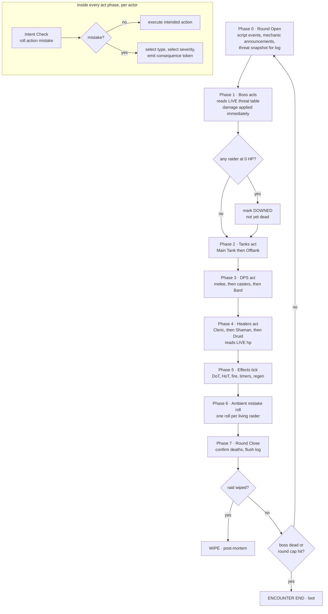

# 07 — Raid Simulation & The Mistake System

> **Status:** Draft · **Owner:** Design · **Updated:** 2026-09-08
> **Canon:** _source/lead-designer-notes-raw.md, _source/ideaboard-transcription.md
> **Legend:** ✅ CANON = decided · 🔷 PROPOSED = needs sign-off · ❓ OPEN = undecided

**In one line:** This document governs how a raid encounter resolves once the player presses Start — round order, the mistake system, threat, death and wipes, determinism, and the combat log.

---

## 1. Scope

**This doc owns:**

- The claim that the player does not drive raiders, and what limited in-raid agency exists instead.
- Round structure and resolution order.
- The mistake system: taxonomy, roll sites, severity selection, cascade rules, log presentation.
- The threat model and the "pulled aggro" failure it enables.
- Death, downed state, battle-res, wipe conditions, attempt policy.
- Determinism, seeding, and replayability of the sim.
- The combat log's data shape and verbosity tiers.

**This doc does NOT own:**

| Topic | Owner |
|---|---|
| Every number and formula — damage, healing, HP pools, the actual mistake-chance equation | [08 — Stats & Formulas](08-stats-and-formulas.md) |
| Encounter and boss content — which mechanics exist, phase timers, boss stat blocks | [10 — Content & Encounters](10-content-and-encounters.md) |
| What a wipe costs the player in money, morale, and time | [01 — Core Loop & Player Fantasy](01-core-loop.md) |
| How the log and raid view are drawn on screen | [13 — UI/UX](13-ui-ux.md) |
| Engine, RNG implementation, save format | [14 — Technical Architecture](14-technical-architecture.md) |

Rule of thumb for reviewers: **if it is a rule, it is here. If it is a coefficient, it is in doc 08.** Where this doc states a number, that number is an example or a structural constant (a cap, a band count, a cooldown in rounds), and doc 08 has final authority over it.

---

## 2. The core claim: the player is not in the raid

✅ CANON by derivation — canon lists only management verbs and never gives the player a combat input (canon: raw notes, Core things to do — "You earn money. You spend money at the blacksmith/Merchant. You recruit people at the tavern as needed. You take missions from the adventure board. You improve the guild/raid team."). The fantasy is guild leadership, not raiding. Canon reinforces this at the roster screen: *"Oh shit, Steve is at 14. Maybe I shouldn't bring him, unless he really wants to go and I know I can beat the raid with him messing up."* (canon: raw notes, Morale) — the decision is made **before** the pull. See also [00 — Vision & Pillars](00-vision-and-pillars.md) Pillar 4, which derives the same rule from the same canon line.

🔷 PROPOSED — **The build rule that follows from this.** The simulation takes a frozen snapshot at the pull and resolves on its own:

```
RaidResult = Simulate(RosterSnapshot, GearSnapshot, EncounterDef, Seed)
```

Everything the player did — who they recruited, what gear they handed out, what morale those people arrived with, what consumables were assigned, which 12 of the roster went — is already inside `RosterSnapshot` and `GearSnapshot`. Nothing the player does during resolution may change `RaidResult` except through the narrow, explicitly enumerated channel in §3 — and whether that channel exists at all is ❓ OQ-0, unresolved. If Calls are cut, the channel is empty and the sim accepts no input whatsoever, which is the reading [00 — Vision & Pillars](00-vision-and-pillars.md) §9 Q3 and VS3 currently assume.

**Things the player explicitly cannot do mid-encounter:**

| Cannot | Why |
|---|---|
| Target a raider's ability, or pick who anyone attacks/heals | That is raider AI. Giving it away makes the player a raid leader in a tactics game. |
| Swap a raider in or out | Roster is the pre-raid decision; swapping is an undo button on the whole loop. |
| Change gear or spend money | Town is the progression engine (canon: raw notes, Town as progression engine). |
| Drink or hand out a potion | Consumables are assigned pre-raid and used by raider AI (see §3.3). |
| Move anyone | There is no player-controlled position layer (see ❓ OQ-7). |

**Why this is stated first:** every other section is downstream of it. Round order only matters because the player cannot intervene in it. The mistake system carries the whole drama budget precisely because there is no skill expression during the fight. If mid-raid agency creeps in, the mistake system stops being funny and starts being a punishment for bad clicking.

---

## 3. In-raid agency: the minimum that is not a cutscene

🔷 PROPOSED — **Why this exists:** with literally zero input, a 20-round encounter is a video the player watches. With full input it is a different game. The design target is *managerial* agency: the player can control **pacing** and can **shout at people**, and shouting works only as well as morale allows.

### 3.1 Pacing controls, zero cost

**Availability is not uniform**, and this table was previously headed "Always
available" in a way [doc 01 §9](01-core-loop.md) had to correct. That doc's OQ#1
ruling governs, because availability is a loop-pacing question: **Instant and Skip
to result unlock per encounter after a first clear of that encounter.** Rationale,
quoted: *"gating skip behind a first clear means the player always watches the
content that is new (where the comedy and the learning are) and can fast-forward
content that is now farming."*

| Control | Behaviour | Availability | Affects outcome? |
|---|---|---|---|
| Speed 1× / 2× / 4× | Presentation cadence. | **Always** | No. Presentation only. |
| Speed — Instant | Resolves the whole encounter and shows the log + post-mortem. | **Unlocked per encounter after first clear** ([01 §9](01-core-loop.md)) | No. |
| Pause | Freezes at the current phase boundary. Log is scrollable, threat table and HP bars readable. No commands accepted while paused. | **Always** | No. |
| Skip to result | Same as Instant, mid-encounter. | **Unlocked per encounter after first clear** ([01 §9](01-core-loop.md)) | No. |

Because the two gated controls are presentation-only either way, gating them
cannot affect a result — §8's "speed affects outcome never" rule is untouched. A
locked control states its unlock condition as text ([13 §7](13-ui-ux.md)).

Build note: because speed cannot affect outcome, the sim must run to completion **independently of frame rate** (see §8). Instant mode is the sim with the renderer detached, not a different code path.

### 3.2 Guild Leader Calls — the one real lever 🔷 PROPOSED — contingent on 00 Q3

⚠️ **This whole subsection is contingent and may not survive.** [00 — Vision & Pillars](00-vision-and-pillars.md) Pillar 4 says no to "pausing to issue orders", anti-goals A2/A3 forbid player-controlled raider input, VS3's acceptance test runs Raid 1 with "input disabled", and §9 Q3's proposed default is "No mid-raid input." Calls contradict all four. That conflict is ❓ **OQ-0** in §11 and must be decided at the doc-00 level before anything below is built. Nothing in §3.2 is signed off by this doc alone.

**If Calls are cut (the no-Calls fallback):** Retreat (below) is the player's only in-raid action, `advance(state, inputs)` in [14 — Technical Architecture](14-technical-architecture.md) §3.4 is retained purely as the log player's per-round step with a permanently empty input queue, and `input_log` stays in the replay artifact as an always-empty field — so doc 14's architecture survives either answer without a rewrite.

🔷 PROPOSED — the player gets **3 Calls per encounter attempt**, shared across the whole raid, each Call type usable once, with a **2-round global cooldown** between Calls. A Call is a shout, not a command: it is offered to every affected raider and each raider rolls **Compliance** against morale.

**Compliance** (rules here, curve in doc 08): each affected raider rolls once. A raider in a low morale band is likelier to ignore the shout; a raider in a high band is likelier to obey. This is deliberate: it makes morale legible *during* the fight, not only on the roster screen, and it means a raid of miserable people cannot be saved by good shouting.

| Call | Effect on compliant raiders | Intent |
|---|---|---|
| **"FOCUS UP!"** | Ambient mistake roll (§5.3c) is skipped for this raider this round and next. | The panic button. Buys two clean rounds. |
| **"HEAL THE TANK!"** | Healers re-prioritise: next Healer phase, all compliant healers target the lowest-HP raider currently holding boss aggro. | Fixes the single most common death: tank dies while healers top up a Rogue. |
| **"BACK OFF!"** | Compliant raiders take no action next round, generate no threat, and auto-pass any mechanic check that round. | Trades a round of DPS for survival. Also the only way to defuse a live Fire token (§6). |

**There is no retreat** ([15 BL-95](15-open-questions.md#bl-95), confirmed 2026-09-15): the attempt is committed at Depart — the sim resolves and the record is written before the account plays a line ([Q-53](15-open-questions.md#q-53)) — so there is no phase boundary at which to abandon it and no mid-fight verb (Q-09). Leaving the account early is Skip or an exit, never an abandonment; the prep board's Back is the only "don't go". What a wipe costs is [01 — Core Loop & Player Fantasy](01-core-loop.md)'s ledger.

❓ OPEN — should Calls be a **per-raid** budget rather than per-attempt? Per-attempt makes retrying cheap and Calls spammy across a long raid; per-raid makes the fifth encounter tense. See OQ-2 — which presupposes OQ-0 resolving in favour of Calls existing at all.

**Downstream dependents of OQ-0, for whoever resolves it:** [01 — Core Loop & Player Fantasy](01-core-loop.md) §9's control table (speed/pause/skip only, no Calls) and §4's state machine (no Call transition); [13 — UI/UX](13-ui-ux.md) §5 S11 and §9.3 (a "CALLS 3 left" panel and three Call buttons); [14 — Technical Architecture](14-technical-architecture.md) §3.1/§3.4 (`advance(state, inputs)`, the input log, OQ-3). All four change with the answer.

### 3.3 Consumables

✅ CANON — the Market sells consumables (Potions) (canon: raw notes, Market). 🔷 PROPOSED — potions are **assigned to a raider pre-raid** in the raid-prep screen and consumed by that raider's own AI under a simple condition (`use healing potion when HP < 35% and no heal landed last round`). The player never clicks them. This keeps the purchase decision in town, keeps the usage decision out of the player's hands, and creates a mistake surface: `MIS_NO_CONSUMABLE` (§5.2) is a raider who forgot the thing you bought them.

---

## 4. Round structure

🔷 PROPOSED — the encounter is a loop of discrete **rounds**. There is no continuous time and no cast bars that resolve between phases; "00:12" in the log is cosmetic and derived from round number (see doc 13).

### 4.1 Phase order

1. **Phase 0 — Round Open.** Increment round counter. Resolve encounter-script events scheduled for this round: phase transitions, add spawns, mechanic *announcements*. Snapshot the threat table for reference/logging.
2. **Phase 1 — Boss acts.** Boss selects actions per its script (doc 10), reads the **live** threat table, applies damage/effects immediately. Raiders who hit 0 HP here become **Downed**, not dead (§7.1).
3. **Phase 2 — Tanks act.** Main tank first, then offtank. Tanks attack, refresh threat, apply mitigation.
4. **Phase 3 — DPS act.** Sub-order: melee (Rogue, Monk) → casters (Mage, Wizard) → Bard. Ties resolved by roster slot index.
5. **Phase 4 — Healers act.** Sub-order: single-target (Cleric) → chain (Shaman) → raid-wide (Druid). Healers read **live** HP, not a snapshot.
6. **Phase 5 — Effects tick.** DoTs, HoTs, standing-in-fire damage, mechanic timers, resource regen, buff/debuff duration decrement.
7. **Phase 6 — Ambient mistake roll.** One roll per living raider for non-action failures (afk, arguing, loot drama, ninja-pull during a break). Action and mechanic mistakes were already rolled inside phases 1–5 (§5.3).
8. **Phase 7 — Round Close.** Confirm deaths for anyone still Downed. Check wipe. Check encounter end. Flush the log buffer.

**Healer sub-order rationale:** Cleric is canon "Main Tank Healer — Efficient single-target healing" and must triage before the raid-wide top-up, or the Druid's small raid heal (canon: "Small heal to the entire raid every round") gets wasted lifting a tank one point above death. Druid last means it mops up whatever the others missed. Shaman's canon chain (medium → medium → small) resolves in the middle, so its bounce targets are already partly topped — which is exactly where `MIS_HEAL_WRONG` gets funny.

### 4.2 Sequential, not simultaneous — and why

**The round is sequentially resolved with immediate application.** Each actor reads live world state at the instant it acts, and its effects land before the next actor reads state.

The alternative — collect all intents against a start-of-round snapshot, then apply — produces a specific bug class this project cannot afford: **a heal that lands after the death it was meant to prevent.** In snapshot resolution, the Cleric picks the tank at 40 HP, the boss then deals 55, and the heal resolves onto a corpse. The player reads the log, sees the heal, sees the death, and concludes the game is broken. Under sequential resolution the Cleric physically cannot pick a dead target, because the boss already acted in Phase 1 of the same round.

The cost of sequential resolution is that boss damage always precedes healing within a round, so a full-HP tank can in principle be deleted with no healer window. That is what the **Downed** state in §7.1 exists to solve: it hands healers exactly one round of grace and makes the clutch heal a real, visible event.

**Consequence for the mistake system:** healing a corpse or healing the wrong target is now *never* an engine artifact. If it happens, a mistake was deliberately rolled and the log says so. The bug became content.

### 4.3 Flowchart



The subgraph is not a separate step in the loop — it is what happens inside phases 1–5 for each actor, and it is specified in §5.3.

---

## 5. The mistake system

✅ CANON — the concept is canon: every raider has a mistake chance, and it moves with morale and with rarity. Canon anchors:

| Anchor | Source |
|---|---|
| Morale is 0–100, one number, one state, one effect, ten bands from **Very Upset** to **Loves Their Guild**, each band naming a mistake-chance direction | canon: raw notes, Morale table |
| "All values above are have within tier limits for mistakes based on their tier" — morale is bounded by rarity | canon: raw notes, Morale (verbatim, including the grammar) |
| Common raiders have "0 raid experience"; rare raiders "only make mistakes sometimes"; epic raiders "rarely make a mistake"; legendary raiders are "basically perfect, near 1% chance of mistake" | canon: raw notes, Guild Reputation |

✅ CANON gives the *dial*. It gives no taxonomy, no roll cadence, and no severity model. Everything in §5 below is 🔷 PROPOSED.

### 5.1 What a mistake is, structurally

🔷 PROPOSED — **Why this exists:** the game's entire comedy and its entire difficulty come out of the same object, so that object has to be a real data type, not an ad-hoc log string.

```
MistakeEvent {
  id, round, phase, actor_id,
  type,               # from the taxonomy in 5.2
  severity,           # Minor | Moderate | Severe | Critical
  roll_site,          # Action | Mechanic | Ambient
  mechanical_effects, # list of concrete state changes
  tokens_emitted,     # consequence tokens for cascade (see 6)
  caused_by,          # MistakeEvent.id or null  <- the causal chain
  cascade_depth,      # 0 for a root mistake
  log_template_id, rng_draw_index
}
```

`caused_by` and `cascade_depth` are the load-bearing fields. They are what lets the post-mortem screen say *"this wipe started when Greg pulled aggro in round 4"* instead of listing twelve unrelated failures.

### 5.2 Taxonomy

Severity column is the mistake's **base** band; the roll in §5.4 can shift it one band either way. "Cascade-only" means the type can never be rolled as a root mistake — it requires a matching live token (§6).

| # | Type | Mistake | Affinity | Fires during | Mechanical effect | Base severity | Emits |
|---|---|---|---|---|---|---|---|
| 1 | `MIS_FIRE` | Stood in the Fire | Any; ×1.5 melee | Mechanic check | Takes mechanic tick damage in Phase 5 each round until they leave; leaves at end of next round, or immediately on **"BACK OFF!"** | Moderate | Fire |
| 2 | `MIS_AGGRO` | Pulled Aggro Off the Tank | DPS; ×2 Wizard, ×1.5 Rogue | Action (own attack) | Their threat is set above the current primary target's; boss retargets them next Phase 1 | Severe | Aggro |
| 3 | `MIS_TAUNT_LAPSE` | Forgot to Taunt | Warrior, Monk | Action (tank) | Generates no threat this round; existing threat unchanged | Moderate | Aggro |
| 4 | `MIS_INTERRUPT_MISS` | Missed the Interrupt | Rogue, Monk, Warrior | Mechanic check | The interruptible cast resolves in full | Severe | — |
| 5 | `MIS_INTERRUPT_WRONG` | Interrupted the Wrong Cast | Rogue, Monk, Warrior | Mechanic check | Interrupt spent on a harmless cast; the dangerous one resolves; interrupt on cooldown 2 rounds | Severe | — |
| 6 | `MIS_HEAL_WRONG` | Healed the Wrong Target | Cleric, Druid, Shaman | Action (heal) | Heal lands on the highest-HP valid target instead of the intended one; resource still spent | Moderate | Focus (1.1) |
| 7 | `MIS_HEAL_CORPSE` | Healed a Corpse | Cleric, Shaman | Action (heal) | Heal targets a Dead raider; entirely wasted, resource spent | Moderate | Focus (1.1) |
| 8 | `MIS_CHAIN_FIZZLE` | Bounced the Chain Heal Into Nobody | Shaman | Action (heal) | Canon chain (medium → medium → small) bounces onto full-HP targets; only the first hop does work | Minor | Focus (1.1) |
| 9 | `MIS_AFK` | Went AFK | Any; ×2 in Upset or worse bands | Ambient | No action for 1–3 rounds (severity picks duration). No damage, no heals, no threat generated | Moderate (Severe if tank or healer) | Aggro if tank |
| 10 | `MIS_MECHANIC_DROP` | Dropped a Mechanic | Whoever the script assigned | Mechanic check | The mechanic resolves on the raid instead of on one raider | Severe | Fire, Distraction |
| 11 | `MIS_WRONG_TARGET` | Attacked the Wrong Target | DPS | Action (attack) | Damage goes into a non-priority or immune target; priority target unharmed this round | Moderate | Adds |
| 12 | `MIS_BROKE_CC` | AoE'd the Sleeping Add | Mage (canon AoE Caster) | Action (attack) | A controlled add is released and joins the fight | Severe | Adds |
| 13 | `MIS_FACEPULL` | Facepulled the Next Group | Melee DPS; ×2 Rogue | Trash phases only | The next trash group is added to the current fight | Critical | Adds |
| 14 | `MIS_NINJAPULL` | Ninja-Pulled During the Break | Any; ×2 in Annoyed or worse bands | Break phase only — rolled at Depart on a raid encounter that already has an attempt this cycle ([15 BL-116](15-open-questions.md#bl-116), W8-CRISIS) | The fight starts immediately: provisions unapplied and unconsumed, the mistake logged Critical at round 1 | Critical | Distraction |
| 15 | `MIS_NO_CONSUMABLE` | Forgot Their Consumable | Any | Encounter start, once | Assigned consumable's buff is not applied for the whole encounter. Item is **not** consumed | Minor | — |
| 16 | `MIS_ARGUMENT` | Started an Argument in Raid Chat | Any; ×2 in Unhappy or worse bands | Ambient | Both this raider and one random other take a mistake-chance penalty for the rest of the encounter | Moderate | Distraction |
| 17 | `MIS_LOOT_CALL` | Called Loot Before the Boss Died | Any | Ambient, last 25% of boss HP | Skips next action. Flags a post-encounter morale event (doc 01 owns the morale ledger) | Minor | Distraction |
| 18 | `MIS_AVOIDABLE_DEATH` | Died to Something Extremely Avoidable | Any | **Cascade-only** — needs a live Fire or Adds token on the actor | Killed outright, bypassing the Downed grace round (§7.1) | Critical | Distraction |

Affinity multipliers scale a type's **selection weight**, not the raider's mistake chance. A Rogue is not clumsier than a Mage; a Rogue's clumsiness is more likely to express itself as a facepull.

❓ OPEN — Bard has no affinities assigned because canon says Bard's abilities are "Random song effects TBD" (canon: raw notes, Classes). Bard acts in the DPS sub-phase and currently draws from the generic pool only. Resolving Bard needs the class pass.

**Ruled — [08 §5.3](08-stats-and-formulas.md) / [15 BL-87](15-open-questions.md#bl-87).** Mana is a magnitude stat only (Model A+, Q-02); the resource a wasted heal spends is **Focus**, class-fixed and never on gear — and Focus is DECIDED for 1.1, not built in 1.0. In 1.0 `MIS_HEAL_WRONG`, `MIS_HEAL_CORPSE` and `MIS_CHAIN_FIZZLE` cost the round and their token (below), not a pool; when Focus lands their "resource still spent" spends the full cast and the Focus token doubles the next heal's cost. Canon's own question — *"we need to discuss if we want to have 2 variables or not"* (canon: raw notes, Weapons) — is answered in doc 08 §5.3 and nowhere else.

### 5.3 Where mistakes are rolled

🔷 PROPOSED — three roll sites, deliberately not one.

**(a) Action mistake — per raider, per action, inside their own act phase.** Before an actor executes its intended action, it makes an **Intent Check**. On failure, the intended action is replaced by a mistake. Roll happens at the moment of acting, so it sees live state (who is Downed, who has aggro, what tokens are live).

**(b) Mechanic mistake — per raider, per mechanic check.** When the encounter script demands a response from a raider (move out, interrupt, hold a debuff, spread), that raider rolls once against that check. A raider facing three checks in one round rolls three times.

**(c) Ambient mistake — one roll per living raider per round, in Phase 6.** Covers the failures that are not attached to an action: `MIS_AFK`, `MIS_ARGUMENT`, `MIS_LOOT_CALL`, `MIS_NINJAPULL`. `MIS_NO_CONSUMABLE` is a special one-shot ambient roll taken once at encounter start, before round 1.

**Why not simply once per raider per round:** encounter difficulty should come from *how much the fight asks of people*, which is doc 10's design surface. Under per-round rolling, a boss that demands four responses per round is no more dangerous than one that demands nothing, and doc 10 loses its main dial. Under per-check rolling, "this boss is hard" and "this boss asks a lot" are the same sentence — which is also what makes the comedy legible.

**Normative cadence — one answer for the whole project.** 🔷 PROPOSED, and this doc claims the ruling because roll cadence is a rule, not a coefficient (see §1's rule of thumb): the mistake cadence is **(a) + (b) + (c) above** — one roll per action per actor phase, one roll per mechanic check, and one ambient roll per living raider per round. There is no fourth reading and no per-round-only reading. Three other docs currently assume otherwise and must be brought into line with this row, not the reverse:

| Doc | What it says today | What must change |
|---|---|---|
| [08 — Stats & Formulas](08-stats-and-formulas.md) §12 | "Mistake chance \| Float, compared against a single RNG draw per raider per round" | Delete that row; it is the rejected alternative. Doc 08 §8.8's `BASE_MISTAKE` and clamps must then be rescaled for the resulting checks-per-encounter count — this doc's §5.4 worked example assumes `p = 14` for a Rare raider at *Annoyed*, against doc 08's current Rare base of 9%. Doc 08 owns the rescaled numbers; doc 07 owns only the count of roll sites. |
| [05 — Morale](05-morale.md) Q7 | "Per raider per mechanic event, roughly 2-4 per encounter … if it lands on per-round, scale all bases down by ~3×" | Record this ruling as Q7's answer and rescale §5.4's effective-chance matrix (Common 24% at *Content*) to the agreed per-check cadence. |
| [13 — UI/UX](13-ui-ux.md) §10.3 | 12-raider *Content* baseline of "2.1" expected mistakes per encounter — roughly one check per raider per encounter | Recompute the baseline and the "Expected mistakes / encounter" figure from the cadence above once doc 08's rescale lands. |

Until doc 08 §12 is amended, treat every mistake percentage in the project as unanchored and do not tune against it.

**Inputs to the mistake chance** (rules only — the equation is doc 08's):

| Input | Source |
|---|---|
| Rarity base | ✅ CANON anchors: legendary ≈ 1%; epic "rarely"; rare "sometimes"; uncommon; common (0 raid experience) |
| Morale band modifier | ✅ CANON, the ten-band table |
| Rarity clamp | ✅ CANON: "within tier limits for mistakes based on their tier" — morale moves the chance inside a floor/ceiling set by rarity, and cannot push a legendary raider into common territory or rescue a common raider into legendary territory |
| Mechanic difficulty | doc 10, per check |
| Situational | Live Calls, live tokens (§6), buffs, this raider's prior mistakes this encounter |

### 5.4 Choosing type and severity

🔷 PROPOSED — **Why this exists:** severity has to correlate with *how badly* the roll failed, or a game with this many rolls flattens into noise where every mistake feels the same size.

Given mistake chance `p` and roll `r` (uniform, `0 ≤ r < 100`), a mistake occurs when `r < p`.

1. **Margin of failure.** `margin = (p − r) / p`, in `(0, 1]`. A roll just barely under the line gives `margin ≈ 0` — a fumble. A roll near zero gives `margin ≈ 1` — a catastrophe.
2. **Type selection.** Build the eligible set: types whose `Fires during` context is currently true, minus types on this raider's per-type cooldown. Weight each by `base_weight × class_affinity`. Draw one.
3. **Severity index.** `S = clamp(round(margin × 100) + d20 − 10, 1, 100)`.

   | S | Severity | Meaning |
   |---|---|---|
   | 1–45 | Minor | Embarrassing, costs a little |
   | 46–75 | Moderate | Costs a round or a chunk of HP |
   | 76–93 | Severe | Someone will probably die from this |
   | 94–100 | Critical | This is how wipes start |

4. **Clamp to the type's base band ±1.** A `MIS_NO_CONSUMABLE` can never be Critical; a `MIS_FACEPULL` can never be Minor.

**Worked example.** Greg the Rogue, rare rarity, morale 31 (canon band `30-40 Annoyed`, "Won't leave; noticeably higher mistake chance"). Suppose doc 08 resolves his action mistake chance for this attack to `p = 14`.

- `r = 3.1` → mistake. `margin = (14 − 3.1) / 14 = 0.779`.
- Eligible types for a melee DPS mid-boss-fight with adds present: `MIS_AGGRO` (weight 10 × 1.5), `MIS_WRONG_TARGET` (10 × 1.0), `MIS_FIRE` (8 × 1.5). No trash pending, so `MIS_FACEPULL` is ineligible. Draw → `MIS_AGGRO`.
- `S = 78 + d20(14) − 10 = 82` → **Severe**. `MIS_AGGRO` base is Severe, so no clamp. Greg's threat is set above the tank's; boss retargets Greg next Phase 1; an **Aggro** token goes into the queue.

Had he rolled `r = 13.6` instead: `margin = 0.029`, `S = 3 + d20 − 10` → clamped to 1 → Minor, then raised to the type floor (Severe − 1 = Moderate). Same mistake, smaller disaster: Greg briefly gets the boss's attention and the tank takes it back the same round.

### 5.5 Anti-spam guards

🔷 PROPOSED — without these, a low-morale raid produces an unreadable wall.

| Guard | Value | Reason |
|---|---|---|
| Per-raider per-type cooldown | 1 round | "Steve stood in the fire" three rounds running reads as a bug, not a joke |
| Critical cap | Max 1 Critical per round, raid-wide | A wipe should read as a chain of small failures, not a simultaneous explosion |
| Cascade depth cap | 3 | See §6 |
| Log collapse | Identical Minor events by different raiders in the same round collapse to one line with a count | Readability; doc 13 owns the widget |

### 5.6 Legendary quirks

A Legendary's `quirk` ([04 §11.2](04-recruitment-and-roster.md) names it; this section specs it — [15 Q-58](15-open-questions.md#q-58)) is one class-flavoured gift expressed against **this doc's own catalogue**: an immunity to one of the class's mistake types (§5.2), a threat shave (§8), a relief against mechanic checks, or the tank-priority seat. No quirk adds damage or healing — canon's "basically perfect, near 1% chance of mistake" is a raider you never have to watch, not a bigger number. The nine ruled rows are [15 BL-58](15-open-questions.md#bl-58)'s (`Quirks.SPECS`, the four-hook shape `tank_priority` / `immune` / `threat_multiplier` / `relief_bp`; `FLAG_DEFAULTS.legendary_quirks = true`; W9-QUIRKS lands them and W9-REVIEW's docs handoff prints the table here so `LegendaryPool._validate()` has its section). Budget: the benchmark twelve's Legendary clear rate moves ≤ 2 pp; the Tier 1 sweep is unmoved.

---

## 6. Cascade: how a wipe becomes a story

🔷 PROPOSED — **Why this exists:** canon's fantasy is a raid of people who are individually mediocre. A wipe that is one person's fault is a bad joke; a wipe that is four people each making one small, in-character error is the game.

**Consequence tokens.** Every mistake may emit typed tokens into the round's Consequence Queue. Tokens are visible to subsequent roll sites in the same round and, where stated, later rounds.

| Token | Emitted by | Duration | Effect on later rolls |
|---|---|---|---|
| **Aggro** | `MIS_AGGRO`, `MIS_TAUNT_LAPSE`, tank `MIS_AFK` | This round + next | Healers' mistake chance +8pp (they are panic-targeting); non-tank in danger becomes valid target for `MIS_AVOIDABLE_DEATH` |
| **Fire** | `MIS_FIRE`, `MIS_MECHANIC_DROP` | Until the raider leaves | Holder is a valid target for `MIS_AVOIDABLE_DEATH`; healers' load increases (mechanical, not a roll modifier) |
| **Focus** (the Mana token, renamed — 08 §5.3; inert in 1.0, live in 1.1) | wasted-heal mistakes | Rest of encounter | Healer's next heal costs double Focus, per doc 08 §5.3's resource rules; in 1.0 the token is logged and spends nothing |
| **Adds** | `MIS_BROKE_CC`, `MIS_FACEPULL`, `MIS_WRONG_TARGET` | Until the add dies | Adds add mechanic checks, so every raider rolls more often. This is the main difficulty amplifier |
| **Distraction** | `MIS_ARGUMENT`, `MIS_LOOT_CALL`, `MIS_NINJAPULL`, `MIS_MECHANIC_DROP` | 2 rounds | +5pp ambient mistake chance, raid-wide |

**Rules:**

1. A mistake caused by a live token records `caused_by = <that token's source event>` and `cascade_depth = parent + 1`.
2. **Depth cap 3.** A mistake at depth 3 emits no tokens. Chains terminate; logs stay readable.
3. **Cascade-only types** (`MIS_AVOIDABLE_DEATH`) require a live token of a listed type on that actor. They can never open a chain.
4. Tokens never modify a chance by more than the values above, and total situational modifier from all live tokens is capped at **+20pp** per raider (doc 08 owns the final cap).

**Worked cascade — four small failures, one wipe.**

| Round | Event | Depth | Effect |
|---|---|---|---|
| 4 | Greg (Rogue) `MIS_AGGRO`, Severe | 0 | Boss retargets Greg. **Aggro** token live. |
| 4 | Bob (Warrior) `MIS_TAUNT_LAPSE`, Moderate — rolled with **Aggro** live | 1 | Threat not refreshed; Greg keeps the boss. **Aggro** refreshed. |
| 5 | Boss hits Greg — 5 AC leather (canon: Rogue starting total 5 AC) is not tank armour. Greg → **Downed**. | — | Not a mistake; a consequence. |
| 5 | Cindy (Cleric) `MIS_HEAL_WRONG`, Moderate — +8pp from **Aggro** | 2 | Heal goes to a full-HP Monk. Greg is not saved. |
| 5 | Round Close: Greg **Dead**. | — | Raid down one DPS; boss HP still high. |
| 6 | Steve (Mage) `MIS_BROKE_CC`, Severe | 0 (new root) | Add joins. **Adds** token → more checks per round for everyone. |
| 7–9 | Check volume up, healer on a **Focus** token, tank taking two targets' damage | — | Attrition. |
| 10 | Wipe. | — | Post-mortem renders the two chains as two sentences. |

The post-mortem screen reads the `caused_by` graph and renders roots + longest chain. Presentation is [13 — UI/UX](13-ui-ux.md); the graph is this doc's contract.

---

## 7. Death, downed, battle-res, wipes

✅ CANON gives almost nothing here. Canon never uses the words death, resurrect, wipe-as-mechanic, or attempt limit — despite the source game being *It's A Wipe!*. Everything in §7 is 🔷 PROPOSED or ❓ OPEN and needs a designer pass before it is built. See OQ-4, OQ-5, OQ-6.

### 7.1 Downed → Dead

🔷 PROPOSED — **Why this exists:** §4.2 puts boss damage before healing inside a round. Without a grace state, healers structurally cannot save anyone from a big hit, and the clutch heal — one of the best moments this genre has — never happens.

| State | Enter | Behaviour | Exit |
|---|---|---|---|
| **Alive** | default | normal | HP ≤ 0 |
| **Downed** | HP reaches 0 in Phase 1–5 | HP pinned to 0. Takes no further damage. Takes no actions. Holds threat but is not a valid boss target. Valid heal target. | Any heal in Phase 4 → Alive at the healed amount. Otherwise Phase 7 → Dead. |
| **Dead** | Downed at Phase 7 Close, **or** overkill, **or** `MIS_AVOIDABLE_DEATH` | Out for the rest of the encounter. Not a valid heal target — healing one is `MIS_HEAL_CORPSE`. Threat cleared. | Encounter end |

**Overkill** skips Downed entirely: damage ≥ `current HP + OverkillThreshold` kills outright. Threshold value is doc 08's; the rule is that a big enough hit is not survivable by luck.

### 7.2 Battle-res

❓ OPEN — no canon class has a resurrect. Cleric is canon "Main Tank Healer — Efficient single-target healing"; Druid "Raid Healer"; Shaman "Chain Healer". Nothing in canon revives anyone.

🔷 PROPOSED, contingent — if battle-res exists at all, it should be a **Guildhall unlock**, not a class default: canon lists "Upgrade guild facilities" and "Train raiders < Maybe if we have level ups" under Guildhall, so mid-fight recovery reads naturally as a town investment. Proposed shape: **1 battle-res per encounter**, cast by the Cleric in Phase 4, returning one Dead raider at 25% HP and 0 threat, and itself subject to a mistake roll (`MIS_HEAL_CORPSE`'s comedic sibling: ressing the wrong corpse). Recommend **shipping without it** and adding it as a Reputation-gated unlock if wipes prove too abrupt in playtest.

### 7.3 Wipe conditions

🔷 PROPOSED:

| Condition | Result |
|---|---|
| All 12 raiders Dead (✅ CANON: raid size is 12 — canon: raw notes, Classes) | **Wipe.** |
| No living healer AND boss above 40% HP | **Soft wipe** — the sim auto-calls it rather than simulating 15 hopeless rounds. Logged explicitly as an auto-call so it never looks like a crash. |
| ~~Player Retreat~~ | ~~Abandoned attempt, not a wipe.~~ Struck ([15 BL-95](15-open-questions.md#bl-95)): the attempt is committed at Depart; there is no retreat. |
| Enrage round + `RaidSim.ATTRITION_GRACE_ROUNDS` (**5**, overridable per record as `attrition_grace`) with the boss alive | **Wipe by attrition** — the rule ([15 BL-114](15-open-questions.md#bl-114)). At `enrage_round` a Story line names the countdown; a stable-but-weak raid cannot grind a fight to a win over 35 rounds. |
| Round cap reached (40 rounds) with boss alive | **Wipe by attrition** — the safety, not the rule. Guarantees the sim always terminates. |

The round cap is also a safety property, not just flavour: no configuration of roster, gear, and encounter may produce an unbounded loop.

### 7.4 Attempts

RULED ([15 Q-53](15-open-questions.md#q-53), 2026-09-15): **attempts are unlimited in count, limited economically, and each is committed at Depart.** Each attempt consumes assigned consumables, applies a morale hit, and burns whatever the loop's time unit is — all doc 01's ledger. No attempt counter, because a counter that hard-locks progression in a comedy game about failure reads as a punishment; the price is the limiter. What a wipe actually costs is [01 — Core Loop & Player Fantasy](01-core-loop.md).

---

## 8. Threat

✅ CANON — threat must exist: the Warrior is "High survivability, **high threat**" and the Monk is "High DPS + **emergency tank**" (canon: raw notes, Classes). Canon also states "most fights normally requiring 2 tanks" (canon: raw notes, Classes). Canon defines no numbers, so §8 is 🔷 PROPOSED and deliberately minimal.

**Why this exists:** the minimum threat model that makes "Pulled Aggro Off the Tank" a real failure rather than a flavour string, and that lets the canon Monk offtank do something.

### 8.1 Model

| Rule | Spec |
|---|---|
| Storage | One float per raider per encounter, starts at 0, resets between encounters. |
| Generation | `threat += effect_magnitude × role_multiplier` where effect_magnitude is damage dealt or healing done. |
| Multipliers (starting values, doc 08 §8.7's `THREAT_COEF` owns tuning) | Warrior **3.0**; Monk **1.5** rising to **3.0** in emergency-tank state; Wizard **1.0**; Mage **1.0**; Rogue **0.80**; Bard **0.50**; healing **0.5** |
| Decay | **None** within an encounter. Monotone-increasing threat is trivially debuggable and makes early threat matter. |
| Boss targeting | Primary Target = highest threat among Alive raiders. Second target (for two-tank fights) = second highest; which fights use it is doc 10's. |
| Taunt | Sets the taunter's threat to `1.10 × current highest`. Warrior taunt is on a short cooldown; `MIS_TAUNT_LAPSE` is the failure to use it. |

### 8.2 Aggro stability and the "pulled aggro" failure

- **Tank Lead:** a tank is *stable* while `tank_threat ≥ 1.30 × highest_non_tank_threat`.
- When a non-tank's threat crosses the primary target's threat, the boss retargets **at the next Phase 1**, never mid-phase. Retargeting is always visible in the log one round before the damage lands, so the player can read the disaster coming — which is most of the entertainment.
- `MIS_AGGRO` short-circuits the arithmetic: it *sets* the offender above the primary target regardless of accumulated threat. This is intentional. Waiting for organic threat overtake makes aggro pulls rare and unfunny; making it a mistake outcome puts it on the morale dial where the design wants it.

### 8.3 Monk emergency offtank

✅ CANON — the Monk is an emergency tank. 🔷 PROPOSED trigger and behaviour: when the primary tank becomes Downed or Dead, the highest-threat living Monk enters **Emergency Tank** at its next Phase 2 slot — auto-taunts, threat multiplier goes to 3.0, gains a mitigation bonus (doc 08), and its DPS drops. It exits when a Warrior is Alive and stable again. A Monk that fails its Intent Check on the taunt round produces `MIS_TAUNT_LAPSE`, which is the most expensive version of that mistake in the game.

❓ OPEN — canon says two tanks are usually needed but names only one Main Tank class (Warrior) plus one emergency offtank (Monk). Is the standard composition Warrior + Warrior, or Warrior + Monk-as-designated-offtank? That changes both the threat model's second slot and the raid-composition rules. See OQ-3.

---

## 9. Determinism and seeding

🔷 PROPOSED — **Why this exists:** without it, a bug report is unreproducible and the save-scum policy is unenforceable.

**The contract.** The sim is a pure function:

```
Simulate(RosterSnapshot, GearSnapshot, EncounterDef, Seed) -> (RaidResult, CombatLog)
```

Same four inputs → byte-identical outputs, on any machine, at any speed setting, with the renderer attached or detached.

**Requirements this places on implementation** (details in [14 — Technical Architecture](14-technical-architecture.md)):

1. **No wall-clock, no frame delta, no engine RNG.** The sim never reads `Time`, `randi()`, or anything global. Speed and pause are renderer concerns.
2. **Explicit, stable iteration order** everywhere. Actor order is `(phase_slot, sub_phase_slot, roster_slot_index)`; ties by `actor_id`. Never iterate a dictionary or hash set in the sim.
3. **Named RNG channels.** Each concern draws from its own substream, derived exactly as doc 14 §8 specifies: `child_seed = splitmix64(master_seed ^ hash64(channel) ^ (round << 32) ^ actor_ordinal)`, with draws from `xoshiro256**` in an explicitly implemented PRNG (never Godot's `RandomNumberGenerator`). Channels: see [14 §8](14-technical-architecture.md); the tree's are `mistake_gate` (type and severity draw from the gate stream in a fixed order), `mechanic_gate`, `targeting`, `fixate`, `healing_debuff`, `fire_escape`, `forced_mistake`, `encounter_start` (the consumable roll at encounter start — Calls were cut, Q-09), `mistake_line`, and `damage` in `Rng.gd`; `break` is the Depart roll's ([15 BL-116](15-open-questions.md#bl-116)) and `song` the Bard's (W9-KITS); loot rolls in `Loot.gd` from its own seeded `Rng`. This is the important one — with a single shared stream, adding one extra roll anywhere shifts every downstream result, and the same seed stops reproducing after any content change.
4. **Deterministic arithmetic.** Integer and basis-point arithmetic only for anything that gates an outcome; no `float` in an outcome-gating comparison (doc 14 §3.5 is the normative statement).
5. **Versioned content.** `EncounterDef` and item tables carry a content version; a replay from an older version is flagged as "may not reproduce" rather than silently diverging.

**Where this section and [14 — Technical Architecture](14-technical-architecture.md) §8 differ, doc 14 §8 is the implementation spec.** This section owns only *which concerns get their own channel* and the determinism guarantee itself; the algorithm, the seed derivation, and the arithmetic policy are doc 14's, and golden files (doc 14 §9.2) are written against doc 14's reading.

**Replay artifact.** `(master_seed, roster_hash, gear_hash, encounter_id, content_version, input_log)` — roughly 200 bytes plus the input log (empty under the no-Calls fallback in §3.2; see doc 14 OQ-3, which flagged this doc's earlier five-field form). Bug reports attach that, not a log dump. QA can also sweep: run 10,000 seeds against a fixed roster to get a real win-rate curve per encounter, which is how doc 08 gets tuned.

**Save-scum policy** 🔷 PROPOSED:

| Situation | Behaviour |
|---|---|
| Attempt starts | `master_seed` is drawn and written to the save **before** the first round. |
| Player reloads mid-encounter | Same seed. The encounter replays identically. Reloading cannot reroll a bad round. |
| Player wipes and retries | **New seed.** Otherwise the retry is the identical wipe and the player is stuck. |
| Player quits mid-encounter | RULED ([15 Q-53](15-open-questions.md#q-53)): the attempt was resolved and recorded at Depart, so nothing is forfeited or rerolled; Continue replays the stored seed (`active_run`, save v17) to Results. |

---

## 10. Observability: the combat log

🔷 PROPOSED — **Why this exists:** the log *is* the game's output. The player reads it more than any other screen and it carries all the comedy. It is also the only debugging surface for a sim the player cannot touch.

### 10.1 Entry schema

Every entry is structured data; the string is rendered from a template at display time (keeps localisation and verbosity filtering possible).

| Field | Notes |
|---|---|
| `round`, `phase`, `sequence` | `sequence` is monotone within the encounter; the log's sort key |
| `tier` | 0–3, see §10.2 |
| `actor` / `target` | id, display name, class |
| `verb` | `attack`, `heal`, `mechanic`, `mistake`, `state_change`, `phase`, `system` |
| `numbers` | damage/heal amount, HP after, threat after, resource after |
| `mistake` | type, severity, `caused_by`, `cascade_depth` (null on non-mistakes) |
| `template_id` + params | Which log line to render, and its fill-ins |
| `debug` | seed, channel, draw index, formula inputs — tier 3 only |

### 10.2 Verbosity tiers

| Tier | Name | Contains | Default for |
|---|---|---|---|
| 0 | **Story** | Mistakes, deaths, Downed/rescued, phase changes, adds, wipe, encounter end | Instant-resolve summary; post-mortem |
| 1 | **Play-by-play** | Tier 0 + one line per actor action with its outcome | **Default player view** |
| 2 | **Numbers** | Tier 1 + damage/heal amounts, HP after, threat table changes, resource spend | Players who want to tune gear |
| 3 | **Debug** | Tier 2 + seed, RNG channel + draw index, mistake chance inputs, eligible-type weights | Dev builds and bug reports only |

Tier is a display filter over a single complete log. The sim always emits everything; it never emits differently depending on what is being shown, because that would make the log a source of divergence.

### 10.3 Sample log lines

Tier 1, mid-fight (names from canon's example roster — canon: raw notes, Morale):

```
[R04] Boss 1 winds up Something Unpleasant.                       (name pending, doc 10)
[R04] Bob (Warrior) strikes Boss 1.
[R04] Greg (Rogue) MISTAKE · Severe · Pulled Aggro Off the Tank
      "Greg saw a big number, chased a bigger one, and is now the big number."
[R04] Bob (Warrior) MISTAKE · Moderate · Forgot to Taunt
      "Bob assumed someone else was handling it. Bob was the someone else."
[R05] Boss 1 turns on Greg (Rogue).
[R05] Greg (Rogue) is DOWNED.
[R05] Cindy (Cleric) MISTAKE · Moderate · Healed the Wrong Target
      "Cindy heals Natsuna, who was at full health, and who did not need it, and who says thank you."
[R05] Greg (Rogue) has DIED.
[R06] Steve (Mage) MISTAKE · Severe · AoE'd the Sleeping Add
      "Steve casts an area spell. The area contained a plan."
[R06] An add joins the fight.
[R08] Natsuna (Shaman) saves Bob (Warrior) at 3 HP. Nobody will ever hear about it.
[R10] WIPE.
```

Tier 2 adds the arithmetic to the same events. **Every number below is scaled to doc 08's Tier 1 Boss 1 budget** — Boss 1 total HP 2,100 (doc 08 §9.2), boss auto 55 raw (§9.3), a raid in full T1 Adventure gear (§9.1 stage A: Warrior 14.0 dmg/round over 2 swings, Rogue 24.2), `THREAT_COEF` Warrior 3.00 / Rogue 0.80 and melee `TAUNT_THRESHOLD` 1.10 (§8.7). Doc 08 has final authority over all of them; do not copy these as a reference in either direction.

```
[R04] Bob (Warrior) strikes Boss 1 for 7. Boss 1: 1,575 HP. Bob threat 168.
[R04] Greg (Rogue) MISTAKE · Severe · Pulled Aggro Off the Tank
      threat 78 -> 185 (set above primary, 1.10x). token: Aggro (2 rounds)
[R05] Boss 1 hits Greg (Rogue) for 47. 55 raw, 14.3% mitigated by 5 AC. Greg: 0 HP -> DOWNED.
```

Tier 3 adds provenance:

```
[R04] Greg (Rogue) mistake_gate: p=14.0 r=3.1 margin=0.779 | seed 0x8A31.. ch=mistake_gate:r4:greg draw#17
      type roll: {AGGRO 15, WRONG_TARGET 10, FIRE 12} -> AGGRO | severity S=82 -> Severe
```

**Writing rules for log templates** (this is a content standard, enforce it in review):

1. One sentence. The joke is in the sentence, not in a paragraph.
2. The raider is a person with a reason, not a random number generator. "Greg saw a big number" beats "Greg made an error".
3. Never explain the mechanic in the joke line — the mechanical effect is already on the structured entry and tier 2 shows the math.
4. Each mistake type needs **at least 6 template variants** so a long raid does not repeat. Legendary raiders get their own variants, because a named legendary failing is inherently funnier than Steve failing.
5. Never blame the player. The player is the guild leader reading a report; the comedy is affectionate exasperation, not scolding.

Presentation — pacing, typography, how lines animate in at each speed setting — is [13 — UI/UX](13-ui-ux.md).

---

## 11. Open questions

| # | Question | Why it matters | Proposed default |
|---|---|---|---|
| **OQ-0** | **Do Guild Leader Calls exist at all?** 00 §3 Pillar 4 says no to pausing to issue orders and 00 §9 Q3's default is no mid-raid input; §3.2 proposes three Calls plus Compliance rolls. | Whichever way this resolves, 01 §9's control table, 01 §4's state machine, 13 §9.3's Calls panel and 14 §3.4's `advance()`/input-log design change with it. It also decides whether 00's VS3 acceptance test ("input disabled, run all 5 encounters") is still the right test. This is the hardest open question in the project and it cannot be settled inside doc 07. | **Escalate to doc 00.** Either add Calls to 00 as a new Open Question and amend A2/A3/VS3 to carve out non-targeted, morale-gated shouts; or cut §3.2, drop 13 §5 S11 / §9.3's Call buttons, and simplify 14 §3.1 to `simulate()` only (retiring §3.4 and OQ-3). Doc 07's fallback if it is cut is in §3.2: Retreat only, `advance()` kept for the log player with an empty input queue. |
| OQ-1 | Is Mana a spendable resource, a damage/healing stat, or both? Canon says "Mana = spell damage (Subject to change)" and separately "we need to discuss if we want to have 2 variables or not". | Four mistake types (`MIS_HEAL_WRONG`, `MIS_HEAL_CORPSE`, `MIS_CHAIN_FIZZLE`, and the Mana token) are built on "the heal was wasted". If Mana is not a pool, wasting a heal costs only the round, and healer mistakes get much weaker. | RULED — Model A+ ([08 §5.3](08-stats-and-formulas.md), [15 Q-02](15-open-questions.md#q-02) / [BL-87](15-open-questions.md#bl-87)): Mana is magnitude only; a wasted heal spends Focus, a class-fixed non-gear resource, DECIDED for 1.1 — in 1.0 it costs the round and its token. The three types keep their severities. |
| OQ-2 | Are Guild Leader Calls budgeted per attempt or per raid? **Blocked on OQ-0** — this question presupposes Calls exist. | Per-attempt makes Calls routine and retries cheap; per-raid makes encounter 5 tense and makes the whole raid a resource-management arc. | **Per attempt** for the first playable, so the system can be felt at all; revisit after playtest. |
| OQ-3 | With "most fights normally requiring 2 tanks" but only Warrior as Main Tank, is the standard composition Warrior + Warrior, or Warrior + designated Monk offtank? | Determines the boss's second-target rule, whether Monk's emergency state is emergency or permanent, and whether the player must recruit two Warriors before raid 1 is possible. | **Warrior + Warrior** standard; Monk emergency state stays emergency-only. |
| OQ-4 | Does battle-res exist? Canon has no resurrect on any class. | Without it, every death is permanent for the encounter and encounters get sharply harder late; with it, wipes become recoverable and the drama flattens. | **No battle-res at launch.** Add later as a Reputation/Guildhall unlock if playtest shows wipes are too abrupt. |
| OQ-5 | Does quitting mid-encounter forfeit the attempt, or resume from the stored seed? | It is the save-scum hole. Resume is player-friendly; forfeit stops alt-F4 being an undo. | RULED ([15 Q-53](15-open-questions.md#q-53)): resume to Results by replaying the stored seed — the attempt is committed at Depart, so quitting cannot reroll or discard anything. |
| OQ-6 | Are raid attempts limited in count? Canon never mentions attempts. | A counter makes failure punishing in a game whose subject is failure; no counter makes the economy the only brake, which puts load on doc 01. | RULED ([15 Q-53](15-open-questions.md#q-53)): **unlimited attempts, economic cost per attempt** — the day, the chalked provisions and the morale ledger; no retry fee. |
| OQ-7 | Is there a position layer? Canon calls the Rogue "Position-dependent burst DPS" and this doc's `MIS_FIRE` implies standable ground, but no space model exists anywhere in canon. | Determines whether `MIS_FIRE` and "spread/stack" mechanics are real positions or abstract flags, and whether Rogue's canon description is mechanically true. | **Abstract flags only** — each raider has an abstract `Melee / Ranged` band plus per-mechanic boolean states. No grid, no coordinates. Rogue's positional bonus becomes a conditional buff, not a location. |
| OQ-8 | Do morale changes happen *during* an encounter, or only in the post-raid ledger? `MIS_ARGUMENT` and `MIS_LOOT_CALL` both want to move morale mid-fight. | Mid-fight morale means mistake chance drifts inside an encounter and a bad round can spiral; post-only keeps the encounter a clean function of its inputs, which is easier to tune and easier to explain. | **Post-raid only.** Mid-fight, those mistakes apply a *mistake-chance penalty* and queue a morale delta that lands at encounter end. |
| OQ-9 | Does a mistake chance apply to trash encounters at the same rate as bosses? Canon has "Adventure 0 - 1 Trash mob (Just for learning - 1 crap trinket)". | A tutorial that rolls mistakes at full rate teaches the player that the game is unfair before it teaches them what the game is. | Tutorial and Adventure 0 run at a **reduced mistake rate** with `MIS_FACEPULL` and `MIS_NINJAPULL` disabled; full rates from Adventure 1 on. |
| OQ-10 | Which specific mistake types are the *signature* of each class? Bard is entirely unassigned because its abilities are canon-TBD. | Class identity in this game is largely "how do you fail" — it needs the class pass to finish, and Bard cannot be simulated meaningfully until then. | Hold. Bard draws from the generic pool and is flagged as not-shippable until the class doc lands. |

---

## Related documents

- [01 — Core Loop & Player Fantasy](01-core-loop.md) — what a wipe, a retreat, and a raider death actually cost the player; the morale ledger a raid feeds into.
- [08 — Stats & Formulas](08-stats-and-formulas.md) — every coefficient this doc deliberately withholds: mistake-chance equation, damage and healing, HP pools, overkill threshold, compliance curve.
- [10 — Content & Encounters](10-content-and-encounters.md) — the mechanic checks this doc rolls against, boss scripts, phase timers, and the encounter definitions the sim consumes.
- [13 — UI/UX](13-ui-ux.md) — how the combat log, the threat readout, and the wipe post-mortem are drawn and paced.
- [14 — Technical Architecture](14-technical-architecture.md) — RNG channels, fixed-point arithmetic, replay artifacts, and where the sim sits relative to the Godot scene tree.
