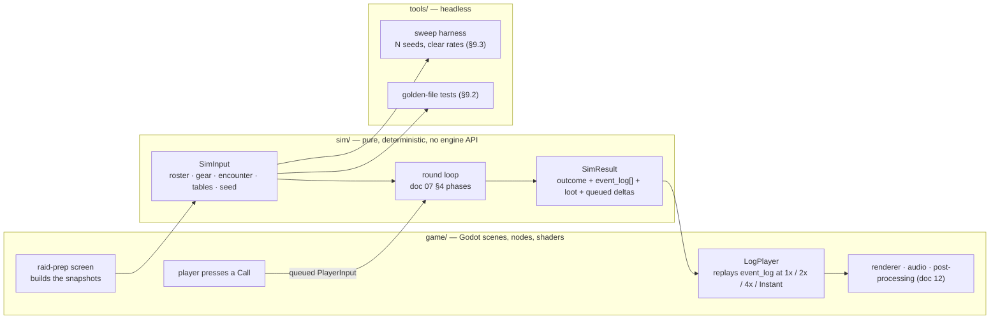

# 14 — Technical Architecture (Godot)

> **Status:** Draft · **Owner:** Design · **Updated:** 2026-09-08
> **Canon:** _source/lead-designer-notes-raw.md, _source/ideaboard-transcription.md
> **Legend:** ✅ CANON = decided · 🔷 PROPOSED = needs sign-off · ❓ OPEN = undecided

**In one line:** This document owns the engine and renderer decision, the sim/presentation split, the project layout, every content and save schema, the content pipeline, determinism, testing, instrumentation, and the build — it is the file engineering opens first.

## 1. Scope

**This doc owns:** engine selection, version **and renderer** policy; the boundary between simulation and presentation; directory layout, dependency rules, and everything under `build/`; the on-disk schema for every content entity and for the save file; the docs → data content pipeline; RNG plumbing; the test and balance-sweep harness; instrumentation mechanism and policy (§12); build, export, and version control; performance budgets.

**This doc does not own:**

| Not owned here | Owner |
|---|---|
| Round order, mistake taxonomy, severity, cascade, threat | [07 — Raid Simulation & The Mistake System](07-combat-simulation.md) |
| Damage, healing, HP pools, the mistake-chance equation and its coefficients | [08 — Stats, Formulas & Numeric Model](08-stats-and-formulas.md) |
| Item stat blocks, families, ID format, tier scaling | [09 — Items & Itemization](09-items-and-itemization.md) |
| Raider fields' *meaning*, generation recipes, backstory tag semantics | [04 — Recruitment & Roster Management](04-recruitment-and-roster.md) |
| Morale numbers, bands, drift, leave/disband rolls | [05 — Morale](05-morale.md) |
| The 2D-HD look, layer stack, shader intent, sprite specs | [12 — Art Direction & Aseprite Pipeline](12-art-direction.md) |
| The `art/` source tree, and the Aseprite invocation — flags, trim policy, filename formats, the export manifest | [12](12-art-direction.md) §7.1, §7.4, §7.6. This doc owns only the build-order position, the CI gate, and everything under `build/` (§10.2) |
| Screen layouts, log pacing, typography | [13 — UI/UX & Frontend Design](13-ui-ux.md) |
| Whether save-scumming is *allowed* | [07](07-combat-simulation.md) §9 and [01 — Core Loop & Session Flow](01-core-loop.md) |

This document specifies *where numbers live and how they load*, never what they are. Every table below carries data shapes, not balance.

---

## 2. Engine decision

### 2.1 What canon actually says

✅ CANON — the whole of canon's engine direction is one line: *"Likely engine: Godot."* (canon: raw notes, *Direction given alongside the notes*). Canon also states *"Aseprite is in the project root; use it heavily for sprite work"* and *"2D-HD aesthetic similar to Octopath Traveler"* and *"'Really awesome frontend design' is a priority"* — all three are engine requirements in disguise.

🔷 PROPOSED — **confirm Godot 4.x.** "Likely" is treated here as a recommendation to ratify, not a settled fact. Below is the case and the bill.

### 2.2 The case, mapped to this game's actual requirements

| Requirement (source) | What Godot 4.x gives us | Confidence |
|---|---|---|
| Hand-authored pixel sprites at a fixed scale, layered into HD scenes (canon: 2D-HD) | First-class 2D renderer: `CanvasLayer`, `Parallax2D` (**4.3+** — on 4.2 the fallback is `ParallaxBackground`/`ParallaxLayer`, whose scroll model differs), `SubViewport` for a fixed-res pixel layer composited into an HD frame, per-texture nearest-neighbour filter | High |
| Bloom / glow / depth-of-field / tilt-shift look of *Octopath* (doc 12) | `WorldEnvironment` glow works in 2D when the viewport is HDR-2D; plus canvas shaders and `BackBufferCopy` for custom passes. **This is the version-sensitive part** — see §2.5 | Medium-high |
| Menu-dense game, nine buildings, roster screens, loot windows (canon: town as progression engine) | Mature `Control` node UI with anchors, themes, and a single `Theme` resource so doc 13's widget library is one file | High |
| Iterate on a comedy log and a sim we will retune weekly | GDScript hot-reload, `.tres`/JSON edited without a rebuild, sub-second script compile | High |
| Headless balance sweeps of thousands of raids (§9.3) | `godot --headless --script` runs a `SceneTree` script with no window and no renderer | High |
| Windows-first PC release (doc 00 §6.1) | One-command export template, ~70 MB binary, no runtime install for the player | High |
| Cost / licence | MIT, no royalties, no seat fees, source available if we hit an engine bug | High |

### 2.3 The honest costs

| Cost | Severity | Mitigation |
|---|---|---|
| GDScript is slow relative to compiled languages (roughly 10–40× slower than C++ for tight loops) | Medium — only matters for §9.3 sweeps | Keep the sim allocation-light and string-free; budget in §9.3; escape hatch is a C# or GDExtension port of `sim/` only |
| Engine 2D post-processing is less turnkey than a bespoke pipeline; 2D glow has real version-to-version behaviour changes | Medium | Pin the version **and the renderer** (§2.5 — Compatibility has no 2D glow at all); prototype the doc 12 look **before** content production starts |
| Smaller commercial 2D-HD precedent than Unity; fewer off-the-shelf assets for this exact look | Low | We are hand-authoring art anyway (canon: use Aseprite heavily) |
| No built-in save/migration framework | Low | §7 specifies ours; it is 200 lines |
| No built-in texture-atlas packer in the import pipeline | Low | Aseprite CLI already packs sheets (§10.2) |
| Godot's own RNG and `Time` are global and tempting | **High — this is the project's main technical risk** | §3 and §8 forbid them in `sim/`, and §3.5 enforces it in CI |

### 2.4 Alternatives, briefly

| Engine | Why not |
|---|---|
| Unity | Heavier iteration, licensing uncertainty, and we would still hand-roll the 2D-HD compositing. No advantage that this game needs. |
| Custom (SDL / love2d / raylib) | We would spend the first two months building the UI toolkit this game is 60% made of. |
| Godot 3.x | 2D HDR and the modern renderer are 4.x. Choosing 3.x is choosing a migration later. |

### 2.5 Version and tooling — undecided

❓ OPEN — **the exact Godot version must be pinned before the first line of code.** Recommendation: the newest stable 4.x that satisfies the doc 12 look, minimum **4.3**. The floor moved up for a concrete reason: **4.2 buys HDR 2D** (what makes glow behave in a 2D scene) and **4.3 buys `Parallax2D`**, which did not exist before it. Doc 12 §6.1's seven-layer stack with parallax factors 0.00 → 1.60 is authored against `Parallax2D`'s scroll semantics; pinning 4.2 means re-expressing that stack in `ParallaxBackground`/`ParallaxLayer`, which scrolls differently and turns those seven factors into a conversion exercise. Pin 4.3 and the factors transfer literally. The pin goes in three places: `project.godot`'s `config/features`, `docs/14` §2.5, and the repo README. Nobody upgrades mid-milestone; upgrades are a scheduled task with a full golden-file re-run (§9.2).

❓ OPEN — **the renderer must be pinned beside the version, and it is not a smaller decision.**

| Decision | Detail |
|---|---|
| Renderer | **Forward+ (default) / Mobile / Compatibility** — pinned in `project.godot` under `rendering/renderer/rendering_method`. **Compatibility (OpenGL3) does not support 2D glow or `rendering/viewport/hdr_2d`**, so choosing it *deletes* doc 12 §2.2 ingredients 5–8 (bloom, tilt-shift DoF, per-pixel lighting, light shafts) — that is, the whole signature of the look. §2.2's HDR-2D row above is only true on Forward+ or Mobile |
| 🔷 PROPOSED default | **Mobile.** It supports HDR 2D and the glow path, and it is materially cheaper than Forward+ on the integrated GPUs §11 targets. Forward+ is the fallback if a 2D effect we need turns out to be Forward+-only; Compatibility is not a look decision we can make quietly |
| The tension to resolve deliberately | §11 sets the target at "60 fps at 1920×1080 on integrated graphics of the last ~4 years" — exactly the audience Compatibility exists to serve. Whichever renderer is pinned, the low-end path is **doc 12's "reduced effects" option on the same renderer**, never a second renderer with a second art look. See OQ-13 |

❓ OPEN — **Godot MCP tooling is unverified.** If a Godot MCP server is intended for editor automation, it must be **installed and proven connectable** before any workflow depends on it. As of this writing the only MCP server configured in this workspace is the Aseprite/pixel plugin server, and it **failed to connect** in the session that wrote this document. Do not plan a pipeline around tooling that has not completed a round trip. Fallback is the Godot CLI, which is fully scriptable and needs no server (§9, §10).

---

## 3. The one rule that matters: the sim is a pure module

🔷 PROPOSED — *Why this exists: this is the single decision that determines whether this game can be balanced at all. Everything else in this document is recoverable from a mistake. This one is not.*

### 3.1 The contract

The raid simulation is a **pure, deterministic, engine-API-independent module**. It is a function of its inputs and nothing else.

```
# sim/sim.gd — the only two entry points into sim/

static func simulate(input: SimInput) -> SimResult
# One shot. Runs the whole encounter to completion and returns the full event log.
# No renderer, no frames, no waiting. Used by Instant mode, the tests, and the sweep harness.

static func advance(state: SimState, inputs: Array[PlayerInput]) -> SimStep
# One round. Returns the mutated state plus the events that round produced.
# Used when the player is watching and can issue Guild Leader Calls mid-fight.
```

```
SimInput  = { roster_snapshot, gear_snapshot, encounter_def, content_tables, master_seed }
SimResult = { outcome, rounds_elapsed, event_log[], loot_rolled[], deltas_queued[], input_log[] }
```

Doc 07 §9 states the same contract as `Simulate(RosterSnapshot, GearSnapshot, EncounterDef, Seed) -> (RaidResult, CombatLog)`. This document adds `content_tables` explicitly, because a sim that reaches out to a global content singleton is not pure and cannot be swept with modified tables.

**Same inputs → byte-identical outputs.** On any machine, at any speed setting, with the renderer attached or detached, in the editor or headless.

### 3.2 The module boundary

| `sim/` MAY use | `sim/` MUST NEVER touch |
|---|---|
| GDScript language types: `int`, `float`, `String`, `StringName`, `Array`, `Dictionary`, `RefCounted` | `Node`, `SceneTree`, `Scene`, `Timer`, `await`, signals, `get_node`, `add_child` |
| Injected `RngStream` objects (§8) | `randi()`, `randf()`, `randomize()`, `RandomNumberGenerator` created inside sim |
| Plain data passed in as arguments | `ResourceLoader`, `load()`, `FileAccess`, `ProjectSettings`, autoloads |
| Pure integer / fixed-point arithmetic | `Time`, `OS`, `Engine.get_frames_per_second()`, `delta`, `process` |
| Emitting `LogEvent` records with `template_id` + params | Building display strings, `print()`, `tr()`, any tween, sound, or particle |
| `Vector2i` for abstract indices if genuinely useful | `Vector2` (32-bit float — a cross-platform divergence source) |

"Engine-independent" here means **engine-API-independent**, not language-independent. The sim is written in GDScript because the rest of the game is; it uses none of the engine's runtime. That is the line that buys the payoff, and it is a line a CI grep can police (§3.5).



The arrows into `sim/` are all data. There is no arrow out of `sim/` into `game/` — no signal, no callback, no node reference. `sim/` does not know the game has a screen.

### 3.3 What this buys, concretely

| Payoff | Without the rule | With the rule |
|---|---|---|
| **Balance is measurable** | Tuning means playing the game and forming an impression. Doc 08's coefficients get set by vibes. | `tools/sweep.gd` runs 10,000 encounters against a fixed roster in seconds and prints a clear rate per encounter. Doc 08's tables become measured, not guessed. |
| **Bugs are reproducible** | "The Cleric healed a corpse sometimes" is unfixable. | A bug report is 200 bytes: `(master_seed, roster_hash, gear_hash, encounter_id, content_version)`. The failing round replays on any machine (doc 07 §9). |
| **Tests exist at all** | A sim wired into nodes can only be tested by running the game. | The sim is a static function over plain data — every rule in doc 07 §4–§8 gets a unit test that runs in milliseconds with no window. |
| **Speed controls are free** | Speed multipliers touch combat timers, so 4× and 1× produce different fights and the player is right to distrust it. | The fight already happened. Speed, pause, and skip are properties of the **log player**, exactly as doc 07 §3.1 requires ("No. Presentation only."). Instant mode is not a second code path. |
| **The renderer can lag** | Sim and view are coupled; a dropped frame is a gameplay event. | The view is a log animator. Art can be re-timed, re-staged, or rebuilt without touching a single rule. |
| **Content changes are auditable** | A silent stat change quietly re-tunes the game. | Golden-file tests fail loudly at the exact seed, and the diff shows which round changed. |

**The load-bearing claim, stated plainly:** the game's difficulty is a probability distribution over thousands of dice rolls made by twelve incompetent people. No human can tune that by feel. Either the sim can be run ten thousand times without a renderer, or this game ships unbalanced. There is no third option.

### 3.4 The wrinkle: Guild Leader Calls

Doc 07 §3.2 gives the player **3 Calls per encounter attempt**, issued while watching. A one-shot `simulate()` cannot accept mid-fight input, so purity and interactivity look opposed. They are not.

🔷 PROPOSED — resolve it with an **input log**, the standard fix from lockstep networking:

1. `SimState` is a plain, serialisable snapshot after Phase 7 of any round.
2. `advance(state, inputs)` consumes the inputs *queued since the previous round* and returns the next state plus that round's events.
3. Every `PlayerInput` is recorded as `{round_issued, call_id}` in `SimResult.input_log`.
4. Replay determinism is over `(inputs, input_log, seed)`. Given the same input log, `simulate()` reproduces the interactive run exactly.
5. Calls are only accepted at phase boundaries (doc 07 §3.1 already forbids commands while paused), so there is no sub-round timing to record.

Consequence for the build: `simulate()` is `advance()` in a loop with an empty input queue. One implementation, two entry points. The replay artifact in doc 07 §9 must be extended by the input log — flagged as OQ-3 because doc 07's five-field artifact currently omits it.

### 3.5 Enforcement — the rule must be mechanical

🔷 PROPOSED — a rule this important is not a convention, it is a build step. `tools/check_sim_purity.sh` fails the build on any forbidden symbol inside `sim/`:

```bash
#!/usr/bin/env bash
# fails if sim/ references the engine runtime
set -uo pipefail
if rg -qn --type-add 'gd:*.gd' --type gd \
  -e '\bget_node\b|\bNode\b|\bSceneTree\b|\bTimer\b|\bawait\b|\bsignal\b' \
  -e '\brandi\b|\brandf\b|\brandomize\b|RandomNumberGenerator' \
  -e '\bTime\.|\bOS\.|\bEngine\.|\bInput\.|\bProjectSettings\b' \
  -e '\bResourceLoader\b|\bFileAccess\b|\bload\(|\bpreload\(' \
  -e '\bprint\(|\btr\(' sim/; then
  echo "SIM PURITY VIOLATION"; exit 1
fi
exit 0
```

Three things about that script are deliberate, because the obvious version of it is broken:

| Detail | Why it is written that way |
|---|---|
| The `if rg …; then fail; fi` shape | `rg` exits **1 when it finds nothing**. The naive `rg … sim/ && echo VIOLATION && exit 1` makes the script's last command exit 1 on a *clean* `sim/` too, so the gate can never report success — it fails the build either way. Branching on `rg`'s status and ending in an explicit `exit 0` is the only form whose exit code means what §10.1 assumes it means. |
| `--type-add 'gd:*.gd' --type gd` | `gdscript` is **not** a ripgrep file type; `--type gdscript` errors out on every rg build. The type has to be defined in the invocation. |
| Findings are reviewed, not auto-trusted | These patterns match inside comments and string literals, and `\bNode\b` will hit prose like "a node reference". A hit is a **question for a human**, not proof of a violation; a genuine false positive is silenced with an inline allow-comment the script also greps for, never by weakening the pattern. |

**Prerequisites (see also §10.1):** the script needs **Git Bash and ripgrep on `PATH`**. Neither is guaranteed on this project's Windows toolchain — `rg` is *not* currently installed on the dev machine. Either install both and document them in the README, or ship the PowerShell equivalent (`Select-String -Path sim\*.gd -Pattern …`, same patterns, same explicit exit codes) and make that the gate. One of the two must exist before §10.1's gate list is real.

Additional enforced rules inside `sim/`:

| Rule | Reason |
|---|---|
| Never iterate a `Dictionary` for anything that affects outcome — sort the keys first | Godot dictionaries preserve *insertion* order, and insertion order depends on the construction path. Doc 07 §9 requires stable iteration order. |
| Damage, healing, threat and HP are integers; probabilities are integers in basis points (1 bp = 0.01%) | Removes float-rounding divergence across platforms and CPU flags |
| No `float` in any comparison that gates an outcome | Same |
| Emit `template_id` + params, never a formatted string | Doc 07 §10.1 requires it; it also roughly halves sweep cost by removing string allocation from the hot loop |

---

## 4. Project layout

🔷 PROPOSED — annotated tree. Paths are repo-relative; Godot sees the repo root as `res://`.

```
A Guild Story/
├─ project.godot                 # engine version pin (§2.5), autoloads, input map, window settings
├─ export_presets.cfg            # Windows Desktop preset (§10.1)
├─ .gitignore                    # §10.3 — does not exist yet
│
├─ sim/                          # PURE. No engine API. Enforced by §3.5. Never imports game/
│  ├─ sim.gd                     # simulate() and advance() — the only public entry points (§3.1)
│  ├─ core/
│  │  ├─ rng.gd                  # RngStream: seeded, injected, channelled (§8)
│  │  ├─ bp.gd                   # basis-point / fixed-point helpers
│  │  └─ ids.gd                  # GENERATED id constants — output of the §6 pipeline
│  ├─ model/                     # plain RefCounted data: no behaviour that touches the world
│  │  ├─ sim_input.gd  sim_state.gd  sim_result.gd
│  │  ├─ raider_state.gd          # combat-time raider: hp, mana, threat, tokens, flags
│  │  ├─ threat_table.gd  token_queue.gd  log_event.gd  mistake_event.gd
│  ├─ rules/
│  │  ├─ round.gd                 # doc 07 §4 phase order
│  │  ├─ mistakes.gd              # doc 07 §5 taxonomy, roll sites, severity
│  │  ├─ cascade.gd               # doc 07 §6 tokens and cascade depth
│  │  ├─ threat.gd                # doc 07 §8
│  │  ├─ classes.gd               # doc 06 kit rules, driven entirely by ClassDefinition data
│  │  └─ formulas.gd              # doc 08 coefficients READ FROM DATA. No literal balance numbers
│  └─ content/                    # typed read-only views over the tables passed into SimInput
│
├─ game/                          # Godot-facing. MAY import sim/. sim/ never imports this
│  ├─ core/                       # the autoloads live here (the tree's name for this folder; reached through Services.gd, never by bare identifier — LESSONS)
│  │  ├─ GameState.gd             # guild, roster, gold, reputation, unlocks; doc 01 owns the FSM; SaveGame.gd is §7
│  │  ├─ GameSettings.gd          # user://settings.cfg (docs/13 §15.1), the display defaults (§10.4)
│  │  ├─ ScreenRouter.gd          # the one screen host; TRANSITION_MS 110 (docs/15 Q-99)
│  │  └─ Audio.gd                 # the fourth autoload: every docs/13 §12.4 hook, the beds, the buses (docs/15 Q-97 / Q-98)
│  ├─ town/                       # one scene per canon building (doc 02)
│  │  ├─ town_map.tscn  guildhall.tscn  tavern.tscn  market.tscn
│  │  ├─ blacksmith.tscn          # canon "Maybe" — behind a feature flag (§5.2)
│  │  └─ adventure_board.tscn
│  ├─ raid/
│  │  ├─ raid_prep.tscn           # builds roster_snapshot + gear_snapshot, draws the seed
│  │  ├─ raid_view.tscn
│  │  ├─ log_player.gd            # THE presentation core: replays event_log; owns speed/pause/skip
│  │  └─ post_mortem.tscn         # reads cascade chain from the log (doc 07 §6)
│  ├─ ui/                         # doc 13's widget library + one Theme resource
│  └─ fx/                         # WorldEnvironment, glow, canvas shaders, layer stack (doc 12)
│
├─ data/                          # AUTHORED GAME CONTENT — JSON, source of truth for the build (§5)
│  ├─ classes/  items/  encounters/  mistakes/  backstory_tags/  buildings/
│  ├─ legendaries/                # 9 hand-authored files (canon: 1 Legendary per class)
│  └─ tuning/                     # doc 05 morale curves, doc 08 coefficients, doc 03 reputation,
│                                 #   flags.json (§5.2), alarms.json (§12.3 thresholds)
│
├─ content_src/                   # DESIGNER-FACING spreadsheets (§6). Never read at runtime
│  ├─ items.tsv  overrides.csv  encounters.tsv  mistake_templates.tsv
│
├─ art/                           # .aseprite SOURCES. Never imported into Godot (doc 12 §7.1 OWNS this subtree)
│  ├─ _palettes/                  # a-guild-story-master.gpl | .ase | night-anchors.gpl
│  ├─ _ref/                       # reference images, non-exporting — .gdignore
│  ├─ characters/                 # <class>/<class>_body|_town|_portrait.aseprite (9 classes)
│  │                              #   legendary/natsuna_shaman.aseprite (8 more pending names)
│  ├─ gear/                       # warrior_bard/ monk_rogue/ healer/ mage_wizard/ heads/ weapons/ offhands/
│  │                              #   -> <slot>_starting|_adventure|_raid.aseprite
│  ├─ town/                       # <building>/<building>_derelict|_working|_prosperous.aseprite + props_r1..r6
│  ├─ raids/                      # raid_01/env_far env_mid enc_01..enc_05 boss_05
│  ├─ fx/                         # hit_flash fumble_glyph dust embers rain lightshaft_masks
│  ├─ icons/                      # one per canon item name
│  ├─ ui/                         # consumed by doc 13
│  ├─ export.manifest.json        # doc 12 §7.6 — the export driver's input
│  └─ tools/                      # export_all.ps1  verify_tags.lua  silhouette_sheet.ps1
│
├─ build/                         # GENERATED. THIS DOC OWNS EVERYTHING UNDER HERE. GITIGNORED
│  ├─ atlas/                      # Aseprite output: <id>.png + <id>.json (doc 12 §7.7 contract)
│  ├─ exports/                    # export_presets.cfg output (§10.1)
│  └─ sweeps/                     # sweep CSVs (§9.3)
│
├─ tools/                         # headless scripts, run via `godot --headless --script`
│  ├─ gen_items.gd                # content_src/items.tsv -> data/items/*.json + docs tables (§6)
│  ├─ sweep.gd                    # the balance harness (§9.3)
│  ├─ analyze_runs.gd             # reduces user://analytics/*.jsonl to the §12.3 metrics
│  ├─ update_goldens.gd
│  └─ check_sim_purity.sh         # §3.5
│
├─ tests/
│  ├─ unit/                       # sim rules, one file per rules/ module
│  ├─ golden/                     # committed expected logs at fixed seeds (§9.2)
│  └─ data/                       # schema-validation tests over data/ (§5.4)
│
├─ docs/                          # this document set. _source/ is canon and never edited — .gdignore
├─ ideaboard/                     # the nine canon screenshots. COMMIT THESE — they are evidence — .gdignore
└─ Aseprite/                      # vendored Aseprite.exe + its user config. GITIGNORED (§10.3) — .gdignore
```

**Who owns which subtree.** [12 — Art Direction & Aseprite Pipeline](12-art-direction.md) owns the `art/` subtree above (reproduced from its §7.1) **and** the Aseprite invocation, flags, trim policy and filename formats (§7.4/§7.6). This document owns everything under `build/`, the import side, and the build-order position of the atlas step (§10.2). The single atlas output path for the whole project is **`build/atlas/`** (singular), matching doc 12 §7.1/§7.6. There is no `build/atlases/`; if a script or doc references one, it is a typo, not a second location.

**The dependency rule, stated once:** `game/` may import `sim/`. `sim/` may import nothing but `sim/`. `tools/` may import `sim/`. `tests/` may import both. Any other direction is a build failure.

**The `.gdignore` rule, and it is not optional:** Godot 4 scans and imports **every recognised file under `res://`**, and `res://` is the repo root because `project.godot` sits there. Left alone, the importer picks up the nine canon `ideaboard/*.png` screenshots and ships them inside the exported `.pck`, does the same to `art/_ref/`, and re-scans the vendored `Aseprite/` tree (its `docs/`, `palettes/`, `data/` images, `crashdb/`) on every editor start. So: **every directory under the project root that Godot must not import carries a `.gdignore` file** — `Aseprite/`, `ideaboard/`, `docs/`, `content_src/`, `art/_ref/`, and `art/` itself once only `build/atlas/` output is consumed. `.gitignore` does **not** affect the Godot importer; the two lists are separate concerns and both are required. This is real import-time and export-size cost that §11's atlas/VRAM budget does not otherwise account for.

---

## 5. Data-driven content

🔷 PROPOSED — *Why this exists: every class, item, encounter, mistake type, backstory tag and building in canon is a row, not a branch. Content that lives in code cannot be swept (§9.3), diffed, or handed to a designer.*

### 5.1 Format decision: JSON under `data/`, with `.tres` for tuning singletons

**Decision:** authored content is **JSON files under `data/`**, loaded once at boot by `content_db.gd` into plain typed structs. `.tres` Resources are used only for a handful of hand-tuned singletons that benefit from the inspector (the doc 03 reputation resource, doc 05's morale curves, the UI `Theme`).

| | `.tres` Resources | JSON (chosen) |
|---|---|---|
| Inspector editing | Yes — real win for one-off tuning | No — mitigated by §6's spreadsheets and a small in-editor viewer |
| Static typing | Yes, via `@export` | No — mitigated by the load-time validator (§5.4), which catches more than typing does |
| Diffability in review | Poor: Godot rewrites unrelated fields and reorders on save | Good: one line per field, stable key order enforced by the generator |
| External tooling (spreadsheets, generators, doc sync) | Painful | Trivial — this is the whole of §6 |
| **Readable by `sim/` without breaking §3** | **No — requires `ResourceLoader`, which `sim/` is forbidden to call** | **Yes — plain Dictionaries passed in as `SimInput.content_tables`** |
| Loadable by the headless sweep with a modified table | Awkward | Trivial |

The last two rows decide it. `.tres` would force either a purity violation or a duplicate loader, and the sweep harness in §9.3 exists precisely to load *altered* tables thousands of times. The inspector is a nice-to-have; a sweepable sim is the product.

✅ RULED (build loop, [15 BL-81](15-open-questions.md#bl-81)) — [03 — Guild Reputation](03-guild-reputation.md) §9 used to propose `res://data/reputation.tres`; the shipped file is `data/reputation.json`, because the table is read by `sim/core/Reputation.gd` and `sim/core/Recruitment.gd` directly and the "readable by `sim/` without breaking §3" row above decides it. `.tres` for tuning singletons survives for the `game/`-side ones (the UI `Theme`); a table the pure sim reads is JSON. See OQ-5.

### 5.2 Conventions that apply to every entity

| Convention | Rule |
|---|---|
| Primary key | An explicit string `id`. **Display names are never keys** — canon proves it: *Worn Leggings* is 2 AC for Warrior and 1 AC for Cleric; *Basic Raid Staff* is +10 / +11 / +12 for Monk / Mage / Wizard; *Raider's Boots — 4 AC / +4 HP* appears in two families (Warrior/Bard and Monk/Rogue) (canon: raw notes *Starting armor*; ideaboard §3.1–§3.4). |
| Immutability | An `id` is permanent. Renaming changes `name`. Removing content sets `retired: true`; the row stays forever so old saves can still resolve it (§7.3). |
| Provenance | Every row carries `canon_ref`: a citation into `_source/`, or the literal `PROPOSED`. This makes canon drift greppable — `rg '"canon_ref": "PROPOSED"' data/` is the "what still needs sign-off" report. |
| Unresolved canon | `stats_pending: true` marks a canon item that exists by name with no stat block (ideaboard §5: Raid Trinket, Final Headband, Final Eyepatch, healer weapons, Mage/Wizard Staff). The loader warns; it never invents a value. |
| Placeholder names | Canon says *"obviously they will need names later"*. Content ids use canon's placeholders (`raid_1`, `adventure_2`, `boss_3`) and every display string comes from data, so naming is one pass over `data/`, not a code search. |
| Feature flags | Canon's "Maybe" systems (Blacksmith, crafting, salvage, level-ups, wishlists) each get a flag in `data/tuning/flags.json`. The game must boot and be completable with every flag off. |
| Versioning | `data/manifest.json` carries `content_version` (integer, bumped by any change to a stat, formula, or encounter). It travels with every save and every replay artifact. |

### 5.3 Schemas

#### 5.3.1 `ClassDefinition` — `data/classes/*.json`

Nine files. ✅ CANON supplies `id`, `name`, `role`, `description` verbatim (canon: raw notes, *Classes*). Everything else is doc 06's kit template made serialisable.

| Field | Type | Notes |
|---|---|---|
| `id` | string | `warrior` … `bard` — the nine canon ids doc 04 §4 already fixes |
| `name`, `role`, `description` | string | ✅ CANON strings, verbatim. `role` is display + comp checking, not logic |
| `armor_family` | enum | `WARBARD` / `MONKROGUE` / `HEALER` / `MAGEWIZ` (doc 09 §4.2) |
| `mh_family`, `oh_family` | enum \| null | `oh_family` is `null` for Monk, Mage, Wizard ✅ CANON (ideaboard §1) |
| `head_family` | enum | Separate field because canon splits head from body — see OQ-6 |
| `dual_wield` | bool | `true` for Rogue only ✅ CANON (ideaboard §1) |
| `act_phase`, `act_sub_order` | int | Doc 07 §4.1 ordering. Data, so the phase list is retunable |
| `threat_profile` | enum | `low` / `medium` / `high` / `tank` |
| `scaling_stat` | enum | `power` / `mana` / `ac` |
| `round_contribution` | object | Kit rule ids + parameters; doc 06 owns the semantics |
| `mistake_affinities` | dict[mistake_id → int] | Weight multiplier ×100. Doc 07 §5.2 affinities |
| `class_state` | enum \| null | `song` / `stance` / `ramp` / `null` (doc 06 §3) |
| `canon_ref` | string | |

❓ OPEN — Bard's kit is canon-TBD (*"Random song effects TBD"*). Its file ships with `round_contribution` empty and `shippable: false`; the validator refuses to build a release while any class has `shippable: false`.

#### 5.3.2 `Item` — `data/items/*.json`

Adopts [09](09-items-and-itemization.md) §12.2 **field-for-field**. Cross-check result: doc 09's schema is implementable as written; this document adds four fields and changes none.

| Field | Type | Req | Notes |
|---|---|---|---|
| `id` | string | yes | Doc 09 §12.1 format: `ITM_T{tier}_{SOURCE}_{FAMILY}_{SLOT}[_{VARIANT}]` |
| `name` | string | yes | Not unique (§5.2) |
| `slot` | enum | yes | `main_hand` `off_hand` `head` `chest` `legs` `feet` `trinket` (doc 09 §3.2) |
| `family` | enum | yes | Drives eligibility; eligible classes are **derived at load**, never stored (doc 09 §12.4) |
| `tier` | int 0–5 | yes | `0` = starting gear ✅ CANON set (raw notes) |
| `source` | enum | yes | `START` `ADV` `RAID` `VEND` `QUEST` |
| `drop_encounter` | int 1–5 \| null | no | ✅ CANON slot-per-boss pattern (ideaboard §4) |
| `ac` `hp` `power` `mana` `damage` | int | yes | Default 0. ✅ CANON values only; never rounded or "fixed" |
| `two_handed` | bool | yes | `true` locks `off_hand` |
| `sell_value` | int \| null | no | Doc 11 owns the number |
| `sprite` | string | no | Atlas key; doc 12 owns it |
| `flavour` | string | no | Empty is legal |
| `canon_ref` | string | yes | |
| **`stats_pending`** | bool | 🔷 added | For the ideaboard §5 items with a name and no stats. Blocks release, not load |
| **`retired`** | bool | 🔷 added | Never delete a row (§5.2) |
| **`rung`** | int 0–10 | 🔷 added | Doc 09 §13.1 `r0`–`r10`. The generator's key; also the sweep's gear-level axis |
| **`generated`** | bool | 🔷 added | `true` if emitted by `gen_items.gd`; hand-edits to a generated row are overwritten (§6) |

Worked example — ✅ CANON stats (ideaboard §3.1, Warrior / Boss 4):

```json
{ "id": "ITM_T1_RAID_WARBARD_CHEST", "name": "Raider's Cuirass",
  "slot": "chest", "family": "WARBARD", "tier": 1, "rung": 2, "source": "RAID",
  "drop_encounter": 4, "ac": 7, "hp": 9, "power": 2, "mana": 0, "damage": 0,
  "two_handed": false, "sell_value": null, "sprite": "items/t1_raid/warbard_chest",
  "flavour": "Dented in the shape of a boss you have not beaten yet.",
  "stats_pending": false, "retired": false, "generated": true,
  "canon_ref": "ideaboard-transcription.md §3.1 Warrior / Boss 4" }
```

And the shape a stat-less canon item takes — no invented numbers:

```json
{ "id": "ITM_T1_RAID_UNIV_TRINKET", "name": "Raid Trinket", "slot": "trinket",
  "family": "UNIV", "tier": 1, "rung": 2, "source": "RAID", "drop_encounter": 5,
  "ac": 0, "hp": 0, "power": 0, "mana": 0, "damage": 0, "two_handed": false,
  "stats_pending": true, "retired": false, "generated": false,
  "canon_ref": "ideaboard-transcription.md §5 — canon name, no stat block" }
```

#### 5.3.3 `Raider` — persisted in the save, not in `data/`

Adopts [04](04-recruitment-and-roster.md) §4 field-for-field. Cross-check produced three reconciliations, all listed as open questions rather than silently applied:

| Field | Type | Notes |
|---|---|---|
| `id` | string (UUID v4) | Stable across saves, never reused |
| `display_name` | string 1–24 | ✅ CANON examples: Bob, Greg, Steve, Natsuna |
| `class_id` | enum | Nine canon classes; immutable |
| `rarity` | enum | `common` `uncommon` `rare` `epic` `legendary` ✅ CANON |
| `legendary_def_id` | string \| null | Non-null only for `legendary` ✅ CANON (1 per class) |
| `portrait_id` | string | |
| `morale` | **float** | See OQ-1: doc 04 says `int`, doc 05 says float-stored. Serialise as float |
| `baseline` | int 20–80 | **Doc 05 §4 field missing from doc 04 §4.** The save record is the union of both |
| `at_risk_strikes`, `crisis_strikes` | int | Same — doc 05 §4 only |
| `mistake_chance_base` / `_floor` / `_ceiling` | int (basis points) | See OQ-2: docs 04/05 use fractions, doc 07 §5.4 works in percent. Store bp, render % |
| `raid_experience` | int | ✅ CANON Common = 0 |
| `equipment` | dict[slot → item_id \| null] | Seven slots; `off_hand` permanently null for Monk/Mage/Wizard ✅ CANON |
| `backstory` | array[BackstoryBullet] | `{ text, tag, polarity, weight }` (doc 04 §8.1) |
| `wishlist` | array[item_id] | ❓ OPEN module, behind a flag |
| `traits` | array[trait_id] | Serialised and always empty — traits are post-1.0 ([15 BL-96](15-open-questions.md#bl-96)); no code reads the field |
| `recruited_at_tier`, `recruited_at_rank` | int / enum | |
| `status` | enum | `active` `benched` `departed` `fired` |
| `runs_attended`, `consecutive_benched`, `wipes_witnessed`, `loot_received` | int | The four counters combat may write |
| `level`, `xp` | int \| null | ❓ OPEN — canon: *"Train raiders < Maybe if we have level ups"*. Reserved, never read |

**Never serialised:** `role` and `morale_band`. Both are derived (doc 04 §4). A derived field in a save file is a bug with a delay on it.

**Snapshot rule** 🔷 PROPOSED — `sim/` never receives a `Raider`. It receives a `RaiderState` built from one: combat fields only, plus `mistake_chance_*` and the flattened gear totals. Doc 04's note that combat writes only four counters plus morale becomes structural: combat *cannot* write a `Raider`, because it has never seen one. Post-encounter deltas come back as `SimResult.deltas_queued` and are applied by `game/` (doc 07 OQ-8 keeps morale post-raid-only, which this shape enforces for free).

#### 5.3.4 `Encounter` — `data/encounters/*.json`

Content ids use canon placeholders. ✅ CANON supplies the five-encounter raid shape and its difficulty stars (raw notes, *Raid Layout and loot drops*); doc 10 owns the scripts.

| Field | Type | Notes |
|---|---|---|
| `id` | string | `adventure_0`, `tutorial_raid`, `raid_1_boss_3`, … ✅ CANON placeholders |
| `display_name` | string | ❓ OPEN — canon: *"obviously they will need names later"*. Ships as the placeholder |
| `kind` | enum | `trash` `harder_trash` `mini_boss` `main_boss` — ✅ CANON's four labels |
| `tier`, `index` | int | Tier 1–5, index 1–5 |
| `difficulty_stars` | int 1–5 | ✅ CANON ★–★★★★★ per encounter |
| `boss` | object | HP, damage profile, target rule, phases — doc 10 |
| `script` | array[ScriptEvent] | `{ round, kind, payload }`: phase change, add spawn, mechanic announce (doc 07 §4.1 Phase 0) |
| `mechanic_checks` | array | `{ id, targets, difficulty, on_fail }` — doc 07 §5.3(b) rolls one per check |
| `round_cap` | int | Hard stop so the sweep always terminates |
| `drop_table` | array | `{ slot, family_scope, count }` — ✅ CANON slot-per-boss pattern; count is doc 09 OQ-6 |
| `mistake_rate_mult` | int (bp) | Doc 07 OQ-9's reduced tutorial rate, as data |
| `disabled_mistakes` | array[mistake_id] | Same — tutorial disables `MIS_FACEPULL`, `MIS_NINJAPULL` |
| `canon_ref` | string | |

#### 5.3.5 `MistakeType` — `data/mistakes/*.json`

Eighteen files, one per doc 07 §5.2 row. Effects are **data-driven tokens**, not GDScript branches, so doc 07 can add a mistake without an engineer.

| Field | Type | Notes |
|---|---|---|
| `id` | string | `MIS_FIRE` … `MIS_AVOIDABLE_DEATH` |
| `display_name` | string | "Stood in the Fire" |
| `roll_site` | enum | `action` `mechanic` `ambient` (doc 07 §5.3) |
| `fires_during` | array[context] | `boss_phase` `trash_phase` `break_phase` `encounter_start` |
| `base_weight` | int | Selection weight before class affinity |
| `base_severity` | enum | `minor` `moderate` `severe` `critical` |
| `severity_clamp` | int | ±1 band (doc 07 §5.4 step 4) |
| `cascade_only` | bool | `true` requires a live token — `MIS_AVOIDABLE_DEATH` |
| `requires_tokens` | array | |
| `emits_tokens` | array | `Fire` `Aggro` `Adds` `Mana` `Distraction` |
| `effects` | array[EffectOp] | `{ op, target, params }` — the only place mechanical effect is expressed |
| `cooldown_rounds` | int | Doc 07 §5.5 anti-spam, default 1 |
| `log_templates` | array[string] | ≥6 required (doc 07 §10 rule 4); validator enforces the count |

#### 5.3.6 `BackstoryTag` — `data/backstory_tags/*.json`

Eighteen files, one per doc 04 §8.3 row. ✅ CANON that backstories drive morale (raw notes, *Morale*: *"Gaining and losing Morale will be based on their back stories largely"*).

| Field | Type | Notes |
|---|---|---|
| `id` | string | `hates_being_benched`, `class_rival:<class>`, … |
| `polarity` | enum | `positive` `negative` `mixed` |
| `listens_for` | array[event_id] | Must name an event the loop already emits (doc 04 §8.3) |
| `delta` | dict[event_id → int] | Morale delta ×100; doc 05 owns the values |
| `bullet_variants` | array[string] | 3–6 per doc 04 §8.1 |
| `excludes` | array[tag_id] | Doc 04's exclusion graph, as data |
| `rarity_rules` | object | Commons must draw ≥1 negative; Epic+ at most 1 (doc 04 §8.1) |

🔷 PROPOSED — the validator fails if `listens_for` names an event no system emits. That single assertion is what stops the tag list drifting into unimplementable flavour.

#### 5.3.7 `Building` — `data/buildings/*.json`

Five buildings ✅ CANON (Guildhall, Tavern, Market, Blacksmith *(Maybe)*, Adventure's Board), levelled per doc 02 §11.

| Field | Type | Notes |
|---|---|---|
| `id`, `display_name` | string | ✅ CANON names, including the apostrophe in *Adventure's Board* |
| `canon_status` | enum | `canon` / `proposed` / `maybe` — Blacksmith is `maybe` ✅ CANON |
| `feature_flag` | string \| null | Non-null for `maybe` buildings |
| `levels` | array[BuildingLevel] | `{ level, unlock_rank, gold_cost, effects[], scene }` |
| `effects` | array | `{ op, params }` — e.g. morale floor, recruit slot count, market stock tier |
| `scene` | string | `res://game/town/tavern.tscn` — the only field pointing at a scene |

✅ CANON — the Adventure's Board is gated by reputation only, never gold (raw notes: *"New Tiers can be unlocked by gaining reputations with the town"*). The validator asserts `gold_cost == 0` for every Board level.

#### 5.3.8 `SaveGame`

See §7.1.

### 5.4 Load-time validation

🔷 PROPOSED — `content_db.gd` validates on every boot in a debug build and in CI. A failed assertion is a hard error in the editor and a refusal to build a release.

| # | Assertion |
|---|---|
| 1 | Every `id` is unique within its entity type; every id referenced anywhere resolves or is `retired` |
| 2 | Every canon-sourced stat matches `_source/` exactly (the golden data test in §9.2) |
| 3 | Item `family` × `slot` is legal for at least one class under the ✅ CANON matrix (ideaboard §1) |
| 4 | `two_handed` items are `main_hand`; classes with `oh_family: null` have no off-hand item eligible |
| 5 | Every canon starting-armour set sums to its ✅ CANON total: Warrior/Bard 7, Monk 6, Rogue 5, Cleric 5, Druid 5, Shaman 5, Mage 4, Wizard 4 |
| 6 | Every Tier 1 Adventure family total matches ideaboard §2.5: 15/+16, 14/+14, 13/+14, 9/+12/+13, 8/+10/+17 |
| 7 | Every `MistakeType.log_templates` has ≥6 entries; every `BackstoryTag.listens_for` event exists |
| 8 | Encounter `round_cap > 0`; every `mechanic_check.on_fail` names a live `MistakeType` |
| 9 | Reputation thresholds strictly increase; `find_weights` rows sum to 1000 (doc 03 §9) |
| 10 | No `stats_pending: true` and no `shippable: false` in a release build |

Assertion 6 is the important one: it is a machine-checked promise that no tuning pass ever silently walks away from canon.

---

## 6. Content pipeline: docs, spreadsheets, and game

🔷 PROPOSED — *Why this exists: the Tier 1 tables live in three places today (the ideaboard screenshots, doc 09's Markdown, and soon `data/`). Three copies of a number is two copies too many.*

**Source of truth, in order of authority:**

1. `docs/_source/` — canon. Read-only, forever.
2. `content_src/*.tsv` — the designer's editing surface. TSV, not CSV: item names contain commas, never tabs.
3. `data/**/*.json` — generated. Committed (so the game runs from a fresh clone), but never hand-edited where `generated: true`.
4. `docs/09-items-and-itemization.md` §6–§8 tables — generated **into** the doc between markers.

```
_source/*.md ──(hand transcription, done once)──> content_src/items.tsv
                                                        │
                          content_src/overrides.csv ─────┤   (doc 09 §13.3 signed deltas;
                                                        │    canon values enter as overrides
                                                        v    and always win over the formula)
                                          tools/gen_items.gd
                                            │            │
              data/items/*.json  <──────────┘            └──────> docs/09 §6-§8 tables
              sim/core/ids.gd    <──────────┘                     (between BEGIN/END markers)
```

`tools/gen_items.gd` responsibilities:

| Step | Behaviour |
|---|---|
| 1. Read | `items.tsv` + `overrides.csv`; every row carries `rung`, `family`, `slot`, `canon_ref` |
| 2. Generate | Rungs r3–r10 from doc 09 §13's multipliers and share table. Rungs r0–r2 are canon and are **never** computed |
| 3. Override | Apply signed deltas from `overrides.csv`, keyed `(family, rung, stat)`. Canon always wins |
| 4. Validate | Re-run §5.4 assertions 5 and 6 against `_source/`. Any mismatch aborts the run — it never writes a file |
| 5. Emit | `data/items/*.json` with stable key order; `sim/core/ids.gd` constants; doc 09 Markdown tables |
| 6. Report | Print the count of `stats_pending` and `canon_ref: PROPOSED` rows — the standing sign-off backlog |

**Enforcement:** CI runs the generator and fails if the working tree changes. That makes "the doc and the game disagree" a build error rather than a discovery made three months later.

The same pattern covers `encounters.tsv` (doc 10) and `mistake_templates.tsv` (the ≥6 log lines per mistake type — a writing task, best done in a spreadsheet).

---

## 7. Save system

🔷 PROPOSED — *Why this exists: this game will change every week for months. An unversioned save format costs weeks of lost test progress and, worse, produces bug reports nobody can trust.*

**Status (2026-09-15): BUILT, and frozen at `save_version` 17 — see §7.5.** `game/core/SaveGame.gd` is the service, `GameState.to_dict()` / `from_dict()` the body, and every row of §7.1 has a key. What deviates from the section as written is marked **As built** in the table below and in §7.3's two path rows; nothing else in §7 is a proposal any more.

### 7.1 What is persisted

| Block | Contents | Notes |
|---|---|---|
| `header` | `save_version` (int), `content_version` (int), `engine_version`, `created_at`, `played_seconds`, `guild_name` | Read **without** parsing the body, so the load menu can show an incompatible save instead of crashing on it |
| `guild` | Gold, reputation points, current rank, unlocked content ids, unlocked building levels, flags snapshot | Rank is derived from RP but stored anyway, and the loader asserts they agree — a cheap corruption canary |
| `roster` | Array of `Raider` (§5.3.3), including `departed` / `fired` rows for the guild log | The largest block; ~40 raiders × ~1 KB |
| `legendaries_found` | array[class_id] | ✅ CANON — one Legendary per class, ever. Must survive a raider being fired |
| `inventory` | `{ item_id: count }` plus per-instance rows if upgrades ship (Blacksmith is canon "Maybe") | |
| `progress` | Per-encounter `{ first_cleared, clear_count, best_rounds }` | Feeds doc 03's reputation awards. **As built:** `cleared` / `attempts` / `best_rounds`, three top-level dictionaries keyed by encounter id rather than one row per encounter; `best_rounds[id]` is written only by a clear and only when it beats what is there |
| `active_run` | `null`, or `{ encounter_id, master_seed, round_index, sim_state, input_log }` | Makes a raid resumable mid-encounter (doc 07 OQ-5) without ever rerolling. **As built (v17):** `{ encounter_id, master_seed, party_ids, resolved, difficulty_mult, ninja_pulled, party, loadout }` — no `round_index`, no `sim_state`, no `input_log`, because §8's sim is a pure function of (party, encounter, content, seed, loadout) and re-running it from the seed *is* the resume. `party` is the roster snapshot AS IT DEPARTED and `loadout` the consumables it carried: `record_attempt()` moves morale and empties the cupboard before the autosave, so a replay rolled against the live roster would not be the fight that happened. Written at the top of `record_attempt()` — the attempt is committed at Depart, which is why this is not a save-scum surface ([15 Q-53](15-open-questions.md#q-53)) — and cleared when the player leaves the report for the town |
| `pending_deltas` | Queued morale/reputation deltas not yet applied | So quitting between encounters cannot eat a consequence. **As built (v17):** doc 05 §7.2's peer hit, `[{ id, class_id }]` — the two facts the next tick's pass reads, and not the `Raider` objects, because a departed raider is not on the roster the save writes |
| `log_tail` | Last N=200 log events of the most recent encounter | Lets the post-mortem survive a reload; capped so the file cannot grow forever. **As built (v17):** `{ encounter_id, seed, cleared, rounds, payout, loot_ids, lines }`, where `lines` is the play-by-play already RENDERED to strings and capped at `GameState.LOG_TAIL_CAP = 200`. Strings and not entries: a content edit must not be able to strand a save holding a template nobody can render |
| `rng_town` | Serialised state of the non-sim streams (tavern refresh, loot rolls) | Otherwise reloading rerolls the recruit list |

**Not persisted:** anything derived (`role`, `morale_band`, eligible-class lists, gear stat totals) and anything in `data/` (a save stores item **ids**, never item stats — otherwise a balance change never reaches an existing save).

### 7.2 Format

| Decision | Choice | Reason |
|---|---|---|
| Location | `user://saves/slot_{n}.json` | Godot's `user://` resolves to `%APPDATA%\Godot\app_userdata\...` on Windows |
| Encoding | Plain JSON, pretty-printed | Debuggability beats obscurity in a single-player premium game with no leaderboards. A tester can attach a save to a bug report and an engineer can read it |
| Compression | None until a save exceeds 2 MB, then gzip | |
| Encryption | **No.** Cheating a single-player game is the player's business | |
| Write | Temp file + `fsync` + atomic rename over the target | An interrupted write must never destroy the previous save |
| Slots | 3 guild slots × (1 manual + 3 rotating autosaves) | The rotation is the real backstop against a bad migration |

### 7.3 Versioning and migration

**The rule:** `save_version` is an integer, bumped by **any** change to the save shape. Migrations are a chain of one-way functions in `game/autoload/migrations/`, one file per step: `v7_to_v8.gd`.

```
load(path):
  header = read_header_only(path)                  # never parses the body
  if header.save_version > CURRENT: refuse, explain, do not touch the file
  body = parse(path)
  for v in range(header.save_version, CURRENT): body = migrations[v].apply(body)
  if header.content_version != CURRENT_CONTENT: body = reconcile_content(body)
  validate(body); return body
```

| Situation | Behaviour |
|---|---|
| Older `save_version` | Migrate on load. **Write a `.bak` of the pre-migration file first** |
| Newer `save_version` | Refuse with a clear message. Never partially load |
| Item / class / encounter id no longer exists | `reconcile_content` moves the reference to `orphaned[]`, logs it, and continues. Never crash, never silently equip nothing |
| Stats changed under an existing id | Nothing to do — saves store ids, not stats (§7.1) |
| A migration has no sensible mapping | It may **drop** a field, never guess a value. Dropping is visible; a guess is not |

🔷 PROPOSED — three non-negotiables that make this cheap instead of painful:

1. **Migrations ship from day one**, with `save_version: 1` and an empty chain. Retrofitting versioning onto live saves is the expensive version of this work.
2. **Every migration gets a test** with a committed fixture save at the old version (`tests/data/saves/v7_sample.json`). The test asserts the migrated body validates.
3. **Never delete a content id** (§5.2). `retired: true` costs one boolean and saves every old save.

**Two paths above are not the paths the tree grew** (SHIP-01; recorded here rather than left as folklore, because a doc that names a directory nobody built sends the next reader looking for it):

| This section says | What shipped | Why |
|---|---|---|
| Migrations in `game/autoload/migrations/`, one file per step (`v7_to_v8.gd`) | `SaveGame.MIGRATIONS`, a `static var` dictionary of `{from_version: Callable}` in `game/core/SaveGame.gd`, one small `static func _vN_to_vN1(body)` per step | A `const` expression may not hold a `Callable`, and `migrate()` has to walk the steps one at a time to say which one it is on. Eight one-screen functions beside the loader that calls them read better than eight files, and `SaveGame.chain_gaps()` can then assert there is no hole — a missing step and a deliberate no-op are indistinguishable from the outside, so every version gets a function even when its body is a stamp |
| Fixtures in `tests/data/saves/v7_sample.json` | `tests/fixtures/saves/v10_sample.json` … `v17_sample.json`, generated by `tests/fixtures/make_save_fixtures.gd` (one real campaign, downgraded step by step) | `tests/fixtures/` is where this project's fixtures already lived. Eight files, one per readable version, and `test_savegame.gd` asserts both that a fixture exists for every version the chain claims to read AND that each one carries exactly the keys its version shipped — so a fixture cannot quietly be the current shape with an older number written on it |

The rest of §7.3 is as written: the header is read without parsing the body, a newer `save_version` is refused rather than partly loaded, a pre-migration `.bak` is written before the file is touched, `reconcile_content` moves orphaned ids instead of crashing, and a step may drop a field but never guess one.

### 7.4 Autosave points

| Trigger | Slot | Reason |
|---|---|---|
| Any town screen transition | rotating | Doc 00 §6.2 asks for it |
| Encounter resolved (clear, wipe, or retreat), after deltas apply | rotating | The moment most worth not losing |
| Attempt start, **after** `master_seed` is drawn and written | rotating | Doc 07 §9 requires the seed to be persisted before round 1, or the save-scum policy is unenforceable |
| Loot assignment committed | rotating | It is a decision with morale consequences |
| Recruit hired / raider fired | rotating | |
| Quit to menu / window close | manual-equivalent | `NOTIFICATION_WM_CLOSE_REQUEST` on the root, with `application/config/auto_accept_quit = false` (or `get_tree().auto_accept_quit = false` at boot) so the handler runs the synchronous write and **then** calls `get_tree().quit()`. `quit_on_go_back` is the Android back-button setting and is irrelevant on Windows — with only that disabled, Godot accepts the quit itself and the save is skipped |

Autosave writes are synchronous and must stay under 50 ms; if the roster grows enough to break that, the save moves to a worker thread — not to a less frequent schedule.

### 7.5 The freeze

**`save_version` 17 is the last bump before 1.0.** Every block §7.1 lists has a key; the four that were still missing — `active_run`, `log_tail`, `best_rounds`, `pending_deltas` — landed together in v17 (ship plan W7-SAVE) precisely so that no later wave has to move the format again. `tests/unit/test_savegame.gd` holds `FROZEN_AT_VERSION = 17` and `FROZEN_SHAPE`, the exact top-level key set `to_dict()` emits; adding a key fails the first assertion and bumping the version fails the second, so a shape change cannot be made by accident — only by the deliberate four-part act §7.3 asks for.

What a later feature does instead: **`flags` is a Dictionary and `FROZEN_SHAPE` does not enumerate its contents.** A "has the player seen this / when did it happen" mark is a key inside `flags`, declared in `GameState.ONCE_FLAG_DEFAULTS` with its default — which is also its TYPE, since JSON has one number type and the loader coerces on the way in — and read and written through `once_flag()` / `set_once_flag()`. A mark is stored only when it differs from its default, so a save carries what happened and nothing else, and an undeclared key is still dropped with a problem line the way an undeclared feature flag is (§5.2). The three the crisis work needs (`last_rank_seen`, `disbanded_day`, `crisis_modal_seen`) and the free walk-in's `walk_in_id` are declared here, in v17, and cost nothing to a save that never sets them.

One other thing v17 changed that is not a shape change and is worth writing down: **every 64-bit seed in the body is written as a string.** JSON has one number type — a float64 — so a splitmix64 seed loses its low bits on the way through it. Measured: a `guild_seed` came back 32 off after one round trip, which is invisible until something re-rolls from it (`next_raid_seed()` and the town streams both diverged after any reload, and a replayed attempt was a different fight with the same number of rounds). `guild_seed`, `active_run.master_seed` and `log_tail.seed` are therefore text in the file and are read back through `GameState._int64()`, which accepts either form — so a v16 save's number still loads, with whatever precision that write left it.

---

## 8. RNG and determinism

🔷 PROPOSED — implements doc 07 §9's requirements. That doc owns *why*; this owns the plumbing.

| Rule | Implementation |
|---|---|
| No global randomness in `sim/` | `randi`, `randf`, `randomize` are CI-forbidden inside `sim/` (§3.5). `sim/` receives an `RngStream` and cannot construct an unseeded one |
| Algorithm | An explicitly implemented PRNG in `sim/core/rng.gd` — **not** Godot's `RandomNumberGenerator`, whose internals may change between engine versions and would silently invalidate every golden file. `SplitMix64` for stream derivation, `xoshiro256**` for draws |
| Channels | `child_seed = splitmix64(master_seed ^ hash64(channel) ^ (round << 32) ^ actor_ordinal)`. Channels: `damage`, `mistake_gate`, `mistake_type`, `severity`, `targeting`, `compliance`, `loot` (doc 07 §9) |
| Why channels | With one shared stream, adding a single roll anywhere shifts every downstream result and no seed reproduces after any content change. Channels make the sim *diff-stable* |
| Draw accounting | Every stream counts its draws; the index goes into tier-3 log entries (doc 07 §10.2) so a divergence can be located to one draw |
| Arithmetic | Integers and basis points only for anything that gates an outcome (§3.5) |
| Iteration order | `(phase_slot, sub_phase_slot, roster_slot_index)`, ties by `actor_id` — doc 07 §9. Dictionaries are sorted before iteration |
| Town RNG | A separate, *saved* stream (`rng_town`, §7.1). It is deliberately not the sim's; a tavern refresh must not perturb a raid |
| Replay artifact | `(master_seed, roster_hash, gear_hash, encounter_id, content_version, input_log)` — ~200 bytes plus the input log. See OQ-3 |

**Save-scum implication, stated but not decided:** because the seed is drawn and persisted *before* round 1 (§7.4), reloading mid-encounter replays the identical fight — reloading cannot reroll a bad round. That is a mechanical consequence of determinism, not a design choice made here. Whether a wipe-retry draws a **new** seed, and whether quitting mid-encounter forfeits, are [07](07-combat-simulation.md) §9 and [01](01-core-loop.md)'s calls. This document guarantees only that both policies are *implementable*: seed-per-attempt is one field, and the engine will honour whichever rule those docs set.

---

## 9. Testing

🔷 PROPOSED — three layers. The third is the one that makes doc 08 real.

### 9.1 Unit tests — `tests/unit/`

Framework: GUT or gdUnit4 (either is fine; pick one and stop discussing it). Because `sim/` is static functions over plain data, these need no scene, no window, and no fixtures beyond a JSON table.

| Target | Example assertions |
|---|---|
| `rules/round.gd` | Phase order is exactly doc 07 §4.1; a heal in Phase 4 can never target a raider who died in Phase 1; a Downed raider dies at Phase 7 if unhealed |
| `rules/mistakes.gd` | `margin` and `S` reproduce doc 07 §5.4's worked example exactly — `p=14`, `r=3.1` → `margin=0.779`, `S=82` → Severe; `r=13.6` → clamped up to Moderate |
| `rules/mistakes.gd` | Per-type cooldown is 1 round; max 1 Critical per round raid-wide; cascade depth caps at 3 (doc 07 §5.5) |
| `rules/cascade.gd` | `MIS_AVOIDABLE_DEATH` cannot be rolled as a root mistake; `caused_by` chains back to a real event id |
| `rules/threat.gd` | `MIS_AGGRO` sets threat above the current primary and the boss retargets in the next Phase 1 |
| `core/rng.gd` | Channel independence: adding a `loot` draw does not change any `damage` draw |
| Gear resolution | Canon totals: Warrior starting set = 7 AC; Tier 1 Adventure Mage/Wizard = 8 AC / +10 HP / +17 Mana; a Rogue equipping two `Iron Adventurer's Sword` reads +10 Damage |

### 9.2 Golden-file tests — `tests/golden/`

For each encounter, a small set of fixed `(roster, gear, seed)` fixtures with the **entire event log** committed as JSONL.

| Aspect | Rule |
|---|---|
| Comparison | Byte-exact on the structured log; `template_id` + params, never rendered strings |
| Coverage | Per encounter: one clear, one wipe, one Call-heavy interactive run with its `input_log` |
| Data goldens | Also golden the canon tables: any edit to a Tier 1 stat fails a test that names the ideaboard section it came from |
| Regeneration | `godot --headless --script res://tools/update_goldens.gd`. The diff is **reviewed by design**, not rubber-stamped by engineering — a golden diff is a balance change with a receipt |
| On engine upgrade | Full golden re-run is part of the upgrade task (§2.5). A diff here means the engine changed float or hash behaviour under us, which is exactly what we want to learn early |

### 9.3 The balance-sweep harness — `tools/sweep.gd`

*Why this exists: doc 08's tuning tables are currently adjectives with numbers next to them. This turns them into measurements.*

```
godot --headless --script res://tools/sweep.gd -- \
    --encounter raid_1_boss_5 \
    --roster tests/rosters/rare_12_full_adv.json \
    --gear rung=1 \
    --seeds 10000 \
    --out build/sweeps/r1b5_rare_adv.csv
```

| Aspect | Specification |
|---|---|
| What it does | Loads content tables and one roster fixture, then runs `sim.simulate()` for seeds `0..N-1`. No renderer, no window, no scene tree beyond the script's own |
| Sweep axes | `--seeds`, `--gear rung=0..10`, `--roster` (rarity mixes), `--comp` (tank/heal/dps splits), `--morale band=0..9`, and `--tuning file=...` to swap one coefficient set |
| Per-run capture | outcome, rounds elapsed, deaths, wipe round, first mistake, root cause of the wipe (`cascade_depth == 0` ancestor), mistake counts by type and severity, Call compliance rate, damage and healing totals |
| Report | **Clear rate** with a 95% Wilson interval; median and p10/p90 rounds; deaths per clear; wipe-cause histogram; mistake-type histogram; per-raider blame table |
| The headline number | Clear rate per encounter per gear rung. That single grid is what tells us whether the ✅ CANON five-encounter, ★–★★★★★ difficulty ramp actually ramps |
| Roster fixtures | Committed JSON: `common_12_starting`, `uncommon_12_adv`, `rare_12_full_adv`, `epic_12_raid_partial`, plus a fixture containing canon's example roster (Natsuna 87, Bob 54, Greg 31, Steve 14) — that roster is a designed test case and should be a permanent one |
| Performance budget | 10,000 encounters in **under 60 s** on the dev machine. Estimate: ~12 raiders × ~20 rounds × ~5 rolls ≈ 1,200 sim ops per encounter ≈ 12 M ops per sweep — comfortable for GDScript **only if** the sim allocates little and formats no strings (§3.5) |
| If the budget fails | In order: (1) remove allocation from the hot loop; (2) run sweeps across N processes, one seed range each — the sim is pure, so this is embarrassingly parallel; (3) port `sim/` to C# or a GDExtension. Note that (3) is *possible at all* only because of §3 |
| CI use | A nightly reduced sweep (500 seeds × every encounter) writes a CSV and fails the build if any clear rate moves more than 5 percentage points from the committed baseline. Balance regressions become build failures |

---

## 10. Build and release

### 10.1 Export

🔷 PROPOSED — Windows-first, per doc 00 §6.1 (the toolchain is already Windows-shaped: canon puts Aseprite in the project root, and it is vendored here as `Aseprite/Aseprite.exe`).

| Item | Value |
|---|---|
| Primary target | Windows Desktop, x86_64, single `.exe` + `.pck` |
| Build command | `godot --headless --export-release "Windows Desktop" build/exports/AGuildStory.exe` |
| Pre-export gates | Six, all six run: (1) sim purity; (2) the content generator produces no tree change; (3) unit + golden tests green; (4) §5.4 assertions 1–10, including "no `stats_pending`, no `shippable: false`"; (5) the atlas check clean (doc 12 §7.6); (6) **the exported `.pck` contains no stray imported paths** — grep the *pack itself*, not the export log, which is the check that catches a missing `.gdignore` (§4). **The tool names this row used to carry — `check_sim_purity.sh`, `art/tools/export_all.ps1` — were never built; the project grew `tools/verify.sh` and `tools/export_build.sh` instead. [15 BL-74](15-open-questions.md#bl-74) maps every gate onto the command that runs it, and all six run today.** |
| Gate prerequisites | **Git Bash and the export templates**, matched to the engine pin (`~/AppData/Roaming/Godot/export_templates/4.7.1.stable.mono/`). Nothing needs ripgrep — every check is plain `grep`, which is why `rg` never being installed has cost nothing. Gate (5) needs `Aseprite/Aseprite.exe` at the canon path and **bash + Lua, not PowerShell** (doc 12's driver is `tools/build_art.sh`; [15 Q-95](15-open-questions.md#q-95) rules how this machine is scripted). A gate that cannot run is not a gate — so each one names the command that runs it in [15 BL-74](15-open-questions.md#bl-74) |
| Build order | atlases (§10.2, via `tools/build_art.sh`) → content generation (§6, `tools/gen_items.gd`) → validation → export (`tools/export_build.sh`) |
| Second target | Linux x86_64 from day one — it costs one preset and is the cheapest way to catch platform-dependent float or path bugs (Steam Deck is doc 00's stretch goal). Shipped as `[preset.1]` and exported by `--linux`; it is **not** launch-checked, because there is no Linux runner on the build machine and a binary nobody started is not a binary anybody verified |
| Not targeted for 1.0 | macOS (signing overhead), consoles, mobile |

### 10.2 The Aseprite atlas step

✅ CANON — *"Aseprite is in the project root; use it heavily for sprite work."* Doc 12 owns sprite specs, layer stack, and the look; this owns the build step only.

| Rule | Detail |
|---|---|
| `.aseprite` files are **sources** | They live in `art/` (doc 12 §7.1) and are never imported by Godot — `art/` is `.gdignore`d (§4). Godot only ever sees generated atlases in `build/atlas/` |
| Generation | Driver: `art/tools/export_all.ps1` + `art/export.manifest.json` (doc 12 §7.6). **This document owns only the build-order position and the CI gate (`export_all.ps1 -Check`); flags, trim policy and filename formats are doc 12 §7.4's, which were verified against the vendored Aseprite 1.3.7-x64.** Do not restate a flag list here — a second copy is a second source of truth, and the one that was wrong here forbade nothing and trimmed everything |
| Incremental | `export_all.ps1` rebuilds an entry only when its source is newer than its output (doc 12 §7.6); `-Force` rebuilds all. The staleness manifest lives in `build/atlas/manifest.json` |
| Import settings | Nearest filter, mipmaps off, "Fix Alpha Border" on, no compression on the pixel layer (doc 12 §7.7). The importer reads `meta.frameTags` (name/from/to/direction), per-frame `duration`, and `meta.slices` for anchors — which is why the export must pass `--format json-array --list-tags --list-slices` and, on characters, must **not** trim. Doc 12 owns which layers are pixel-exact and which are HD |
| Atlas budget | ≤ 4096×4096 per atlas; group by scene so a town screen loads one or two atlases, not twelve |
| `build/` is generated | Never committed. A fresh clone must be able to produce a running build from `art/` + `content_src/` alone |

### 10.3 Version control — start it now

🔷 PROPOSED, and the most urgent recommendation in this document: **this project is not currently a git repository.** There is no `.git` directory in the project root. Nine canon screenshots, two canon source files, and ten design documents currently exist in exactly one place.

Initialise before the first line of code:

```bash
git init
git add .gitignore docs/ ideaboard/
git commit -m "Design docs and canon ideaboard screenshots"
```

`.gitignore` — the version to create:

```gitignore
# Godot
.godot/                 # generated import cache (Godot 4). Never commit
*.translation

# Generated build output
build/
export/
*.pck
*.exe
*.zip

# Vendored Aseprite: a licensed binary plus its user config, logs and crash dumps
Aseprite/

# OS / editor
.idea/
.vscode/
.DS_Store
Thumbs.db
desktop.ini
```

| Decision | Rule |
|---|---|
| Commit | `docs/` (including `_source/`), `ideaboard/`, `sim/`, `game/`, `data/`, `content_src/`, `art/` (`.aseprite` sources), `tools/`, `tests/`, `project.godot`, `export_presets.cfg` |
| Ignore | `build/`, `.godot/`, `Aseprite/`, `.idea/` |
| `.gdignore` (a **separate** list) | Committed `.gdignore` files in `Aseprite/`, `ideaboard/`, `docs/`, `content_src/`, `art/_ref/` — and `art/` itself once only `build/atlas/` output is consumed (§4). `.gitignore` stops git; it does not stop the Godot importer. Both lists are required, and the `.gdignore` files are committed precisely because they are project configuration, not local preference |
| `Aseprite/` | Ignored — it is a licensed third-party binary plus per-user config (`aseprite.ini`, `sessions/`, `crashdb/`). The README documents that a build machine needs Aseprite at that path |
| `art/` binaries | `.aseprite` files are small; commit them directly. If they exceed ~50 MB total, move to Git LFS — decide before that happens, not after |
| `export_presets.cfg` | Committed, but it must never contain a keystore password. Signing credentials come from environment variables |
| OneDrive | The project currently sits inside a OneDrive folder. OneDrive and `.godot/` interact badly (file locks during import, sync of a large generated cache). ❓ OPEN — move the working copy outside OneDrive and let git be the backup. See OQ-8 |

### 10.4 Display defaults

The row [13 §15.1](13-ui-ux.md) points at ("Resolution / window mode / vsync — Native, borderless — doc 14"). Landed by W6-SETTINGS (SHIP-06; [15 BL-130](15-open-questions.md#bl-130)): before it the game opened a 1536×1024 window whatever the desktop was, and on a 1366×768 laptop the bottom 256 px — every commit row — was off the screen.

| Key | Default | Where it is applied | Behaviour |
|---|---|---|---|
| `window_mode` | `borderless` | `GameSettings.apply_window_mode()` from `Boot._ready()` and the Options row; `F11` / `Alt+Enter` (`nav_fullscreen`) swap it anywhere | `borderless` = `Window.MODE_FULLSCREEN` at the desktop's own size (Godot's fullscreen is the borderless kind); `windowed` = the largest 3:2 window no wider than 1536 that fits the usable desktop once the OS chrome is allowed for (`windowed_size()`: 1020×680 on a 1366×728 desktop), centred |
| `display_aspect` | `keep` | `GameSettings.apply_display_aspect()` | `keep` letterboxes the 1536×1024 frame; `expand` fills (art/ref/specs/11 §1) |
| `resolution` | `native` | — | The frame is authored at 1536×1024 and `window/stretch/mode = canvas_items` scales it; there is no resolution list |
| `vsync` | `true` | `DisplayServer.window_set_vsync_mode`, same door as the mode | On / off |
| `project.godot` | `window/size/mode = 3`, overrides 1536×1024 | engine, before Boot runs | A fresh install never opens a window larger than the screen even before the settings file is read |

`tools/shot.gd` is unaffected (it renders into a SubViewport at the reference size). The Options screen lists the mode as a cycle chip and V-sync as On / Off ([15 BL-140](15-open-questions.md#bl-140)); nothing here is versioned with `save_version` — options are a property of the installation ([13 §15.1](13-ui-ux.md)).

---

## 11. Performance

🔷 PROPOSED — *Why this exists: it would be easy to spend optimisation effort on the sim. The sim is not the cost. The frame is.*

**The sim is cheap.** Twelve raiders, discrete rounds, no continuous time, no physics, no pathfinding, no navigation, integer arithmetic. An encounter is thousands of operations, not millions. It resolves faster than the player can read one log line — which is exactly why the log player throttles playback for readability rather than the sim throttling for cost. §9.3's budget exists for *ten thousand* encounters, not for one.

**The real costs, in order:**

| # | Risk | Why it bites | Budget / mitigation |
|---|---|---|---|
| 1 | **Post-processing (doc 12)** | Glow/bloom is a multi-pass blur over the full frame; at 1080p that is fixed per-frame cost regardless of scene complexity, and it lands hardest on the low-end integrated GPUs a 2D game's audience assumes it is safe on | One glow pass, budgeted; every effect individually toggleable; a "reduced effects" option that keeps the art readable. Profile on integrated graphics **before** the look is locked |
| 2 | **Overdraw from layered environments** | The 2D-HD look is built from stacked parallax and lighting layers. Each full-screen translucent layer is another full-screen fill; eight layers is 8× fill rate on a GPU that is often fill-limited | Cap the town scene at a stated layer count (start at 8, measure); no full-screen alpha layer that is ~invisible; use opaque bases where possible |
| 3 | **Atlas size and VRAM** | Doc 00 estimates ~350–450 items for 1.0, plus nine classes of raider sprites and five buildings across four upgrade levels. Naively one atlas per screen becomes hundreds of megabytes at 4K-friendly resolutions | ≤ 4096² per atlas; group by scene; load and free per screen rather than holding everything resident; icons in one shared atlas |
| 4 | **UI redraw churn** | This is a menu-dense game. A roster of 40 raiders with live morale faces can re-layout every frame if built carelessly | Update UI on signal, never in `_process`; `Control` visibility toggles rather than rebuilds; virtualised lists past ~30 rows |
| 5 | **Log player allocation** | A 20-round encounter emits hundreds of events; naive per-event `Label` creation churns the heap mid-fight | Pooled log rows; render only the visible window; the log is data and can be re-rendered at any time |

**Targets:** 60 fps at 1920×1080 on integrated graphics of the last ~4 years; 60 at 1440p on a low-end discrete GPU; 30 floor at 4K. **The shipped budget, as measured** ([15 BL-104](15-open-questions.md#bl-104)): mount ≤ 140 ms warm, frame ≤ 16.6 ms, calibration loop ≤ 10 ms, on the reference laptop boosting — `verify.sh` stage 8 (`tools/perf_probe.gd`) prints it and stays WARN, never FAIL, so a slower machine reads a number rather than a red gate; the README's budget line says "measured on the second machine at the native window (W10-WALK)" so WARN is never read as "not measured"; `test_perf_mount.gd`'s cache invariants are the FAIL that exists. Draw calls under ~800 per frame in the busiest town screen. Measure with Godot's `Performance` monitors on a real low-end machine, not the dev workstation — and measure the week the doc 12 look is prototyped, not the month before ship.

---

## 12. Instrumentation

**Status ([15 BL-105](15-open-questions.md#bl-105), 2026-09-15): 🔷 PROPOSED, post-1.0; nothing under `game/` produces these events; the balance harness (§9.3) is the shipped instrument.** The only file the shipped game writes about itself is Godot's crash log (`debug/file_logging`, five files) — [00 §6.1](00-vision-and-pillars.md)'s "no telemetry-driven tuning".

🔷 PROPOSED — *Why this exists: four documents demand metrics, no document said how any of them are collected, and doc 00 forbids telemetry outright. This section is the mechanism that lets those demands be met without breaking the anti-goal — and it is the last unowned piece of the harness, because this doc already owns the save format (§7), the build gates (§10.1) and the sweep harness (§9.3).*

### 12.1 The policy, first, because it decides the mechanism

| Rule | Detail |
|---|---|
| **Local only** | Run logs are written to the player's own machine and read by a human. Nothing is aggregated anywhere |
| **No network egress of any kind** | No sockets, no HTTP, no queued upload, no "anonymous" ping, not even an opt-in one in this design. This is what makes the section compatible with [00](00-vision-and-pillars.md) anti-goal **A11** ("No always-online, no accounts, no telemetry required to play") *as written* — a local file the player already owns is not telemetry |
| **Off in release** | Instrumentation is gated behind a `--instrument` launch flag (or a playtest build flag), default **off**, paired with the debug overlay in OQ-12 so one switch turns on both the log and the way to read it live |
| **The playtester is the transport** | A tester attaches the run log to a report exactly the way §7.2 already expects them to attach a save. That is the entire collection pipeline, and it is the reason the format has to stay human-readable |

### 12.2 Format and location

| Decision | Choice | Reason |
|---|---|---|
| Location | `user://analytics/run_{iso8601}_{guild_id}.jsonl` — alongside the saves in §7.2 | One directory a tester can find and zip; same `user://` root, so no new path policy |
| Encoding | **JSONL** — one event object per line, append-only, flushed on write | Survives a crash mid-session (a truncated last line is discardable); greppable; readable in a bug report without a tool |
| Common envelope | `{ t_iso, played_seconds, save_version, content_version, event, payload }` | `content_version` on every line is what makes a metric attributable to a build — a number from a superseded tuning pass is worse than no number |
| Retention / size cap | Keep the **10** most recent run logs, hard-cap each at **5 MB**; on cap, stop appending and write one final `log_truncated` event | An uncapped append-only log on a player's disk is a bug, and a silently rotated one loses the run that mattered |
| Never logged | Display names the player typed, file paths, machine identifiers, anything not needed by §12.3 | The file leaves the machine as an attachment; it must be boring to read |

### 12.3 Event schema — derived from what the other docs actually asked for

Each row exists because a named metric elsewhere requires it. Nothing here is collected speculatively.

| Event | Payload | Serves |
|---|---|---|
| `encounter_attempt` | `{ encounter_id, attempt_index, outcome, rounds, master_seed, gear_rung, roster_rarity_mix, reputation_rank }` | **Attempts-per-first-clear per encounter** (03 §8.3, alarm > 6 median). `attempt_index` + `outcome` is the whole metric; the seed makes any outlier replayable via §8 |
| `rank_dwell` | `{ from_rank, to_rank, real_minutes_in_from_rank }` | **Real minutes per reputation rank** (03 §8.3, alarm > 2× neighbouring median) — the dead-**Established**-rank check |
| `recruit_generated` | `{ rarity, reputation_rank, recruits_since_last_rare_or_better }` | **Recruits generated per Rare-or-better** (03 §8.3, validates M2's threshold of 25; alarm > 20 median at Respected) |
| `rank_reached` | `{ rank, played_seconds, encounters_cleared }` | **% of saves reaching each rank** (03 §8.3 funnel, alarm < 40% to Established); also **Legendary acquisitions per save by rank** when paired with `legendary_acquired` |
| `legendary_acquired` | `{ class_id, reputation_rank, raid_tier }` | 03 §8.3's 15 / 50 per-mille split check |
| `catchup_flag_activated` | `{ flag_id, reputation_rank, trigger }` | 03 §8.1 **M3** activation rate — the row that currently reads "if telemetry shows stalls" with no telemetry behind it |
| `tier_boundary_balance` | `{ tier, coin_balance, tier_total_earned }` | **Coin balance at each tier boundary** against 11 §4.4's 0–20% carried-balance target (11 §13) |
| `drop_disposition` | `{ item_id, rung, disposition: kept\|sold\|salvaged, was_wishlisted }` | **Drops sold vs kept vs salvaged**, and **wishlist items sold**, per tier (11 §13) |
| `purchase_declined` | `{ item_id, price, coin_balance }` | **Purchases declined for affordability** (11 §13) |
| `morale_band_transition` | `{ raider_id, from_band, to_band, cause_event_id }` | 05 §3.1's band state name is called "a telemetry key"; this is the event that makes it one |
| `recruit_outcome` | `{ raider_id, recruited_at_rank, runs_attended, final_status }` | 04 §4's justification for `recruited_at_rank` as "telemetry and flavour" — without this event the field is flavour only |
| `session_start` / `session_end` | `{ engine_version, renderer, resolution, avg_fps, p1_fps }` | §11's performance targets, measured on the machines that actually matter rather than the dev workstation |

**Reduction, not collection, is the work.** `tools/analyze_runs.gd` (headless, same shape as §9.3's harness) reads a directory of JSONL files and prints the six 03 §8.3 metrics and the four 11 §13 metrics against their stated alarm thresholds. The thresholds live in `data/tuning/alarms.json` so a threshold change is a data diff, not a code change. **No alarm fires automatically anywhere** — it prints, a human reads it, and that is the only "someone watching the numbers" this design has.

### 12.4 What this does *not* resolve

The mechanism above is honest about being playtest instrumentation. It does not tell us whether a shipped build ever reports anything, and two documents currently assume someone is watching live numbers. See **OQ-14**.

---

## 13. Open questions

| # | Question | Why it matters | Proposed default |
|---|---|---|---|
| OQ-1 | Is `morale` an int (doc 04 §4) or a float (doc 05 §4, "Stored as float so sub-1 drift accumulates")? | Two docs specify one save field two ways. It also changes whether drift below 1.0 per tick does anything at all. | **Float**, displayed rounded. Doc 05's drift model needs it; doc 04's table should be amended to match. |
| OQ-2 | Are mistake chances stored as fractions (doc 04: `0.01–0.45`) or percent (doc 07 §5.4 worked example: `p = 14`)? | A silent 100× error in the single most important number in the game. | Store **integer basis points** (1400 bp = 14%). Render as percent. Never store a bare float probability. |
| OQ-3 | Does the replay artifact include the Guild Leader Call input log? Doc 07 §9 lists five fields and omits it. | Without the input log, an interactive run is not reproducible, so the bug reports that matter most are the ones we cannot replay. | **Yes** — add `input_log` to the artifact (§3.4). It is a handful of bytes. |
| OQ-4 | Is `sim/` written in GDScript, or C#/GDExtension from the start? | Decides whether §9.3's 60 s sweep budget is comfortable or tight, and how fast rules iterate. | **GDScript.** Iteration speed matters more now; §3's purity keeps the port available if measurement demands it. |
| OQ-5 | JSON everywhere, or `.tres` for tuning as doc 03 §9 proposes? | Two formats means two loaders and two validation paths. | **JSON for content, `.tres` for tuning singletons only** (§5.1), with tuning flattened to Dictionaries before entering `SimInput`. |
| OQ-6 | Does the Item schema need a separate `head_family`? ✅ CANON's matrix gives Warrior its own Head family while every authored table gives Warrior and Bard the identical *Raider's Helm*. | Decides whether head is a fifth armour family or a column of the existing four — a data-shape difference, not a stat difference. | Keep `head_family` as a distinct field so **either** reading is expressible without a migration. Doc 09 OQ-1 makes the design call. |
| OQ-7 | Which Godot version, exactly? | Pins 2D HDR/glow behaviour (doc 12), and therefore the entire look. 4.2 buys HDR 2D; `Parallax2D`, which doc 12 §6.1's layer stack is authored against, only exists from 4.3. | Newest stable 4.x, minimum **4.3**. Pin it in `project.godot` and here before any code. |
| OQ-8 | Does the working copy move out of OneDrive? | OneDrive sync plus Godot's `.godot/` cache produces file locks and import corruption; it also makes git history the *second* source of truth. | **Yes.** Move to a local path; git plus a remote is the backup. |
| OQ-9 | Is a Godot MCP server part of the toolchain? | If a workflow assumes it and it does not connect, the pipeline silently has no automation. The pixel/Aseprite MCP server failed to connect in this session. | **Verify before depending.** Ship the CLI path (§9, §10), which needs no server. |
| OQ-10 | Are morale/reputation deltas applied by `game/` from `SimResult.deltas_queued`, or written by the sim? | Deciding "sim writes nothing outside its own state" is what keeps the sim swept and testable. | **`game/` applies them.** The sim only *reports*. This also enforces doc 07 OQ-8 (post-raid-only morale) structurally. |
| OQ-11 | Is `active_run` resumable mid-encounter, or is quitting a forfeit? | Determines whether `SimState` must be fully serialisable — a real constraint on the sim's data types. | **Serialisable and resumable** (doc 07 OQ-5's proposed default). Since the seed is fixed, resuming rerolls nothing. |
| OQ-12 | Do we ship a debug console / dev overlay in release builds? | It is the fastest way to reproduce a player's bug, and the fastest way to leak balance internals. | Ship it behind a launch flag, disabled by default, with tier-3 log verbosity attached (doc 07 §10.2). Same flag as §12's `--instrument`. |
| OQ-13 | Which renderer — Forward+, Mobile, or Compatibility (§2.5)? | Compatibility supports neither 2D glow nor `rendering/viewport/hdr_2d`, so picking it deletes doc 12 §2.2 ingredients 5–8 and with them the signature of the look. §11's target is integrated graphics, which is exactly Compatibility's audience — so this is a real trade, not a formality. **Consequence line: a Compatibility fallback for low-end GPUs must ship the doc 12 "reduced effects" path, not a second art look.** | **Mobile** (HDR 2D supported, cheaper than Forward+ on integrated GPUs), with Forward+ as the fallback if a needed 2D effect proves Forward+-only. Pin in `project.godot` `rendering/renderer/rendering_method` beside the version pin. |
| OQ-14 | Does any build ship network telemetry? | 00 A11 says no; 03 §8.1 M3's config flag and 03 §8.3's alarm thresholds assume someone is watching the numbers — reconcile as playtest-only local logs or amend 00 A11. | **Playtest-only local logs** (§12): JSONL under `user://analytics/`, no egress, off in release, a tester attaches the file. If the project ever wants aggregate data from shipped builds, that is an amendment to 00 A11 and a business decision, not an engineering one. |

---

## Related documents

- [00 — Vision & Design Pillars](00-vision-and-pillars.md) — platform, resolution target and content-volume envelope that this architecture is sized for; §6.1's engine row defers to §2 here, and anti-goal A11 is the constraint §12 is built to satisfy (see OQ-14).
- [01 — Core Loop & Session Flow](01-core-loop.md) — the state machine `game_state.gd` implements, and the retry/forfeit design call that §8's determinism has to honour.
- [02 — The Town & Its Buildings](02-town-and-buildings.md) — the five canon buildings behind the `Building` schema in §5.3.7 and the town scene structure in §4.
- [03 — Guild Reputation](03-guild-reputation.md) — the reputation resource in its §9, which §5.1 and OQ-5 reconcile with the JSON decision here; its §8.3 metrics and §8.1 M3 flag are what §12.3's event schema is derived from.
- [04 — Recruitment & Roster Management](04-recruitment-and-roster.md) — the raider data model §5.3.3 implements field-for-field, plus the generation pipeline order the town RNG stream must reproduce.
- [05 — Morale](05-morale.md) — the morale fields §5.3.3 adds to doc 04's record, and the float-vs-int conflict in OQ-1.
- [06 — Classes, Roles & Raid Composition](06-classes-and-roles.md) — the kit template `ClassDefinition` serialises, including the canon-TBD Bard.
- [07 — Raid Simulation & The Mistake System](07-combat-simulation.md) — the rules the pure module in §3 executes, and the determinism requirements §8 plumbs.
- [08 — Stats, Formulas & Numeric Model](08-stats-and-formulas.md) — the coefficients loaded from `data/tuning/`; the sweep harness in §9.3 is the tool that measures them.
- [09 — Items & Itemization](09-items-and-itemization.md) — the item schema §5.3.2 adopts, and the tier generator plus `overrides.csv` that §6 automates.
- [10 — Content Structure: Adventures, Raids & Encounters](10-content-and-encounters.md) — the encounter scripts and mechanic checks the `Encounter` schema in §5.3.4 has to carry.
- [11 — Economy, Shops & Crafting](11-economy-and-crafting.md) — owns `sell_value` and the upgrade/salvage data that decides whether inventory needs per-instance item rows in §7.1; its §13 telemetry row is the other half of §12.3's event list.
- [12 — Art Direction & Aseprite Pipeline](12-art-direction.md) — **owns the `art/` tree (§7.1) and the Aseprite invocation (§7.4/§7.6)** that §4 reproduces and §10.2 only sequences; the look whose post-processing is the actual performance cost in §11, and the §2.2 ingredients 5–8 that OQ-13's renderer choice can delete.
- [13 — UI/UX & Frontend Design](13-ui-ux.md) — the log player's pacing and typography; §3 guarantees it can be rebuilt without touching a rule.
- [_source/lead-designer-notes-raw.md](_source/lead-designer-notes-raw.md) — canon for the engine line, the Aseprite direction, classes, morale bands, and starting armour.
- [_source/ideaboard-transcription.md](_source/ideaboard-transcription.md) — canon for the slot matrix and every Tier 1 stat the §5.4 validator asserts against.
