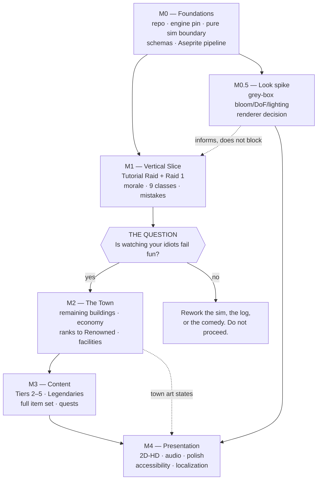

# 16 — Production Roadmap

> **Status:** Draft · **Owner:** Production · **Updated:** 2026-09-08
> **Canon:** _source/lead-designer-notes-raw.md, _source/ideaboard-transcription.md
> **Legend:** ✅ CANON = decided · 🔷 PROPOSED = needs sign-off · ❓ OPEN = undecided

**In one line:** This document is the build plan — five milestones in dependency order, the entry and exit criteria for each, the docs each one implements, the risks each one retires, a risk register, a cut list, and a proposed team shape. It converts fourteen design documents into an order of operations.

---

## 1. Scope

**This doc owns:** milestone definition and sequence; entry/exit criteria per milestone; the dependency spine between milestones; the vertical-slice cut and its defence; the risk register; the cut order at the production level; proposed team shape and the milestone each role is first needed for; the canon-reconciliation queue (§4.4) and which milestone each conflict blocks.

**This doc does not own:**

| Not owned here | Owner |
|---|---|
| Whether the content volume is affordable, and the 1.0 content cut order it starts from | [00 — Vision & Design Pillars](00-vision-and-pillars.md) §6.3 |
| The acceptance criteria VS1–VS8 and R1–R9 that §6 and §9 schedule | [00](00-vision-and-pillars.md) §8 |
| Content counts — 42 encounters, 21 boss actors, 26 trash actors, ~360 item records, 90 icon renders | [10 — Content Structure](10-content-and-encounters.md) §12 |
| Art asset counts, the animation tag set, the `art/` tree and the Aseprite invocation | [12 — Art Direction & Aseprite Pipeline](12-art-direction.md) §5–§7 |
| The engine and renderer pin, the project layout, schemas, the purity rule, the harnesses | [14 — Technical Architecture](14-technical-architecture.md) |
| Screen-level build order inside a milestone (its §15 phases 1–8) | [13 — UI/UX](13-ui-ux.md) §15 |
| Every balance number, every formula, every stat block | [08](08-stats-and-formulas.md), [09](09-items-and-itemization.md), [10](10-content-and-encounters.md) |

This document says **when and in what order**, never **what the numbers are**. Where a milestone names a figure, it is quoted from the owning doc so the two can be diffed.

**Why this doc exists, stated plainly.** [Doc 10 §12](10-content-and-encounters.md) records that its counts "were previously handed to a *16 — Production Roadmap* that does not exist", and [doc 10 §14 Q14](10-content-and-encounters.md) closes with "**Schedule and staffing have no owner** and this needs a decision, not a default." This is that owner. ❓ OPEN — [doc 00 §1.1](00-vision-and-pillars.md)'s canonical index runs 00–14 and must gain a row for this file; there is no doc 15, and this doc does not invent one. The number 16 is kept because doc 10 already referenced it twice.

---

## 2. What this document deliberately does not contain

🔷 PROPOSED — and this is a design decision about the roadmap itself, not an omission.

**There are no dates, no week counts, and no hour estimates in this document.** Team size, seniority and availability are all unknown; the project is a documentation set and a vendored copy of Aseprite. Any calendar attached to that would be invention dressed as a plan, and would be quoted back later as a commitment.

What a roadmap can honestly provide without knowing the team is **sequence and dependency**: what must exist before what, what each stage proves, and what it is safe to stop doing. That is what follows.

| Provided here | Deliberately absent |
|---|---|
| Milestone order and the dependency that forces it | Start and end dates |
| Entry criteria (what must be true to begin) | Duration, in any unit |
| Exit criteria (what must be true to stop) | Per-task hour estimates |
| Which docs each milestone implements | Headcount ramp by date |
| Which risks each milestone retires | A release date |
| Relative cost, stated as **S / M / L / XL** against the largest item in the same milestone | Absolute cost |

**The relative-cost scale** is comparative and internal only: **S** = one person, one sitting; **M** = one person, sustained; **L** = the milestone's dominant line item; **XL** = larger than any single milestone should contain and therefore a candidate for the cut list (§10). It exists so two items in the same table can be ranked, not so a total can be summed.

**Add a schedule when, and only when, two things are true:** (1) Milestone 0 is complete, so estimates are made against a real repo rather than a document; (2) the team shape in §11 has actual names against it. Estimating before M0 estimates the wrong project.

---

## 3. The dependency spine

🔷 PROPOSED. The order below is not preference. Each arrow is a hard dependency where the later item cannot be built correctly, or cannot be *verified at all*, before the earlier one.

**The four dependencies worth stating in words, because they are the ones teams break:**

1. **M0 before everything.** The purity gate ([14 §3.5](14-technical-architecture.md)), the golden-file harness ([14 §9.2](14-technical-architecture.md)) and the sweep harness ([14 §9.3](14-technical-architecture.md)) are cheap to add to an empty repo and expensive to retrofit onto a working game. A sim that has already called `Time.get_ticks_msec()` in forty places is not made pure by adding a ripgrep check; it is made pure by a rewrite.
2. **M1 before M2.** The town is the progression bar ([00 Pillar 1](00-vision-and-pillars.md)) — but a progression bar for an activity that is not fun is a well-decorated menu. M2 is the largest presentation-and-content surface in the project outside M4; committing it before the raid loop is proven is committing the budget to the wrong half of the game.
3. **M2 before M3.** Tiers 2–5 are the same content shape five times over ([10 §12](10-content-and-encounters.md): one palette, one boss silhouette, one environment identity per tier). Building tier 2 before the economy, the rank ladder and the reputation gates exist means building it against a stub and then rebuilding its gating.
4. **The look spike runs early but gates nothing except M4.** [Doc 12 §2.2](12-art-direction.md) flags ingredients 5–8 (bloom, tilt-shift DoF, per-pixel lighting with normal-mapped sprites, light shafts) as "shader tasks that should be prototyped on grey boxes in week one", and [doc 14 OQ-13](14-technical-architecture.md) cannot be answered without that prototype. It runs alongside M0/M1 so the answer arrives before art production, not after.

**What deliberately runs in parallel with everything:** the canon-reconciliation queue (§4.4), and comedy writing (§7.6, §8.7). Both are cheap per unit, both have long lead times, and both block other people when they are late.

---

## 4. Milestone 0 — Foundations

**Nothing in M0 is player-facing.** No screen, no sprite, no encounter. This is the milestone most likely to be skipped by a team that wants to see something move, and the one that makes every later milestone cheaper.

### 4.1 Why this comes first

| Foundation | What it costs in M0 | What it costs if retrofitted |
|---|---|---|
| Git repository ([14 §10.3](14-technical-architecture.md): "the project is not a git repository today") | One command, one `.gitignore` | Every irreversible mistake between now and then. Fourteen design docs and nine canon screenshots exist in **exactly one place**, inside a OneDrive folder |
| Sim purity boundary + `tools/check_sim_purity.sh` ([14 §3](14-technical-architecture.md)) | A directory rule and a ripgrep script | A rewrite of every rule module, plus the loss of the sweep harness that balances the game |
| Deterministic RNG with named channels ([14 §8](14-technical-architecture.md)) | One 200-line `rng.gd` | Every golden file invalidated; "why did we wipe" becomes unanswerable |
| Data schemas + load-time validator ([14 §5.3, §5.4](14-technical-architecture.md)) | Eight schemas and ten assertions | Canon drift discovered at content-lock, when ~360 item records already exist |
| Save versioning shipped at version 1 with an empty chain ([14 §7.3](14-technical-architecture.md)) | Near zero — it is the header plus a switch | Every playtester's save discarded at every content change |
| Aseprite export pipeline ([12 §7](12-art-direction.md)) | One manifest, one driver script, one Lua verifier | Hand-exporting 378 combat frames, then again after every tag change |
| `.gdignore` in six directories ([14 §4](14-technical-architecture.md)) | Six empty files | The nine canon screenshots and the vendored Aseprite tree shipped inside the `.pck` |

**The one-line version:** M0 buys the ability to *verify*. Every later milestone's exit criteria are machine-checkable only because M0 exists.

### 4.2 Entry criteria

| # | Criterion |
|---|---|
| E0.1 | Docs 00–14 exist and are internally cross-linked (satisfied today) |
| E0.2 | ❓ [Doc 14 OQ-7](14-technical-architecture.md) closed: exact Godot version, minimum 4.3 (`Parallax2D` exists from 4.3; [doc 12 §6.1](12-art-direction.md)'s layer stack is authored against it) |
| E0.3 | ❓ [Doc 14 OQ-8](14-technical-architecture.md) closed: the working copy moves off OneDrive to a local path. This is an entry criterion, not a task — `git init` inside a syncing folder with Godot's `.godot/` cache is the hazard doc 14 names |
| E0.4 | A git remote exists and is writable |

### 4.3 Work items

| # | Item | Implements | Cost |
|---|---|---|---|
| W0.1 | `git init`, `.gitignore` per [14 §10.3](14-technical-architecture.md) (`build/`, `.godot/`, `Aseprite/`, `.idea/`), first commit **including** `docs/`, `docs/_source/` and `ideaboard/` — canon evidence is committed, per doc 14 | 14 §10.3 | S |
| W0.2 | `project.godot` with the version **and renderer** pinned side by side; `export_presets.cfg` Windows Desktop; `.gdignore` in `Aseprite/`, `ideaboard/`, `docs/`, `content_src/`, `art/_ref/`, `art/` | 14 §2.5, §4, §10.1 | S |
| W0.3 | Directory skeleton exactly as [14 §4](14-technical-architecture.md), including empty `sim/`, `game/`, `data/`, `content_src/`, `tools/`, `tests/`, `build/` | 14 §4 | S |
| W0.4 | `sim/core/rng.gd` — hand-implemented SplitMix64 / xoshiro256\*\*, seven named channels derived per `(seed, channel, round, actor)`, integer basis points for anything gating an outcome, separate town stream | 14 §8 | M |
| W0.5 | `sim/sim.gd` with `simulate()` and `advance()` as the only public entries; `simulate()` implemented as `advance()` looped over an empty input queue, so there is one implementation and two doors | 14 §3.1, §3.4 | M |
| W0.6 | `tools/check_sim_purity.sh` wired into CI, failing the build on any reference to `Node`, `Timer`, `await`, `ResourceLoader`, `Time`, `randi`, `Vector2` inside `sim/` | 14 §3.5 | S |
| W0.7 | Eight JSON schemas under `data/` + `game/autoload/content_db.gd` loader + the ten load-time assertions, including the machine-checked canon rows (starting armour summing to 7/6/5/5/5/5/4/4; Tier 1 Adventure family totals) | 14 §5.3, §5.4 | L |
| W0.8 | Content pipeline: `content_src/*.tsv` → `tools/gen_items.gd` → `data/items/*.json`, applying `overrides.csv` signed deltas, re-validating against `_source/` and **aborting before writing** on mismatch; CI fails if running the generator dirties the tree | 14 §6, 09 §11 | L |
| W0.9 | `save_service.gd`: plain JSON at `user://saves/`, header readable without parsing the body, temp-file + atomic rename, 3 slots × (1 manual + 3 rotating autosaves), `save_version: 1` with an empty migration chain and a `.bak` before any future migration | 14 §7 | M |
| W0.10 | Test harnesses stood up empty but running: `tests/unit/`, `tests/golden/` with `tools/update_goldens.gd`, `tests/data/` | 14 §9.1, §9.2 | M |
| W0.11 | `tools/sweep.gd` skeleton with its CLI axes (seeds, gear rung, roster rarity mix, comp, morale band, tuning file) and its report shape (clear rate with Wilson intervals, p10/median/p90 rounds, wipe-cause and mistake histograms) | 14 §9.3 | M |
| W0.12 | Aseprite pipeline: `art/` tree, `art/export.manifest.json` (13 fields), `art/tools/export_all.ps1` with all five modes, `verify_tags.lua`. Authored for **Windows PowerShell 5.1**, invoked as `powershell -File` ([12 Q12](12-art-direction.md) — `pwsh` is verified absent) | 12 §7.1, §7.4, §7.6 | L |
| W0.13 | CI gate: `export_all.ps1 -Check` runs every manifest entry through Aseprite's `-p/--preview`, which is a true dry run that writes nothing and exits 0. Mode flags before the input path, output flags after; **`--trim` never on a character export**; **`--all-layers` never on a character export** | 12 §7.4 | S |
| W0.14 | `data/tuning/flags.json` created with the feature flags the later milestones need already declared and off: `blacksmith`, `salvage`, `wishlist`, `guild_leader_calls`, `disband`, `rp_stall_catchup` (doc 03 M3), `forgiving_guild` | 14 §5.2, 00 §6.4 | S |
| W0.15 | The canon-reconciliation queue (§4.4) opened as tracked items, each with an owning doc | this doc | S |

### 4.4 The canon-reconciliation queue

❓ OPEN — **eight conflicts across the doc set must close before the M0 validator can assert canon, or before a milestone that depends on them can pass its exit criteria.** These are not editorial nits; each is two documents specifying one value two ways, and each has a milestone that cannot be verified until it closes. They are listed here because scheduling them is a production job; resolving them is not this doc's call.

| # | Conflict | Owner | Blocks |
|---|---|---|---|
| RC-1 | **Base HP.** [Doc 08 §6](08-stats-and-formulas.md) gives Warrior 120 / Monk 100 / Bard 90 / Rogue 85 / healers 75 / Mage-Wizard 65. [Doc 10](10-content-and-encounters.md) gives Warrior-Bard 60 / Monk 50 / Rogue 45 / healers 40 / Mage-Wizard 35. Doc 10's own Related-documents note says doc 08 **owns** base HP, so doc 10's table appears stale — but every boss damage figure in doc 10 §5.4 was sized against *something* | [08](08-stats-and-formulas.md) §6 | M1 exit (VS6) |
| RC-2 | **Base mistake chance.** Common is 22% in [doc 04](04-recruitment-and-roster.md) and [doc 08](08-stats-and-formulas.md), 24% in [doc 05](05-morale.md). Doc 05's whole 10×5 matrix is computed from its own figure | [08](08-stats-and-formulas.md) §11 | M1 exit (VS6) |
| RC-3 | **Roster cap driver.** [Doc 02](02-town-and-buildings.md) makes it a Guildhall facility level (14/18/22/26). [Doc 04](04-recruitment-and-roster.md) makes it a reputation rank (15 → 20). Two different progression axes for one number | [02](02-town-and-buildings.md) + [04](04-recruitment-and-roster.md) | M2 |
| RC-4 | **Recruit cost.** [Doc 04](04-recruitment-and-roster.md): 60 / 180 / 450 / 1,100 / 3,000 G at Tier 1. [Doc 11 S1](11-economy-and-crafting.md): 15 / 60 / 160 / 420 / 1,000 G. Doc 11's entire faucet/sink balance is computed from its own figures | [11](11-economy-and-crafting.md) | M2 |
| RC-5 | **Benchmark comp** — [doc 10 §5.3](10-content-and-encounters.md) vs [doc 08 §9](08-stats-and-formulas.md), one Monk↔Wizard swap apart. Every boss HP value derives from doc 08's ([doc 10 Q16](10-content-and-encounters.md)) | [06](06-classes-and-roles.md) rules one canonical | M1 exit (sweep baseline) |
| RC-6 | **`SubViewport` for the pixel layer.** [Doc 14 §2.2](14-technical-architecture.md) names it; [doc 12 §3.1 and Q11](12-art-direction.md) rule it out because a 640×360 intermediate quantises all motion and deletes sub-pixel positioning | [12](12-art-direction.md) Q11, resolved by the M0.5 spike | M4 |
| RC-7 | **Paperdoll vs palette-swap** ([doc 10 Q15](10-content-and-encounters.md)): ~87 layer sets at Tier 1 authored across 42 frames each, or zero extra layer sets and no visible gear progression on the sprite in a game whose loop is gear acquisition. Explicitly the lead designer's call, resolved in neither doc | lead designer | M3 art budget |
| RC-8 | **Morale band 70–80 rename.** [Doc 05](05-morale.md) proposes "Quite Happy"; [doc 00 Q6](00-vision-and-pillars.md) says the designer must rule and doc 05 "must not silently rename it". Until sign-off, code keys off band index 0–9, never the display string — which is doc 05's own instruction and is safe to build against | lead designer | M4 (string freeze / localization) |

Two more are already resolved as defaults and only need ratifying: `morale` is a **float** displayed rounded ([14 OQ-1](14-technical-architecture.md)) and mistake chances are stored as **integer basis points** ([14 OQ-2](14-technical-architecture.md)). Both must be true in code from W0.4 onward; OQ-2 in particular is described by doc 14 as "a silent 100× error in the single most important number in the game".

### 4.5 Exit criteria

| # | Criterion | How it is tested |
|---|---|---|
| X0.1 | The repo is a git repository with a remote, and the working tree is outside OneDrive | `git remote -v`; path check |
| X0.2 | `godot --headless` opens the project with zero import errors and zero `.gdignore` violations | Boot log clean; exported `.pck` contains no `ideaboard/` or `Aseprite/` file |
| X0.3 | `simulate(SimInput) -> SimResult` runs a hand-authored one-round stub encounter to completion with no engine API in `sim/` | `check_sim_purity.sh` exits 0; unit test green |
| X0.4 | The same seed produces byte-identical results across two processes and two machines | Golden file committed and re-verified in CI |
| X0.5 | `content_db.gd` loads `data/` and all ten load-time assertions fire on deliberately corrupted fixtures | `tests/data/` green; each assertion has a red-path test |
| X0.6 | The content generator round-trips: `items.tsv` → `data/items/*.json` → doc 09's Markdown tables, and re-running it leaves the tree clean | CI diff gate |
| X0.7 | A save is written, reloaded, and survives a simulated `save_version` bump through the (empty) migration chain | Round-trip test |
| X0.8 | `export_all.ps1 -Check` passes on a manifest containing at least one real multi-tag, multi-layer `.aseprite` file, and `-Verify` fails the build on a deliberately untagged frame | CI green on the good file, red on the bad one |
| X0.9 | `sweep.gd` runs 10,000 stub encounters headless in under 60 s and emits a CSV to `build/sweeps/` | Timed run |
| X0.10 | RC-1, RC-2 and RC-5 are closed (they gate M1's exit, so closing them here is cheaper than closing them under content pressure) | Signed-off resolution recorded in the owning doc |

### 4.6 Risks retired

| Risk retired | How |
|---|---|
| Irrecoverable loss of the only copy of the design set | Version control with a remote |
| The sim becomes unbalanceable because purity was broken incrementally | The rule is mechanical and in CI from commit one — see R-2 in §9 |
| Determinism bugs discovered after content exists | Golden files exist before content does |
| Canon drift | The validator asserts canon at load; the generator refuses to write against a mismatch |
| Art pipeline surprises during production | The four pipeline gotchas doc 12 found by execution are encoded in the driver script, not in someone's memory |

---

## 5. Milestone 0.5 — The look spike (parallel)

🔷 PROPOSED — a small, explicitly time-boxed technical spike that runs **alongside** M0 and M1 rather than after them. It is separated from M4 because its output is a *decision*, and that decision has to arrive before art production, not after.

**Why it cannot wait.** [Doc 12 §2.1](12-art-direction.md): "The look is roughly 40% pixel work and 60% render pipeline… if bloom and depth-of-field run at the chunky internal resolution, the result reads as a filtered retro game rather than a diorama." A team that discovers this after authoring 378 combat frames has authored them against the wrong pipeline.

| Item | Question it answers |
|---|---|
| Grey-box scene: 7-layer parallax stack with doc 12 §6.1's parallax factors, one integer-scaled sprite, glow + tilt-shift DoF + one normal-mapped light | ❓ [14 OQ-13](14-technical-architecture.md) — Mobile, Forward+, or Compatibility |
| The same scene with and without a fixed-res `SubViewport` | RC-6 / [12 Q11](12-art-direction.md) — and specifically whether sub-pixel motion, camera drift and the 1.04× punch-in survive |
| Normal maps on one class body only | ❓ [12 Q6](12-art-direction.md) — keep per-sprite normals, or drop to a single baked light direction |
| One glow pass at 1080p profiled on integrated graphics | [14 §11](14-technical-architecture.md)'s first ranked performance risk, measured before the look locks |

**Exit criterion:** the renderer is pinned in `project.godot` beside the version pin, RC-6 is closed, and a screenshot of the grey-box scene is on the reference board next to the *Octopath Traveler* reference. **Nothing in the spike ships.** If a Compatibility fallback is needed for low-end GPUs it ships doc 12's reduced-effects path, never a second art look.

---

## 6. Milestone 1 — The Vertical Slice

### 6.1 The question this milestone exists to answer

> **Is watching your idiots fail actually fun?**

Nothing else in this roadmap matters until that is answered yes. Every other milestone is an amplifier: M2 makes the failure more consequential, M3 gives it more places to happen, M4 makes it prettier. None of them make it funny. If the slice is not fun, the correct response is to rework the sim, the log or the writing — and the wrong response is to build the town in the hope that context will save it.

**The slice is not a demo and not a prototype.** It is production code in a subset of the game, built to the standards of M0, on the real data pipeline. Everything in it ships.

### 6.2 The cut, precisely

🔷 PROPOSED shape, reconciled with [doc 00 §8.1](00-vision-and-pillars.md)'s slice definition:

| In the slice | Out of the slice |
|---|---|
| **Content:** the Tutorial Raid, Adventure 0, Adventure 1, and all five encounters of Raid 1 | Raids 2–5, Adventures 2–5 |
| **Buildings:** the Adventure's Board, the Tavern, and the Guildhall reduced to two tabs (Roster, Raid Group) | Market, Blacksmith, Guildhall Facilities and Records tabs, the quest board |
| **Reputation:** Unknown and Known only — exactly one rank-up | Respected through Legendary |
| **Morale:** the whole system. Ten bands, the 10×5 effective-mistake matrix, rarity resilience, the per-tick leave check with its three-stage warning UX, the full morale-source table | Guild disband (behind the `disband` flag, off) |
| **Classes:** all nine, at Tier 1 gear, with all nine named failure modes and the 18-type mistake taxonomy | Legendary raiders (all nine), the Bard's second `fumble` variant |
| **Economy:** gold as a number, encounter payouts, hire costs, the retry fee. One faucet, two sinks | The full 7-faucet / 14-sink ledger, consumables, comfort items, salvage, upgrades |
| **Art:** placeholder everywhere, except **one finished raider** (all 8 tags, 42 frames, one gear rung) and **one finished screen** | The other eight classes' finished sheets, all environment plates, all town rank states |
| **Screens:** doc 13's S02, S03, S04, S09, S10, S11, S12, S13 — its §15 build order phases 1–6 | S01 (stub), S05, S06 partial, S07, S08, S14, S15 (stub), S16 |

### 6.3 Defending the cut

Each of the four contested inclusions and exclusions, with the reason:

**Why all five Raid 1 encounters and not one.** [Doc 10 §7](10-content-and-encounters.md) specs the five as an escalation with a coverage rule — each tier must stress tank, healer, melee and caster before E5 — and its round-23 E5 failure trace shows that no single event kills anyone: Lost Aggro plus Bad Bounce plus a scheduled raid-wide pulse do. **Cascade is the product.** A slice containing one encounter tests a mistake; a slice containing five tests whether mistakes compound into a story, which is the actual claim.

**Why the full morale system and not a stub.** Morale is [Pillar 2](00-vision-and-pillars.md) — one number per raider — and the slice's central decision is canon's own: should I bring Steve at 14? That decision only exists if the number moves for legible reasons and clamps within rarity limits. [Doc 05](05-morale.md)'s asymmetry (the punishment shoulder has ~6× the range of the reward shoulder) is exactly the thing playtesting must confirm or reject, and a linear stub would confirm nothing.

**Why all nine classes at Tier 1 and not three.** [Doc 06](06-classes-and-roles.md)'s comp puzzle is arithmetic over tank weight (Warrior 1.0, Monk 0.5, everything else 0) against a 12-slot raid with a 2-tank baseline. With three classes there is no puzzle, no composition preview, no Comp Preview verdict, and no way to test whether the four template comps are genuinely distinct. Nine classes at Tier 1 is also the cheapest nine will ever be: **Tier 1 is fully specified in canon, so the slice needs no invented numbers** ([doc 00 §8.1](00-vision-and-pillars.md)).

**Why the Guildhall cannot actually be cut, despite "Tavern and Board only".** [Doc 02](02-town-and-buildings.md) splits ownership: the Tavern acquires and dismisses; the **Guildhall** owns the roster, morale, comfort, gear view and raid-group assembly. The roster screen and raid prep are the two screens the slice exists to test ([doc 13 §15](13-ui-ux.md) puts them at phases 2 and 3 for exactly that reason). So the slice ships the Guildhall as two tabs and defers Facilities and Records to M2. Stating this explicitly avoids the slice being scoped from a sentence that contradicts doc 02.

**Why one finished raider and one finished screen, and how that squares with VS7.** [Doc 00 VS7](00-vision-and-pillars.md) asks that "the presentation reads as 2D-HD, not as flat pixel art", tested by art review with lighting, DoF and parallax present in the town scene. Taken literally against the whole slice, VS7 demands the town's environment stack before the raid loop is proven — which inverts §3's dependency 2. 🔷 PROPOSED amendment: **VS7 is evaluated against the one finished screen and the one finished raider, plus the M0.5 grey-box scene** — enough to prove the pipeline produces the look, not enough to commit the art budget. The full VS7 review, against the town, moves to M2 exit. This is the only change this doc proposes to doc 00 §8.

**What is deliberately in the slice that a leaner reading would cut:** the post-mortem / Wipe Report. It is [Pillar 5](00-vision-and-pillars.md)'s build test — every wipe attributable to a named raider, a named mistake, and a town action that would have prevented it — and it is where the joke is delivered. Cutting it makes the slice unable to answer its own question.

### 6.4 Entry criteria

| # | Criterion |
|---|---|
| E1.1 | All of M0's exit criteria pass |
| E1.2 | RC-1, RC-2, RC-5 closed (see §4.4) |
| E1.3 | Tier 1 item rows generated from `content_src/items.tsv` and validating clean against `_source/`, with **zero rows still `stats_pending`** for anything Raid 1 drops. ⚠️ [Doc 10 Q11](10-content-and-encounters.md): canon healer weapon stats are TBD and canon starting armour has 0 Mana, so a Mana-only heal formula heals nothing and Adventure 1 is literally unwinnable. Doc 08 must publish `base` and `k` for `heal = base_class + k × Mana`, and its stage-0 raid-DPS row ([doc 10 Q17](10-content-and-encounters.md)), before the slice can be balanced |
| E1.4 | Doc 06 has signed off the Bard (canon marks it TBD): direction B1's d6 song table with B3's stat model, plus the d4 Wrong Song mistake table |

### 6.5 Work items

| # | Item | Implements | Cost |
|---|---|---|---|
| W1.1 | `sim/rules/round.gd` — the 8-phase round with healer sub-order Cleric → Shaman → Druid, sequential resolution with immediate application, the Downed state with its one round of grace and overkill bypass | 07 §4 | L |
| W1.2 | `sim/rules/mistakes.gd` — three roll sites (Action / Mechanic / Ambient), the 18-type taxonomy, margin-of-failure severity, the four anti-spam guards | 07 §5 | L |
| W1.3 | `sim/rules/cascade.gd` — five typed consequence tokens, `caused_by`/`cascade_depth` graph, depth cap 3, +20pp situational cap | 07 §6 | M |
| W1.4 | `sim/rules/threat.gd` — one monotone float per raider, no decay, role multipliers, taunt at 1.10× top, Tank Lead stability 1.30×, retarget deferred to the next Phase 1 so the player sees it coming one round early | 07 §8 | M |
| W1.5 | `sim/rules/classes.gd` + nine `ClassDefinition` rows: seven fields each, four-rule cap, the nine failure modes, Rogue Behind/Front flag, Monk Stance Swap, Wizard Ramp, Mage non-stacking buff | 06 §3–§5 | L |
| W1.6 | `sim/rules/formulas.gd` reading every coefficient from `data/tuning/` — no literal balance number in code. `DAMAGE_VARIANCE = 0.0`, `CRIT_CHANCE = 0.0` for the first playable | 08 | M |
| W1.7 | Morale: bands via `min(9, floor(morale/10))`, the effective-mistake equation with per-rarity clamps, rarity resilience as four compounding multipliers, the floor-at-5 single-tick clamp, per-tick leave check with three-stage warning, full morale-source table with every cap and cooldown | 05 | L |
| W1.8 | Reputation: RP awards (10/15/25/35/65 first-clear at Tier 1, +50 full-tier bonus), the repeat-decay formula, thresholds 0/120/400/900/1800/3200, the monotonic-rank rule, mitigations M1 and M2 shipped and M3 behind its flag | 03 | M |
| W1.9 | Recruitment: rarity-before-class roll order, per-mille find weights for Unknown and Known, three-shape name generator with collision rules and hot-reloadable pools, starting-gear rule per tier, Boss-5 lockout, arrival gear bound to the recruit | 04 §3–§7 | L |
| W1.10 | Encounter data for the Tutorial Raid, Adventure 0, Adventure 1 (A1–A3) and Raid 1 (E1–E5): 16-field records including the mandatory `comedy_line`, one mechanic per star, `tanks_required` per fight, Adventure 0's single `force_mistake_round` | 10 §6–§9 | L |
| W1.11 | Loot as the single join `drop_pool(tier, encounter)`, roll counts 2/2/2/3/3+1, Master Looter with a one-click Suggested button, one loot window at end of raid | 09 §13, 10 §4.2 | M |
| W1.12 | The FSM: TownHub as the only route between buildings, RaidSim reachable only via ConfirmRaid, `TutorialSkipPrompt` between them, no save/quit mid-sim, checkpointing at the first uncleared encounter within a town cycle | 01 §4 | M |
| W1.13 | UI, doc 13 §15 phases 1–6: `MoraleChip` / `LedgerRow` / `StampBadge` / type scale / token set, then S04 Roster in full, S10 Raid prep with the numeric risk readout, S11 log at 1× only, S02/S09 navigation, S12 + S13 + the six-beat wipe sequence | 13 §15 | XL |
| W1.14 | Guild Leader Calls behind their flag: accepted only at phase boundaries, recorded as `{round_issued, call_id}`, Compliance rolled against the morale band, `input_log` added to the replay artifact | 07 §3.2, 14 §3.4, OQ-3 | M |
| W1.15 | Comedy content pass 1: ≥6 log variants for every mistake type that Raid 1 can fire, the nine per-class fumble flavours, Wipe Report templates readable in under 15 s, all against doc 07's five writing rules | 07 §10, 12 §5.3 | L |
| W1.16 | Art: one finished raider (8 tags, 42 combat frames, one gear rung, one portrait) and one finished screen. Everything else grey-box or single-colour silhouette | 12 §5.2 | L |
| W1.17 | Golden files for all five Raid 1 encounters at fixed seeds; first real sweep pass against Tier 1 | 14 §9.2, §9.3 | M |

### 6.6 Exit criteria

The slice exits on [doc 00 §8.1](00-vision-and-pillars.md)'s VS1–VS8, with VS7 amended per §6.3 and one addition:

| # | Criterion | How it is tested |
|---|---|---|
| VS1 | A new player benches or brings a low-morale raider **on purpose** | Think-aloud playtest; 8 of 10 testers name the morale number as the reason |
| VS2 | The roster row is readable at a glance | 2-second exposure, 12 rows, tester reads name / class / morale value / state correctly |
| VS3 | Raid 1 resolves end to end with **zero** player input during resolution | Automated: input disabled, 1000 seeded runs of all five encounters, no hangs |
| VS4 | Every wipe is attributable | 100% of wipes name the raider, the mistake, and one town action that would have helped |
| VS5 | Unknown → Known is felt as a change in the town, not a notification | Tester names ≥2 things that changed |
| VS6 | Tier 1 numbers match canon exactly | Clean data diff against both `_source/` files |
| VS7′ | The **one finished screen and one finished raider** read as 2D-HD | Art review against the reference board, alongside the M0.5 grey-box scene. Full-town VS7 moves to M2 |
| VS8 | 40 minutes of play with no dead time | No screen where the player has nothing to decide for >30 s |
| **X1.9** | **The question is answered.** ≥8 of 10 playtesters, unprompted, retell a specific failure — naming the raider and the mistake — after the session ends | Post-session recall interview. This is the gate on M2 |

X1.9 is the milestone's real exit criterion, and it is deliberately a *recall* test rather than a satisfaction score. [Doc 00 Pillar 3](00-vision-and-pillars.md) is that complexity lives in stories, not systems; a player who cannot retell the story does not have one.

### 6.7 Risks retired

| Risk retired | How |
|---|---|
| **The comedy does not land** (R-3) — the project's largest non-recoverable risk | This is the test. It is answered here, before the art and content budget is committed |
| The sim cannot resolve without input (Pillar 4's hardest edge) | VS3's 1000-seeded-run input-disabled sweep |
| Cascade is unreadable at speed | The anti-spam guards and the comedy brake are exercised against real Raid 1 logs |
| Morale is a decoration rather than a decision | VS1 |
| Tier 1 balance is impossible in canon numbers | First real sweep pass; if Adventure 1 is unwinnable, E1.3 was the reason |
| The 12-slot comp puzzle is trivial or unsolvable | ≥3 viable comps clear Raid 1 in sweep (an early read on [00 R3](00-vision-and-pillars.md)) |

---

## 7. Milestone 2 — The Town

**What this milestone is for:** making the failure consequential. The slice proves the raid is fun; M2 makes the town the thing that fixes it, which is [Pillar 1](00-vision-and-pillars.md) and the project's first differentiator.

### 7.1 Entry criteria

| # | Criterion |
|---|---|
| E2.1 | X1.9 answered **yes**. If it is not, M2 does not start — see §3 dependency 2 |
| E2.2 | RC-3 and RC-4 closed: one roster-cap driver, one recruit-cost table |
| E2.3 | [Doc 02](02-town-and-buildings.md)'s navigation ruling ratified (option A, clickable illustrated scene) and [doc 12 §6.2](12-art-direction.md)'s plate model accepted: 3 base plates + 6 additive prop overlays, not 30 painted buildings |
| E2.4 | ❓ [Doc 12 Q4](12-art-direction.md) / [doc 13 OQ-9](13-ui-ux.md) closed: is the Blacksmith in? Until it is, the town ships a boarded-up facade and no S08 |

### 7.2 Work items

| # | Item | Implements | Cost |
|---|---|---|---|
| W2.1 | The Market (S07): buy consumables, sell loot, the vendor price formula with per-gear-step coefficients and rank sell rates, the "sell all unusable by current roster" helper, no-blind-sale UI, bulk-sell excluding wishlisted items by default | 11 §6, 02 §6 | M |
| W2.2 | Six consumables and only six — Minor Healing Potion, Potion of Steady Hands, Whetstone Kit, Mana Draught, Rally Flask, Guild Feast. All pre-raid or automatic, because there is no player-controlled "when" | 11 §7 | M |
| W2.3 | The Blacksmith, at minimum scope only: sharpening bench, +1 to +3, cost 1/3/6 units, cap = building level, per-stat per-slot headroom cap computed from doc 09's tables at load, never adding a stat the item lacks. **Crafting and material salvage stay cut**; degenerate gold-only salvage at 25% of value ships beside it | 02 §5, 11 §8, 11 §9 | M |
| W2.4 | Guildhall Facilities L1–L4: comfort floors 45/50/55/60, comfort slots 1/2/3/4, roster cap per RC-3, each level owing a named exterior change | 02 §4 | M |
| W2.5 | Comfort items in two SKU lines: durable Furnishings (40–360 G) with `effective_floor = guildhall_floor + Σ(item bonuses)` clamped at 90, and consumed Indulgences at 20 G | 02 §4.3, 05 §7, 11 §7.2 | M |
| W2.6 | Reputation ranks Respected, Established and Renowned: their find-weight rows, the master gating table, Market stock tier / sell % / buy % per rank, and the `data/reputation.json` load-time assertions (rows sum to 1000, thresholds strictly increasing, no rank reintroduces a retired tier, one row per canon rank — JSON, not `.tres`, per [15 BL-81](15-open-questions.md#bl-81)) | 03 §5, §7, §9 | M |
| W2.7 | The full economy ledger: 7 faucets, 14 sinks, the two per-tier ratios (essential coverage 1.9×, affordable discretionary share 0.27), and the anti-exploit rules written as test assertions (R1, R3, V2, V4, R5–R8, and R7's retry fee only from attempt 3) | 11 §4, §5, §12 | L |
| W2.8 | The Tavern in full: 4–7 slots by level, free refresh on run resolution, doubling paid refresh within a cycle, the escalating manual reroll capped at 400 G, the one-candidate hold, the forced-role anti-softlock slot, and doc 06's single safety net (guarantee a missing tank-weight-1.0 or healer on the next refresh) | 02 §3, 04 §2, 06 §8 | M |
| W2.9 | Town visual progression: the per-rank table (buildings / crowd count / banners / lighting-weather-time / audio), the Rule of Visible Change R1–R5 including the 1.5 s camera pan-to-change on unlock, cosmetic time-of-day advancing one step per completed mission | 02 §8, §9 | L |
| W2.10 | Guild disband, flag on: the three simultaneous conditions, `p_disband` 0/0/8/18/30%, the onboarding exemption, the pre-roll autosave, and the recoverable outcome (roster dissolved, Reputation drops one rank, save continues) | 05 §6, 00 Q4 | M |
| W2.11 | Stalled-cycle detection: if a cycle changed none of gear, morale, roster quality or unlocks, the Adventure's Board surfaces a hint naming the weakest of the four | 01 §7 | S |
| W2.12 | Adventures 2–5 at the 3-encounter shape, and Raid 2 as the **first** tier authored entirely through the M3 pipeline — built here as the pipeline's proof, not as content | 10 §8, §14 Q4 | M |
| W2.13 | Doc 13 §15 phase 7: S05 Raider detail, S07, S14, S15 | 13 §15 | M |
| W2.14 | Wishlist / BiS module (flagged, and specced by doc 05 as fully cut-able): weighted generation from doc 09's tables never drawing statless Boss 5 items, +12 on grant, −5 elsewhere, −7 on sale, surfaced as a priced choice | 05 §9 | S |

### 7.3 Exit criteria

| # | Criterion | How it is tested |
|---|---|---|
| X2.1 | Every unlock, purchase and rank claims **at least one persistent exterior asset**. No unlock resolves into UI only | Audit against doc 02's R1–R5; a HUD-less screenshot at each rank is distinguishable by a naive viewer |
| X2.2 | [Doc 00 R4](00-vision-and-pillars.md): all ranks reached in M2 have ≥2 nameable town changes and a stated recruit-rarity change | Design review |
| X2.3 | Coin balance at each tier boundary sits at 0–20% of that tier's gross income | `sweep.gd` economy pass; above 35% means the economy went slack |
| X2.4 | A player who never declined a purchase they wanted is filed as a **bug** | Playtest instrumentation ([14 §12](14-technical-architecture.md), local JSONL only) |
| X2.5 | Every anti-exploit rule in doc 11 §12 exists as a passing test, each with a red-path fixture | `tests/` green |
| X2.6 | Town time exceeds sim time per cycle | Instrumented session logs. If the ratio inverts, the town has become a menu — the exact failure canon warns against |
| X2.7 | **VS7 in full**: the town scene reads as 2D-HD with lighting, depth-of-field and parallax present | Art review against the reference board — the deferred half of §6.3 |
| X2.8 | Raid 2 was authored end-to-end using only the pipeline, with no engineering change | Content-authoring dry run; if it needed code, M3 is not ready |

### 7.4 Risks retired

| Risk retired | How |
|---|---|
| The town is a menu with a picture behind it — the differentiator that stops this being a re-skin | X2.1, X2.6 |
| The economy is slack, so nothing is ever refused | X2.3, X2.4 |
| Exploit loops (strip-and-fire, buy-low/sell-high, salvage arbitrage) | X2.5 |
| Content authoring requires an engineer | X2.8 — the single most important thing M2 proves about M3 |
| The morale spiral has no exit | Comfort items, facilities and the assist toggle all exist and are measurable |

---

## 8. Milestone 3 — Content

**What this milestone is for:** volume, produced against a proven pipeline. If M2 exited cleanly, M3 is mostly authoring — and that is the point of putting it fourth.

### 8.1 Entry criteria

| # | Criterion |
|---|---|
| E3.1 | X2.8 passed: a full tier can be authored with no engineering change |
| E3.2 | RC-7 closed (paperdoll vs palette-swap). This is the single largest art-budget fork in the project and M3 cannot be costed while it is open |
| E3.3 | The per-tier art constraint accepted as binding: **one palette, one boss silhouette, one environment identity per tier** ([doc 10 §12.3](10-content-and-encounters.md)). A tier needing more than that triggers a scope conversation, not an exception |
| E3.4 | ❓ [Doc 12 Q1](12-art-direction.md): the eight unnamed Legendary raiders have names. Canon names only Natsuna the Shaman; art is blocked on the other eight and **no placeholder lore names are invented** |
| E3.5 | The tier-scaling generator validated: within-tier AC ×1.45 (cloth ×1.60), HP ×1.55, Mana ×2.05; cross-tier ×1.10 AC/HP, ×1.15 Mana — with `overrides.csv` keyed by (family, rung, stat) and canon always winning over the formula |

### 8.2 Work items

| # | Item | Implements | Cost |
|---|---|---|---|
| W3.1 | Tiers 2–5: 40 raid + adventure encounter records against doc 10's 16-field template, the 12-mechanic vocabulary (M01–M12), the coverage rule (tank/healer/melee/caster stressed before E5) and the escalation rule (**max 2 new mechanics per tier** — tiers get harder by overlap, not novelty) | 10 §7, §10 | XL |
| W3.2 | ~360 item records generated, with the 65 hand-authored exceptions (capstones, trinkets, joke items) and a published fit audit against canon | 09 §11 | L |
| W3.3 | Item icons: **18 base shapes × 5 tier palettes = 90 renders**, not 360 hand-drawn icons. The reuse strategy is not optional | 10 §12.2, 12 §3.2 | M |
| W3.4 | Nine Legendary raiders: reuse the class body sheet, replace gear / weapon / FX layers, one bespoke portrait each ≈ 9 layer sets + 9 portraits — **not** 378 new frames. Plus the three "not easily bothered" mechanisms and the five enumerated BIG-dumb conditions that suspend the morale floor | 12 §5.4, 04 §8 | L |
| W3.5 | Remaining character art: the other eight class body sheets (8 × 42 frames), gear layer sets per RC-7, 26 trash actors (104 clips from 6 base silhouettes) and 21 boss actors (105 clips from 5 base silhouettes, one bespoke `special` each — this is where the art budget should go) | 12 §5, 10 §12.3 | XL |
| W3.6 | Environments: ~15 painted plates, ~40 dressing sets, 25 lighting grades, 5 bespoke arenas (E5 reuses nothing; E4 reuses E3's arena damaged), 2 tutorial backdrops | 12 §6.3, 10 §12.3 | XL |
| W3.7 | The quest / achievement board: five entry types, five reward kinds, no timers, no repeatables, hard-capped at ~15% of lifetime income so it can never substitute for playing content | 11 §11, 02 §4.4 | M |
| W3.8 | Reputation Legendary rank: the terminal row (Rare retired, Epic modal, Legendary find chance 1.5% → 5%), and the pity timer / modal-floor mitigations verified across the full ladder | 03 §5.4, §8 | S |
| W3.9 | The completion beat: doc 13 gains **S17 — Completion / credits**, firing on the first clear of Raid 5 Encounter 5; the save continues into Legendary collection to 9-of-9, achievements, and flat repeat clears | 10 §13 | M |
| W3.10 | Comedy content pass 2: ≥6 log variants for all 18 mistake types across all five tiers, one `comedy_line` per encounter (an encounter that cannot be given one is a chore and should be cut), boss and trash flavour | 07 §10, 10 §6 | L |
| W3.11 | Full-ladder sweep and balance: every tier swept, clear rates with Wilson intervals, ≥3 viable comps per tier, the nightly reduced sweep failing CI on >5pp clear-rate drift | 14 §9.3 | L |
| W3.12 | The `DIFFICULTY_MULT` lever and the **Forgiving Guild** assist toggle, scaling mistake chance and boss HP only, with sweep reporting clear rates per setting | 00 §6.4, 08 §11 | S |

### 8.3 Exit criteria

| # | Criterion | How it is tested |
|---|---|---|
| X3.1 | [Doc 00 R1](00-vision-and-pillars.md): the full canon ladder is shippable — Adventure 0 through Raid 5, 12 entries, all 25 raid encounters | Content check against doc 10 §12.1's 42 |
| X3.2 | [R3](00-vision-and-pillars.md): ≥3 viable comps clear **each** tier in the balance sim | `sweep.gd` per tier |
| X3.3 | [R5](00-vision-and-pillars.md): nine unique Legendary raiders exist, named, one per class, findable once | Content check; the roll order's unclaimed-class draw and Epic redistribution tested |
| X3.4 | [R6](00-vision-and-pillars.md): ≥8 backstory triggers per archetype; no raider whose morale only moves from generic events | Content audit over the 18 tags |
| X3.5 | [R7](00-vision-and-pillars.md): a full run to Raid 5 completes inside the stated budget | Instrumented playthrough |
| X3.6 | No release build exports while any row is `stats_pending` or any class is `shippable: false` | Export gate ([14 §5.4](14-technical-architecture.md)) |
| X3.7 | [R8](00-vision-and-pillars.md): the originality audit passes — six checklist categories, design-lead sign-off, manifest checked in, running as a **pre-export gate** | Gate run on a real export |
| X3.8 | [R9](00-vision-and-pillars.md): zero canon drift. The final data diff against `_source/` shows only changes with a signed-off Open Question behind them | Data diff |

### 8.4 Risks retired

| Risk retired | How |
|---|---|
| The content volume is unaffordable (R-1) — but note this risk is *retired* here only if the reuse strategies held; if they did not, §10's cut list is the instrument | Measured against doc 10 §12's counts, tier by tier |
| Tiers 2–5 are the same fight five times | The escalation rule and the coverage rule, audited per tier |
| The game has no ending (doc 10 §13's completion gap) | W3.9 |
| Rights and originality exposure | X3.7, as a blocking pre-export gate rather than a review |
| Late tiers are unbalanceable | X3.2 — possible only because the sim stayed pure |

---

## 9. Milestone 4 — Presentation

**What this milestone is for:** the 60% of the look that is render pipeline rather than pixels, plus everything that is verification of a requirement built in earlier.

### 9.1 Entry criteria

| # | Criterion |
|---|---|
| E4.1 | M3 exits. Post-processing tuned against placeholder art is tuned twice |
| E4.2 | The M0.5 spike's renderer decision is pinned and RC-6 is closed |
| E4.3 | RC-8 closed: the morale band names are frozen, because M4 freezes strings for localization |
| E4.4 | ❓ [Doc 13 OQ-12](13-ui-ux.md) closed: gamepad **focus model** shipped in 1.0 (already required by the keyboard rule, so cost is zero), rebinding UI and Steam Deck verification deferred to the Deck milestone |

### 9.2 Work items

| # | Item | Implements | Cost |
|---|---|---|---|
| W4.1 | Doc 12 §2.2 ingredients 5–8 at native output resolution: bloom, tilt-shift DoF, per-pixel lighting with normal-mapped sprites, light shafts. **Not** at an internal low-res buffer — that single sentence is the whole trick | 12 §2 | L |
| W4.2 | The 7-layer environment stack with its parallax factors and focus assignments, and the hard requirement that the foreground occluder cover 15–30% of frame edges or the scene reads flat regardless of play-plane quality | 12 §6.1 | M |
| W4.3 | Night and low-reputation grades as a **shader grade** driven by five named anchors, not hand-painted night plates; lamp/forge emitters read from Aseprite slices | 12 §4.4 | M |
| W4.4 | The fumble animation polish pass: frame 1 identical to a competent attack, frames 2–3 the tell, frame 4 a **200 ms freeze** (the comedy is in the pause), 5–6 the consequence, 7–8 recovery to a shoulders-dropped idle, gold `!` glyph on 3–5, camera punch-in | 12 §5.3 | M |
| W4.5 | Audio: the material-only sound hook table, with `ui.stamp` as the signature sound — ≤140 ms, three round-robin variants, ±2 semitone pitch, firing on **frame 1** of the press. Plus per-rank town audio | 13 §12 | L |
| W4.6 | Log presentation at speed: the pacing table and the **comedy brake** — at 2× and 4×, Severe mistakes, deaths and the wipe line drop to 1× cadence for that line only; mistake lines never below a 300 ms hold, never batched | 13 §11 | M |
| W4.7 | Accessibility verification: four redundant channels on every morale reading, the **blocking** CVD/greyscale simulation gate, 14 px readable floor, 100/125/150% text scale reflowing by reducing rows, reduced-motion disabling the post-processing motion and both indulgent transitions | 13 §13 | M |
| W4.8 | Localization: the `xx-LONG` pseudolocale screenshot pass in CI failing the build on clipped text, the 22-character morale-state column reservation, single-template roster lines so a locale can reorder them | 13 §14 | M |
| W4.9 | Performance: one glow pass at 1080p on integrated graphics inside budget, a measured cap on full-screen parallax/lighting layers, ≤4096² atlases grouped per scene, virtualised lists, the pooled log-row renderer | 14 §11 | M |
| W4.10 | Latency: 80 ms to first visible change, 140 ms screen switch, 100 ms sort/filter reflow, same-frame number recompute with no tweening, every animation interruptible | 13 §12.1 | M |
| W4.11 | Doc 13 §15 phase 8 completion, S16 Codex, S01 in full, the departure page turn and the day-advance ledger close (the only two indulgent motions in the game) | 13 §15 | M |
| W4.12 | Store copy conforming to doc 00 §4.4.2, explicitly filtering out players who want to *play* the raid rather than manage it | 00 §4.4, §5 | S |

### 9.3 Exit criteria

| # | Criterion | How it is tested |
|---|---|---|
| X4.1 | Every screen passes doc 13's per-screen definition of done: latency budget, fully keyboard-operable, legible in greyscale and under three CVD simulations, survives `xx-LONG` at 150% text scale, authored empty state, every disabled control states its reason | Per-screen checklist, all 17 |
| X4.2 | The CVD/greyscale gate and the pseudolocale gate are **blocking** in CI, not advisory | CI configuration audit |
| X4.3 | The look review passes against the *Octopath Traveler* reference on the town, one raid arena per tier, and the roster screen | Art review |
| X4.4 | Frame budget met at 1080p on the integrated-graphics target with the full effect stack | Profiled |
| X4.5 | Reduced-motion, emoji-free and `log_manual_advance` paths all playable start to finish | Full playthrough per option |
| X4.6 | No network egress in any build; instrumentation off in release and behind a launch flag | Build audit against [00 A11](00-vision-and-pillars.md) / [14 OQ-14](14-technical-architecture.md) |

### 9.4 Risks retired

| Risk retired | How |
|---|---|
| **2D-HD is claimed but not delivered** — the differentiator that makes this not a re-skin | X4.3, and the spike that de-risked it before art production |
| Accessibility retrofit | It was built in from doc 13 phase 1; M4 only verifies |
| Localization breakage at ship | X4.2's blocking pseudolocale gate |
| Performance discovered at ship on the actual target hardware | X4.4, against a budget set in M0 |

---

## 10. Risk register

🔷 PROPOSED. Likelihood and impact are **High / Medium / Low**, assessed for a small team. Ordered by the product of the two, most severe first.

| # | Risk | Likelihood | Impact | Why it is real here | Mitigation | Owner | Retired by |
|---|---|---|---|---|---|---|---|
| **R-1** | **2D-HD art cost dominates the budget.** The counted set is 378 combat frames for the base cast, ~87 gear layer sets at Tier 1 each authored across 42 frames, 104 trash clips, 105 boss clips, ~15 painted plates, ~40 dressing sets, 25 lighting grades, 5 bespoke arenas, 90 icon renders, 9 Legendary layer sets and portraits | **High** | **High** | Doc 10 §12 states it outright: "360 hand-drawn icons is not a small-team number". Doc 12's look is 60% render pipeline, but the 40% that is pixels is still the largest single line in the project, and RC-7 could double it | Every reuse strategy in the docs treated as **binding, not aspirational**: 18 shapes × 5 palettes for icons; 3 town plates + 6 prop overlays; Legendaries reuse class bodies; one palette / one boss silhouette / one environment identity per tier. Close RC-7 **before** M3 starts. §11's art roles are the first place to add a person. §12's cut list is ordered so art volume is cuttable without touching a differentiator | Art lead | M3 (measured), M4 (delivered) |
| **R-2** | **The sim becomes unbalanceable because the pure-module rule was broken.** If `sim/` touches `Time`, `randi`, `ResourceLoader` or a `Node`, the sweep harness cannot run 10,000 headless encounters, and the game is then balanced by feel | Medium | **High** | Doc 14 §2.3 names Godot's global RNG and `Time` as "**the project's main technical risk**" — tempting, in reach, and silently fatal. The failure is gradual: one `await` for a visual beat, one `Time` call for a duration | The rule is mechanical from commit one: `tools/check_sim_purity.sh` in CI (W0.6), the MAY / MUST-NEVER table, hand-rolled `rng.gd` instead of `RandomNumberGenerator`, golden files that fail the moment determinism slips, and `game/` — never the sim — applying morale and reputation deltas from `SimResult.deltas_queued` | Engineering | M0 (mechanism), continuously enforced |
| **R-3** | **The comedy does not land.** This is a **content and writing risk, not a code risk** — the taxonomy can be perfect and the game still not funny | Medium | **High** | The whole product claim is that watching your idiots fail is entertaining. Nothing in the doc set can prove it; the log templates, the fumble pause, the Wipe Report and the encounter `comedy_line`s are all bets. Its severity is that it is discovered late and fixed only by rewriting content | **The vertical slice is the test**, and X1.9's recall interview is the instrument. Write ≥6 variants per mistake type before the slice is reviewed (repetition reads as broken, not funny). Hold doc 07's five writing rules as gates: one sentence, the raider has a reason, never explain the mechanic in the joke, never blame the player. Keep the Wipe Report under 15 s so retrying stays fast. If X1.9 fails, rework — do not proceed to M2 | Lead designer / writer | M1 (X1.9) |
| **R-4** | **Scope creep from the canon "maybe" systems.** Crafting, salvage, level-ups, training, the Blacksmith itself, a second currency, heroic/farming modes, Tier 6 | **High** | Medium | Canon literally hedges: "Blacksmith (Maybe)", "If we do crafting", "Train raiders < Maybe if we have level ups". Every hedge is an invitation, and each looks small in isolation. Doc 10 §13's completion gap is a standing invitation to invent an endgame | Every "maybe" already has a written decision to point at, and they are the first three lines of §12: crafting **cut**, salvage **degenerate only**, level-ups **cut** in favour of hard-capped Drilling, second currency **rejected**, Tier 6 **not in 1.0**, heroic mode **not in v1**. All live behind `data/tuning/flags.json` flags declared in W0.14, so adding one is a visible, reviewable act rather than a drift | Lead designer | Never fully — managed continuously by §12 |
| **R-5** | **Clone positioning.** Canon describes the project as a clone of an existing game. If the four differentiators are cut or thinned, what ships is a re-skin — commercially and reputationally exposed, and unable to justify its own store page | Medium | **High** | Doc 00 §4.3 is explicit: "a clone that cuts them yields a re-skin, not a smaller version of this game." The four are the town-as-progression-engine, Reputation-gated recruit quality, the 9-class/12-slot raid, and 2D-HD presentation. Doc 00 Q14 also records that the nine `ideaboard/` screenshots have **no recorded provenance**, and the entire Tier 1 item corpus derives from them | The four differentiators are **must-ship scope on the same footing as the raid loop**, and §12's cut list never touches them — the cut order goes through content volume and polish instead. Doc 00 §4.4's originality audit runs as a **pre-export gate** (X3.7), not a review. Close doc 00 Q14 in writing before shipping the corpus, and treat original naming/art/copy as a day-one pipeline constraint | Lead designer | M4 (X3.7 + store copy) |
| R-6 | **Single point of failure on canon knowledge.** Fourteen interlocking documents with ~17 open questions each, and eight live cross-doc numeric conflicts (§4.4) | **High** | Medium | The set is internally cross-referenced to a degree that only its author holds in one head. A second person joining mid-M2 cannot safely change a number | §4.4's queue is tracked and scheduled, not left in footnotes. Every table cites its owning doc so a change has one address. The load-time validator makes canon a machine check rather than a memory | Production | Reduced at M0, never zero |
| R-7 | **Renderer choice deletes the look.** Compatibility supports neither 2D glow nor HDR 2D, so choosing it deletes doc 12 ingredients 5–8 — and doc 14 §11's target is integrated graphics, which is exactly Compatibility's audience | Medium | Medium | This is a real trade, not a formality, and it is expensive to reverse after art is authored against one pipeline | M0.5 spike answers it before art production. Default is Mobile with Forward+ as fallback; any low-end path ships doc 12's **reduced-effects** path, never a second art look | Engineering + art lead | M0.5 |
| R-8 | **Balance is blocked on canon TBDs.** Canon healer weapon stats are TBD, canon starting armour has 0 Mana, and doc 08's earliest raid-DPS stage is *full Tier 1 Adventure gear* — yet Adventure 1 and both tutorials are played below it | **High** | Medium | A Mana-only heal formula heals literally zero at game start, which makes Adventure 1 unwinnable ([doc 10 Q11](10-content-and-encounters.md)); and A3's post-mitigation load on a 6-person one-healer party is the tightest healing requirement in the game, tighter than E5 | E1.3 makes it an M1 **entry** criterion: doc 08 publishes `base` and `k`, plus a stage-0 row. Do not invent the figures elsewhere | Doc 08 owner | M1 entry |
| R-9 | **OneDrive + Godot import cache corruption**, and git history becoming the second source of truth rather than the first | Medium | Medium | Doc 14 OQ-8 names it. Sync locks against `.godot/` produce import corruption that looks like engine bugs | E0.3 makes moving off OneDrive an M0 **entry** criterion, not a task | Production | M0 entry |
| R-10 | **Comedy and log content volume is under-counted.** 18 mistake types × ≥6 variants, ×5 tiers of flavour, plus 42 encounter `comedy_line`s, 9 fumble flavours, boss and trash lines, Wipe Report templates | Medium | Medium | Writing is invisible in a task list and is usually the last thing scheduled — and R-3 means it is also the thing the product depends on | Writing runs in parallel from M1 (W1.15) and M3 (W3.10), never as a final pass. An encounter with no `comedy_line` is cut, per doc 10 §6 | Writer | M3 |
| R-11 | **The endgame is empty.** Doc 10 §13: Legendary rank raises the Legendary find rate to 5% at exactly the moment there is no content left to recruit for | Medium | Low | The reward for finishing the game is currently a recruit-quality upgrade with nothing to spend it on | W3.9 ships the completion beat and names the post-clear activity (9-of-9 Legendaries, achievements, flat repeat clears). Explicitly **no Tier 6 in 1.0** | Lead designer | M3 |
| R-12 | **Difficulty retrofit.** Two named spirals (recruit quality, morale) have no player-side relief valve, and doc 08 §11 has no global difficulty lever | Low | Medium | Retrofitting difficulty after the sim is swept against one tuning set means re-sweeping every table in doc 10 | One `DIFFICULTY_MULT` lever and one assist toggle (**Forgiving Guild**), scoped in M3 (W3.12) so it is swept alongside the content rather than after it | Doc 08 owner | M3 |

---

## 11. Cut list

**A roadmap without a cut list is a wish.** This is the order things come out, and what each cut costs. It starts from [doc 00 §6.3](00-vision-and-pillars.md)'s three-line cut order and extends it — doc 00's lines are C1, C2 and C8 below, kept in their canonical relative order.

**Rule: cut top-down.** Nothing lower is cut while something above it is still in.

**Second rule, from [doc 00 §4.3](00-vision-and-pillars.md): the four differentiators are never on this list.** The town as a progression engine, Reputation-gated recruit quality, the 9-class/12-slot raid, and 2D-HD presentation are must-ship scope. Cutting one of them does not produce a smaller version of this game; it produces a different, worse game, and R-5 is what that costs.

| # | Cut | What it saves | What it costs | Reversible later? |
|---|---|---|---|---|
| C1 | **Blacksmith crafting and material salvage** (already cut in docs 02 and 11; this line is the confirmation) | A full crafting UI, crafting supplies in the Market, material item records, the Blacksmith interior and its icon set | Almost nothing — canon marks both "Maybe" / "If we do crafting". Drops keep three destinations because gold-only salvage stays | Yes, post-launch |
| C2 | **Raider level-ups and training** (already cut; hard-capped Drilling ships instead) | An XP curve, a per-raider progression UI, and a second power axis that would need re-sweeping every tier | Raider power stays gear-and-rarity only. Canon marks it "Maybe if we have level ups" | Yes |
| C3 | **The wishlist / BiS module** | Generation, the +12/−5/−7 morale deltas, the priced loot-screen choice, and the Market's wishlist-collision UI | Doc 05 specs it as fully cut-able, so nothing structural breaks. It costs the sharpest emotional moment in loot assignment, and doc 11's deliberate inversion (the Market pays less per morale point than the Guildhall charges) loses its illustration | Yes — it is a leaf module by design |
| C4 | **S16 Codex** | One screen and its data views | The player cannot answer "who else can wear this?" without walking the roster — a real cost in a game whose itemization is a nine-class sharing matrix | Yes |
| C5 | **Quest / achievement board** | Five entry types, five reward kinds, ~40 achievement records, and one screen | Doc 10 §13 names achievements as one third of the post-clear activity, so cutting it makes R-11 worse. It is capped at ~15% of lifetime income, so the economy does not shift | Yes |
| C6 | **Gamepad rebinding UI and Steam Deck verification** | A rebinding screen and a device-verification pass | Nothing in 1.0 — doc 13 OQ-12 already defers exactly this, and the focus model (the expensive half) is required by the keyboard rule anyway | Yes — this is the Deck milestone |
| C7 | **Paperdoll gear layers → palette-swap only** (RC-7 resolved the cheap way) | ~87 layer sets at Tier 1, each authored across 42 frames — the single largest art line in the project | **High, and visible every second of play:** a fully raid-geared Warrior looks like a naked one in a different colour, in a game whose entire loop is gear acquisition. Weigh against C8 before taking it, and against C9/C10 first | Very expensive to reverse — the frames must be re-authored |
| C8 | **Raid 5 and Adventure 5 — ship a 4-tier ladder** | 8 encounter records, ~72 item records, 1 boss silhouette, 1 palette, 1 environment identity, 1 bespoke arena, ~9 clips of boss animation | Doc 00 already sanctions it. It costs the canon ladder's final rung and forces the completion beat and Legendary rank to retime to Raid 4 — a design change, not just a deletion | Yes, as post-launch content |
| C9 | **Second `fumble` variants** (ship one per class) | Two thirds of the fumble frame budget | Repetition undercuts the core joke, which is R-3's territory. Doc 12 Q8 already defaults to one at v1 with a second for the three most-played classes after playtest, so this is really "don't add the second", not a cut | Yes |
| C10 | **Hand-authored sprite normal maps** | A layer group and a second atlas across every gear set | Ingredient 7 of the look softens to a single baked light direction. Doc 12 Q6 already sanctions this if the shader gain is not obvious at 1440p | Yes |
| C11 | **Guild Leader Calls** | Three calls, Compliance rolls, the phase-boundary input path, and `input_log` in the replay artifact | The player's only in-fight agency goes, and morale stops being legible *during* the fight. It also removes the one feature that makes the pure-sim boundary awkward, so it is a genuine simplification — which is exactly why it must not be cut casually | Yes — the lockstep design means it re-attaches cleanly |
| C12 | **Cosmetic time-of-day and per-rank lighting variants** | A second lighting pass per building | Doc 02 already marks this rejectable if doc 12 prices the second pass above 0.5 AU per building. Town rank change stays legible through props and crowd, so R1–R5 still pass | Yes |
| C13 | **The `Forgiving Guild` assist toggle** | One lever and one extra sweep axis | A stuck player has no admitted way out of either named spiral. Doc 00 §6.4 argues this makes the spirals a design flaw rather than a stated choice — so this is near the bottom deliberately | Yes, but re-sweeping is the cost |
| **Never** | The four differentiators; the `fumble` animation; the post-mortem's named-raider attribution; the pure-sim boundary; the originality audit | — | Each of these *is* the product, the joke, Pillar 5, the ability to balance at all, or the ability to ship legally | — |

**One thing that is not cuttable and looks like it should be:** the sim purity rule (R-2). It reads like engineering luxury and is the cheapest thing in M0. Breaking it saves days and costs the ability to balance five tiers.

---

## 12. Team shape 🔷 PROPOSED

All of §12 is **PROPOSED**. These are roles, not headcount — one person can hold several, and on a small team most will. The useful content here is **which milestone each role is first genuinely needed for**, so that hiring or borrowing happens one milestone ahead rather than one milestone late.

| Role | First needed | Through | What it owns | If nobody holds it |
|---|---|---|---|---|
| **Lead designer / canon owner** | M0 | M4 | The §4.4 reconciliation queue, every open question's resolution, RC-7, the eight Legendary names, sign-off on the slice's answer | Eight numeric conflicts stay open, and every milestone's exit criteria become negotiable |
| **Gameplay / sim engineer** | M0 | M3 | `sim/`, the RNG, the purity gate, the round loop, mistakes, cascade, threat, the sweep harness | R-2 happens |
| **Tools / pipeline engineer** | M0 | M3 | The content pipeline, the generator, the validator, the save system, CI, the Aseprite driver script | Everything is hand-exported and canon drift is found late. **This is the role most often skipped and the one M0 exists to justify** |
| **UI / frontend engineer** | M1 | M4 | Doc 13's widget library and its 17 screens, the log player, latency, accessibility, localization | The slice cannot be playtested — S04 and S10 *are* the test |
| **Technical artist / shader** | M0.5 (spike) | M4 | Ingredients 5–8, the layer stack, the night grade, the renderer decision, the performance budget | R-7 lands, and the look is discovered to be undeliverable after the art is authored |
| **Character / gear pixel artist** | M1 (one raider) | M3 | Nine class body sheets, the fumble frames, gear layer sets, nine Legendaries, trash and boss actors | The largest line in R-1. Note the shape: **one artist in M1, more in M3** — M1 needs one finished raider, M3 needs the other eight plus 209 actor clips |
| **Environment / plate artist** | M2 | M4 | Town plates and prop overlays, ~15 raid plates, ~40 dressing sets, 25 grades, 5 bespoke arenas | The town cannot satisfy the Rule of Visible Change, and X2.1 fails |
| **Comedy writer** | M1 | M3 | ≥6 log variants per mistake type, nine fumble flavours, 42 `comedy_line`s, the Wipe Report templates, boss and trash flavour | R-3 and R-10. The one role whose absence is invisible in a task list and fatal to the product |
| **QA / balance analyst** | M1 | M4 | Sweep interpretation, the economy's 0–20% tier-boundary check, the ≥3-viable-comps requirement, golden-file maintenance, playtest instrumentation | The sim is balanced by feel, which is R-2's outcome by a different route |
| **Audio** | M4 | M4 | The material-only sound hook table, `ui.stamp` as the signature sound, per-rank town audio | The stamp is the game's signature beat and there is nothing to hear it with. Genuinely deferrable to M4 |
| **Production / scheduling** | M0 | M4 | This document, §4.4's queue, the cut list, and the schedule that §2 says cannot be written yet | Doc 10 §14 Q14's exact complaint: the counts exist and nobody converts them into an order |

**Three honest notes about the shape:**

1. **M0 is one or two people's work, and adding more costs more than it buys.** There is nothing to parallelise until the skeleton, the schemas and the pipeline exist. The instinct to staff up before M0 produces merge conflicts in an empty repo.
2. **The M1→M3 art ramp is the real staffing cliff.** M1 needs one finished raider. M3 needs eight more class sheets, ~87 gear layer sets (or zero, per RC-7), 209 actor clips and ~60 environment assets. That is not the same job at a larger volume — it is a different team size, and it should be planned during M2, not discovered at M3's entry.
3. **The writer is not a polish role.** Placing writing in M4 alongside audio would be the single most likely way to lose R-3, because by then the content is authored and the mistake taxonomy is frozen. Writing starts in M1 and is a slice exit criterion.

---

## 13. Open questions

| # | Question | Why it matters | Proposed default |
|---|---|---|---|
| Q1 | Does [doc 00 §1.1](00-vision-and-pillars.md)'s canonical index gain a row for this file, and is there a doc 15? | Doc 00 §1.1 is explicitly the fixed set map and says no doc renegotiates the numbering — yet this file exists outside it, and doc 10 twice references a "doc 16" | Add **16 — Production Roadmap** to §1.1 with owner *Production*. **No doc 15 is invented**; the gap is left visible rather than filled to make the numbering tidy |
| Q2 | Is [doc 10 §14 Q14](10-content-and-encounters.md) closed by this document? | It is the doc set's only explicitly ownerless question, and it names schedule and staffing specifically | **Partly.** §4–§9 own sequence, §11 owns the cut order, §12 owns role shape. **Schedule remains unowned by design** (§2) until M0 exists and §12 has names against it |
| Q3 | Does the amendment to [doc 00 VS7](00-vision-and-pillars.md) (§6.3) stand? | It is the only change this doc proposes to another doc's acceptance criteria. Taken literally, VS7 requires the town's environment stack inside the slice, which inverts §3's dependency 2 | Yes: VS7′ in the slice (one finished screen, one finished raider, the grey-box scene), full VS7 at M2 exit as X2.7. Doc 00 §8.1 amends its VS7 row to point here |
| Q4 | Is X1.9 — the recall interview — the right gate on M2, or is it too subjective to block a milestone on? | It is the only exit criterion in this document that is not machine-checkable, and it gates the largest spend decision in the project | Keep it, and keep it subjective. R-3 is a content risk; no automated test can retire it. If a better instrument exists, it replaces X1.9 rather than joining it |
| Q5 | Do milestones ship to players, or are they internal? | Decides whether an early-access or demo beat exists, which changes M1's polish bar and M2's content bar considerably | ❓ OPEN — a business decision, not a production one. This roadmap assumes **all four milestones are internal** and 1.0 is the first public build. If a demo ships, the honest candidate is the slice **after** M2's town, not the slice itself |
| Q6 | Is the relative S/M/L/XL scale in §2 enough for anyone to plan against? | A scale that cannot be summed cannot be forecast, and someone will eventually want a forecast | It is enough to **order** work and not enough to **schedule** it, which is the intended limit. Replace it with real estimates at the first M0-complete planning pass, not before |
| Q7 | Who signs off a milestone exit? | Every exit criteria table above assumes a signer, and none of them names one | 🔷 Lead designer signs the content and comedy criteria; engineering signs the machine-checked ones; both sign M1's exit, because X1.9 is the only gate in this document that can stop the project |

---

## Related documents

Filenames are the canonical ones from [doc 00 §1.1](00-vision-and-pillars.md).

- [00 — Vision & Design Pillars](00-vision-and-pillars.md) — **owns** the four differentiators §11 refuses to cut, the §6.3 content envelope and the three-line cut order §11 extends, and the VS1–VS8 / R1–R9 gates that §6.6 and §8.3 schedule. Q3 here proposes the one amendment to its §8.
- [01 — Core Loop & Session Flow](01-core-loop.md) — the FSM built in W1.12, the checkpointing and retry rules the slice must honour, and the town-time-exceeds-sim-time pacing rule that becomes X2.6.
- [02 — The Town & Its Buildings](02-town-and-buildings.md) — the Rule of Visible Change that becomes X2.1, the Guildhall facility track and Tavern economy in M2, and the Tavern/Guildhall ownership split that §6.3 uses to correct the slice's building list.
- [03 — Guild Reputation](03-guild-reputation.md) — the rank ladder M1 ships two rungs of and M2 completes, the RP tables, the monotonic-rank rule, and the Recruit Quality Spiral whose mitigations M1/M2 ship and M3 verifies.
- [04 — Recruitment & Roster Management](04-recruitment-and-roster.md) — the generation pipeline in W1.9, the recruit-cost table in RC-4, and the roster-cap conflict in RC-3.
- [05 — Morale](05-morale.md) — the whole system, shipped in the slice deliberately (§6.3); its base-mistake figure is RC-2 and its band rename is RC-8. Its wishlist module is C3, cut-able by its own design.
- [06 — Classes, Roles & Raid Composition](06-classes-and-roles.md) — nine classes at Tier 1 in W1.5, the tank-weight arithmetic and Comp Preview that make the slice a puzzle, the Bard sign-off in E1.4, and the benchmark-comp ruling in RC-5.
- [07 — Raid Simulation & The Mistake System](07-combat-simulation.md) — W1.1–W1.4's round order, taxonomy, severity and cascade; the five log-writing rules that gate W1.15 and W3.10; the Guild Leader Calls that are C11.
- [08 — Stats, Formulas & Numeric Model](08-stats-and-formulas.md) — **owns** base HP (RC-1), the base mistake chances (RC-2), the healer-weapon and stage-0 figures that gate M1 entry (R-8, E1.3), and the `DIFFICULTY_MULT` lever in W3.12.
- [09 — Items & Itemization](09-items-and-itemization.md) — the seven slots and item schema W0.7 validates, the tier generator and `overrides.csv` W0.8 automates, and the ~360 records W3.2 produces.
- [10 — Content Structure: Adventures, Raids & Encounters](10-content-and-encounters.md) — **the doc that asked for this one.** Owns the §12 content counts M3 is sized against, the encounter template, the mechanic vocabulary, the escalation and coverage rules, and the §13 completion gap that becomes W3.9 and R-11.
- [11 — Economy, Shops & Crafting](11-economy-and-crafting.md) — the ledger, the two per-tier ratios and the QA definition that becomes X2.3/X2.4, the anti-exploit assertions that become X2.5, and the crafting decision that heads §11's cut list.
- [12 — Art Direction & Aseprite Pipeline](12-art-direction.md) — **owns** the asset counts behind R-1, the pipeline W0.12/W0.13 builds (including the four gotchas found by execution), the four render ingredients in W4.1, the fumble contract in W4.4, and the Legendary-name blocker in E3.4.
- [13 — UI/UX & Frontend Design](13-ui-ux.md) — **owns** the screen build order §6.5 and §7.2 sequence by phase, the per-screen definition of done that becomes X4.1, the comedy brake in W4.6, and the accessibility and localization gates in W4.7/W4.8.
- [14 — Technical Architecture (Godot)](14-technical-architecture.md) — **owns** essentially all of M0: the purity rule and its CI gate, the schemas and validator, the content pipeline, the save system, the RNG, the sweep harness, version control, and the performance budgets M4 verifies.
- [_source/lead-designer-notes-raw.md](_source/lead-designer-notes-raw.md) — canon for the engine line, the Aseprite direction, the ladder, and every "Maybe" that §11's top three lines resolve.
- [_source/ideaboard-transcription.md](_source/ideaboard-transcription.md) — canon for the slot matrix and the Tier 1 corpus that makes the vertical slice buildable without inventing numbers; its provenance is the open half of R-5.
